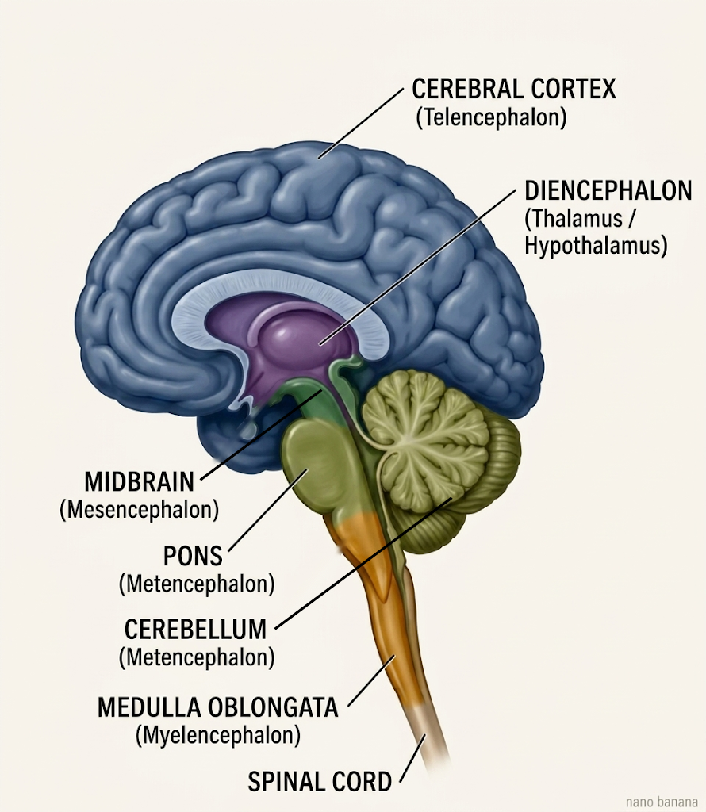
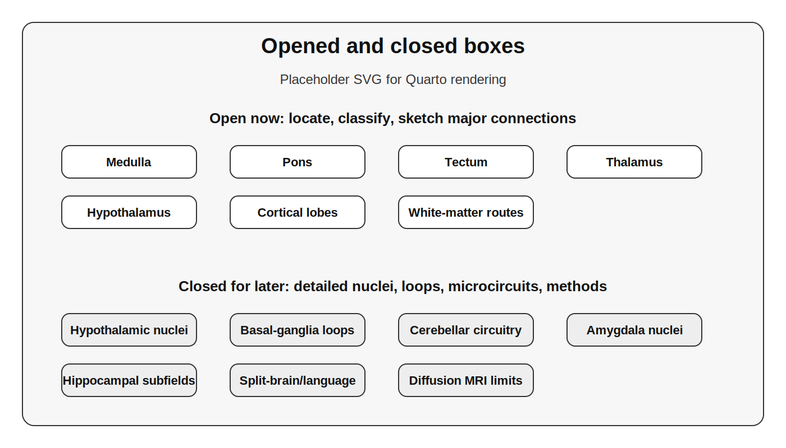

# The brain as a connected map {#sec-connected-map}

## A word about this chapter

This was the hardest chapter in the book to organize, and the difficulty is worth one paragraph because it points at the chapter's real subject.

The trouble is that anatomy and function pull against each other. March through the structures one by one — here is the medulla, here is the pons, here is the thalamus — without saying what any of them is *for*, and you have a list of names, which is the least memorable thing a textbook can offer. But leap straight to function — "the basal ganglia select actions" — and you have made a claim about a place the reader cannot yet locate, which is just noise. We have in fact been naming structures on credit for four chapters — hippocampus, amygdala, thalamus, the nucleus of the solitary tract — without saying where they are located. This is the chapter that pays that debt. Neither pure ordering works, though, and some textbooks concede the point by exiling the anatomy to an appendix. I am going to try something else, and here is the strategy.

**I will give you a map first — just enough to locate things — and then spend the rest of the chapter on the connections between the places, because that is where most of the content lives.** The reason is not stylistic. It is a claim about how brains are built, and it is the thing I most want you to take away of this chapter, so let me state it plainly.

It is natural to think the places are the brain and the routes between them are mere wiring — that the work happens inside the structures and the wiring just ships the results around. That picture is often backwards. A great deal of what a brain region "does" is not performed inside it but is *constituted by its connections* — by which signals converge on it, from where, and where its output is sent. Change what feeds a structure, and you change what it computes; the same tissue, given different inputs, can do a different job. Yet the opposite error is just as real: some of the work genuinely is intrinsic to the tissue — a particular clump of cells, connected to itself in a particular way, doing something its inputs do not dictate. Neither extreme is right. For any given structure the truth sits somewhere between "it is all in the connections" and "it is all in the box," and knowing *where on that line a structure falls* is a large part of understanding it.

And there is a reason connections can carry so much of the work: when routes loop back on themselves — when the wiring is recurrent, as the brain's is — the connections stop merely ferrying signals and begin to generate dynamics of their own, patterns of activity that persist, evolve, and settle in ways no pure feedforward chain could. This, as the @sec-control promised, is where coupled oscillators and attractors enter the story, and it is how the later units will explain what circuits actually do.

So as we walk the map, I will ask of each place not only "what is it, and where," but "how much of what it does lives in its connections, and how much in the structure itself?" That second question is the real content of this chapter. The bare list of names is scaffolding for it. It is also why the detailed inner workings of each system — the full roster of hypothalamic nuclei, the connections with the cerebellar cortex, how the basal-ganglia loops are organized — wait for the later units where each system is the main topic. Those units are, in large part, where we answer the "how much work is done in the structure itself" half of the question for one region at a time. **This chapter builds the framework; the later units fill it in.** When I deliberately leave a box unopened, I am creating a placeholder for later.

I will lean on a single metaphor — the brain as a *map of places connected by routes* — and like every metaphor it eventually breaks. One of the ways it breaks is the very illusion I just warned about: a map makes the places look primary, and the routes look secondary, when the brain frequently inverts that. I will use the metaphor when it is useful and tell you when it stops being so.

## The map grows out of the five vesicles of the neural tube.

In @fig-blastula we saw how the neural tube swelled into a series of bumps: first three primary vesicles, then five. **The five bumps are not a developmental curiosity — they are the top level of the map we are about to use for the entire rest of this book.** Every structure we discuss is a descendant of one of those swellings. If you remember the five, you have the skeleton on which the rest depends. 

Let me recall the derivation briefly, because a map whose shape is *explained* is a map you can reconstruct, whereas a map you simply memorize is a map you will forget. The neural tube's front end — the **prosencephalon**, or forebrain — divides into the **telencephalon** and the **diencephalon**. The middle — the **mesencephalon**, or midbrain — stays undivided. The hindbrain — the **rhombencephalon** — divides into the **metencephalon** and the **myelencephalon**. Five vesicles: telencephalon, diencephalon, mesencephalon, metencephalon, myelencephalon, running front to back. And out of each, by the differential expression of regulatory genes we discussed in @sec-evo-devo, grow the adult structures.

::: {.callout-note}
## The four questions this chapter teaches you to ask

For every structure in the brain, ask four questions.

**Where is it on the developmental map?** Is it telencephalon, diencephalon, mesencephalon, metencephalon, or myelencephalon?

**What kind of architecture is it?** Is it a layered sheet of cortex, a cluster of nuclei, a bundle of white-matter routes, or part of the hollow ventricular system?

**What does it connect to?** What information arrives there, and where does its output go?

**What loop is it part of?** Does it help regulate the body, guide movement, route or recode sensory information, compare prediction with outcome, or coordinate activity between other structures?
:::

Here are two ways of viewing the organizational structure of the adult brain. The first is an anatomical drawing as shown below in @fig-sagittal-brain. 

{#fig-sagittal-brain}

The second is a concept map that presents the same information in a graphical outline format.

::: {.callout-note}
## How to read the map figures in this chapter

The map in this chapter is built as a set of nested, expandable lists — a "concept or mind map." Each box is a structure; the boxes nest, so that a box can be *opened* to reveal what it contains. A telencephalon box opens to reveal cortex, the forebrain components of the basal ganglia circuit, hippocampal formation, and amygdala; the cortex box in turn opens to reveal the lobes; and so on.

Here is the important convention. When a box is **opened**, it means *we are unpacking this structure now*. When a box is left **closed**, it means *this structure has contents, and we are deliberately leaving them for a later unit*. A closed box is a promise, not a gap. So as you read, notice which boxes I open and which I leave shut — the shut ones are a map of what is still to come, and you can return to them as each later unit pries one open.
:::

::: {#fig-brain-markmap}
<iframe src="figs/brain-markmap.html" style="width: 100%; height: 400px; border: 1px solid #eee; border-radius: 8px;"></iframe>

Central Nervous System concept map. [Open map in a new tab ↗](figs/brain-markmap.html){target="_blank"}
:::

The map in @fig-brain-markmap opens to three levels, showing the three primary brain divisions (Forebrain, Midbrain, Hindbrain) branching into the five secondary vesicles — **telencephalon**, **diencephalon**, **mesencephalon**, **metencephalon**, **myelencephalon**. You can expand each vesicle to reveal the major adult structures extending from each. You will see the cerebral cortex, basal ganglia, hippocampus, and amygdala deriving from the telencephalon; the thalamus, hypothalamus, epithalamus, and subthalamus from the diencephalon; the tectum, tegmentum, and cerebral peduncles from the mesencephalon; the cerebellum and pons from the metencephalon; and the medulla (medulla oblongata) from the myelencephalon. Because of how the map hierarchy is structured, the branches will keep the color of their primary division root (Forebrain, Midbrain, or Hindbrain) as they descend. This is the master map of the chapter; later figures open individual nodes.

{#fig-connected-map-open-closed-boxes}

The version in @fig-connected-map-open-closed-boxes should make the reading convention visible. Some boxes are open now: medulla, pons, tectum, thalamus, hypothalamus, cortex, and the largest white-matter routes. Other boxes are visibly closed: the detailed hypothalamic nuclei, basal-ganglia loops, cerebellar microcircuitry, amygdala nuclei, hippocampal subfields, language lateralization, and the imaging methods used to reconstruct pathways. The shut boxes are not missing content; they are the curriculum still ahead.

Notice the shape of the thing. The architecture runs rostral to caudal, and — this is the through-line of the whole unit, so I will keep returning to it — it runs, very roughly, from structures that handle the body's most basic regulation at the caudal end to the structures that perform the most elaborate integration at the rostral end. The medulla, at the caudal end, keeps you breathing. The telencephalon, at the rostral end, is where the great human expansions of cortex, basal-ganglia circuitry, hippocampus, and amygdala live.

## The hollow map: ventricles and cerebrospinal fluid

There is one more feature of the map that is often ignored because brain pictures emphasize solid tissue. The brain began as a tube, and the adult brain still carries the hollow remnant of that tube inside it: the **ventricular system**, a set of fluid-filled spaces containing **cerebrospinal fluid**.

The telencephalon contains the two **lateral ventricles**, one in each hemisphere. They drain into the **third ventricle**, which lies in the midline of the diencephalon, between the thalami and near the hypothalamus. A narrow channel, the **cerebral aqueduct**, passes through the midbrain to the **fourth ventricle**, which sits between the pons and medulla in front and the cerebellum behind. From there, cerebrospinal fluid flows around the brain and spinal cord.

You do not need the plumbing details yet. The point is simpler: the brain is not only a mass of tissue. It is tissue wrapped around spaces, surfaces, barriers, and fluids. When we later return to the choroid plexus, circumventricular organs, hydrocephalus, glymphatic flow, and the blood-brain barrier, those topics will not seem like side issues. They are part of the same map.

## Two ways to build a brain: nuclei and layered cortex

First, some groundwork you already half-know from earlier chapters. The brain's information-processing cells are **neurons**. We will discuss neurons and other cells of the brain at great length in @sec-cells. Briefly, a neuron receives signals chiefly on its branching **dendrites** and sends signals down its single **axon**, which may itself branch to reach many targets. When neurons' cell bodies and synapses are packed together, the tissue looks gray to the eye — **gray matter**. When we look instead at regions full of long axons bundled and traveling, those look pale, because axons are often sheathed in fatty, light-colored myelin — **white matter**. Gray matter is where neuronal cell bodies and most synapses are concentrated; white matter is dominated by the long-range axons that connect one gray-matter region to another.

Now the two motifs:

**A nucleus is a cluster of neuronal cell bodies, grouped together because they share connections and a job.** This is the neuroanatomical sense of "nucleus" — nothing to do with the nucleus of a cell. A nucleus is a *clump*: a discrete blob of gray matter, with inputs arriving and outputs leaving, doing some identifiable piece of work. The nucleus of the solitary tract from @sec-embodied-brain was one such clump — the place visceral afferents land. When I tell you later that the hypothalamus is densely subdivided into many nuclei, you now know what that means: little functional clumps of cell bodies, packed into one region, each tuned to its own job. The thalamus is organized this way; the hypothalamus is; the amygdala is; the basal ganglia are; the brainstem is packed with nuclei. **Whenever you meet a roster of nuclei in a later unit, you are meeting the contents of a such a structure**.

**Layered cortex is the other motif: not a cluster but a sheet.** In the telencephalon, much of the gray matter is not balled into nuclei. Instead, it is spread into a continuous thin sheet — the **cortex**, Latin for "bark," because it wraps the surface like bark on a tree. The human cortical sheet is only about two to four millimeters thick, but if you unfolded it, it would cover roughly a square foot per hemisphere. And within that sheet, the neurons are stacked in **layers** — strata that differ in the kinds of neurons they contain and, crucially, in their connections: some layers are mostly *input* layers, receiving signals from elsewhere; others are mostly *output* layers, sending signals away. A sheet, layered by connectivity, is a fundamentally different architecture from a clump — and the difference will matter when we ask what cortex is *for*.

There is a wrinkle worth one paragraph. Not all cortex has the same number of layers. The evolutionarily ancient cortex — **allocortex**, found in older structures such as the hippocampus and olfactory cortex — has only three or four layers. The newer **neocortex**, which makes up the great majority of the human cortical sheet, has six layers and is a mammalian elaboration. This is the same lesson as the rest of the book in miniature: the elaborate six-layered sheet is built around an older cortical core, not a thing that appeared from nowhere. Recall the warning from @sec-evo-devo against assuming human brains have unique magic structures: neocortex is genuinely a mammalian elaboration, but it is an *elaboration of* conserved cortical tissue, expanded and re-layered, not a novelty without ancestry.

::: {.callout-note}
## Why the cortex is folded — and why that is a clue about connections

The cortical sheet is too large to fit smoothly inside the skull, so it is folded. The ridges that show on the surface are **gyri**; the grooves folded down between them are **sulci**. You will hear these words constantly, so: gyrus = bump, sulcus = groove.

The folding is *not random*. The major sulci and gyri sit in recognizably similar places across individuals — the central sulcus, the fusiform gyrus, and the rest have consistent locations and names. Why would folds be reproducible? One influential idea is that folding reflects the mechanical problem created by an expanding cortical sheet constrained by skull, tissue, and white-matter connections. In some models, connected regions are mechanically coupled; in others, differential growth and tissue stress do more of the work. The details remain active science. Indeed, we have summarized recent work on this topic in @sec-why-brain in our consideration of @sec-why-brain-special and @sec-why-brain-capuchin. But the important point for this chapter is durable: the folded surface is not just decoration. It is a physical trace of development, geometry, mechanical stresses, and connectivity.
:::

## The real subject: places are defined by their connections

Here is the move on which this whole chapter turns, and it is worth stating baldly. **A place in the brain is not fully described by where it is or even by what cells it contains. It is described, more than anything, by what it is connected to.** A structure's function is largely a function of its inputs and outputs — of the routes that run in and out of it.

Let me make this concrete with a metaphor. Think of the brain as a map of *places*, the way a country is a map of regions. Iowa is, first of all, just a location — you can point to it before you know anything about it, which is exactly what our vesicle map lets us do for brain structures. But the moment you ask what Iowa is *for*, you find that its character is bound up with what flows in and out of it. Iowa grows corn; that corn ships out along routes to food producers in other states. So already Iowa is defined not just by its borders but by its *trade routes* — by where its output goes and where its inputs come from. To understand Iowa as an economic place is to understand its connections.

**Places have characteristic outputs, but rarely a single one.** Iowa's corn does not only become food. Some of it becomes ethanol, which becomes fuel. So you cannot say "Iowa = corn = food" and stop; the same output feeds into more than one downstream system. This is the single most important thing to internalize before we open any boxes, because the brain is *full* of structures that do more than one job, and students reliably trip over it. The basal ganglia help select movements *and* carry reward signals. The cerebellum coordinates movement *and*, it turns out, does more than that. The superior colliculus handles vision *and* the orienting of the eyes and head. You will be tempted, every time, to want each structure to have one tidy function. Resist it. A place can supply more than one system, and the brain's places usually do. You already accept this for Iowa without effort. Extend the courtesy to the basal ganglia.

**Places are connected in characteristic patterns.** When many routes converge on one place, we call that **convergence**; when one place sends routes out to many, we call that **divergence**. These are not idle terms — they describe the computational *shape* of a connection, and you will meet them throughout the course. The nucleus of the solitary tract from @sec-embodied-brain is a convergence zone: visceral reports from all over the body funnel into it. The neuromodulatory systems we will meet — the ones that release dopamine or noradrenaline widely across the brain — are divergence in pure form: a small source broadcasting to a vast territory. When you later study a sensory system and learn that many receptors feed into one neuron, that is convergence; when you learn that one alarm signal reaches the whole brain at once, that is divergence. The words let you describe what a wiring diagram is *doing*.

**Routes run in both directions, and the return route carries regulation.** Here is the feature that makes this a chapter about a *control system* rather than a chapter about a pipeline. Iowa ships corn forward to the consumer — but the consumer signals *back*. If demand falls, word returns to Iowa to cut production. The route is not a one-way chute; it is a loop with a forward leg and a return leg. We have names for these. A connection that carries signals "forward" — from input toward output, from a lower station to a higher one — is **feedforward**. A connection that carries signals back the other way, or that loops within a system, is **feedback** or, when it forms loops, **recurrent**. And here is the empirical punchline, which genuinely surprises students: in the brain, the return routes are not an afterthought. They are everywhere, and they are often *more* numerous than the forward ones. The cortex and the thalamus are massively interconnected in both directions. Sensory pathways that carry information up to the cortex are shadowed by descending pathways carrying signals back down. Almost nothing in the brain is a one-way.

This should sound familiar, because it is the same fact we met in @sec-embodied-brain. There, the surprise was that the vagus is mostly *afferent* — the body reports up far more than the brain commands down. Here, the surprise is that brain structures are mostly talking *back and forth*, not just forward. These are two views of one deep principle: **the brain is built out of loops, not chains.** A control system *must* be — you cannot regulate anything without feedback, without the return signal that tells you whether your last action worked. The recurrence is not a complication on top of the architecture. The recurrence *is* the architecture, because regulation is what the architecture is for. When you find yourself imagining information flowing one way through the brain, from senses to thoughts to actions, stop and add the return arrows. They are always there, and they are the point.

::: {.callout-note}
## Where the map metaphor breaks

Here are its two main failures, and each points at something true.

*Map regions have crisp, fixed borders; brain territories often do not.* Iowa has a hard line around it. Many functional territories in the brain shade into one another, overlap, and are defined by gradients rather than fences. When we "carve" the brain into regions, we are sometimes carving at real joints, as @sec-evo-devo discussed, and sometimes imposing tidier borders than nature drew.

*A map is static; the brain's functional geography is not.* States and their economies sit still on the map. The brain's functional assignments are shaped by development and can be *renegotiated* — by experience, by learning, and dramatically by injury. A map that can rewire itself is straining the metaphor. But the strain is informative: it tells you that "what this place does" is partly a fact about the present wiring, not an eternal property of the location.
:::

## Walking the map, back to front

Now we open boxes. We will walk the five vesicles from caudal, body-facing hindbrain to rostral, elaborated forebrain, and for each structure I will do two things: locate it on the map, and sketch *what it connects to* — because the connections are what make the location mean something. Remember the convention: where I open a box, we unpack it now; where I leave one shut, its contents wait for a later unit.

### Cranial nerves: routes into and out of the map

Before we walk the vesicles one by one, there is one more set of routes worth placing on the map: the **cranial nerves**. These are the named nerves that enter and leave the brain directly rather than traveling first through the spinal cord. We have already devoted @sec-embodied-brain-vagus to the vagus nerve - CN X - in @sec-embodied-brain. They are often taught as a list of twelve, and students are asked to memorize their names, numbers, and functions. That list matters, and any student who aspires to a career in neurology should know them well. But in this chapter I want you to see something more useful: the cranial nerves are not just a mnemonic sequence. They are another way of reading the developmental map.

Some cranial nerves are almost purely **afferent**: they bring information into the brain. The olfactory nerve carries smell, the optic nerve carries vision, and the vestibulocochlear nerve carries hearing and vestibular information. Others are primarily **efferent**: they send motor commands outward, as in the nerves that move the eyes or tongue. Many are mixed. The trigeminal nerve brings somatic sensation from the face and also controls the muscles of mastication. The facial, glossopharyngeal, and vagus nerves combine sensory, motor, taste, and parasympathetic functions. That mixture is the important point. A cranial nerve is rarely “for” one thing. It is a bundle of routes.

The vesicle map helps organize the bundle. CN I is associated with the telencephalon; CN II with the diencephalon; CN III and IV with the midbrain; CN V through VIII with the pons and metencephalic territory; and CN IX through XII with the medulla and caudal brainstem. There are anatomical complications behind that clean teaching map — especially because nuclei, roots, and peripheral branches do not always respect the tidy boundaries of a figure — but the organization is still a powerful first pass. It lets you ask the same questions we have been asking all along: what information enters here, what commands leave here, and what loop does this route belong to?

The interactive map below is meant to carry the details. Use it as a reference rather than as a table to memorize in one sitting. Open each vesicle, then open each nerve, and notice the afferent/efferent distinction. The pattern should feel familiar by now: the brain is not a chain of structures but a network of routes, and the cranial nerves are some of the most ancient and clinically important routes in that network.

::: {#fig-cranial-nerves-markmap}
<iframe src="figs/cranial-nerves-markmap.html" style="width: 100%; height: 460px; border: 1px solid #eee; border-radius: 8px;"></iframe>

Cranial nerves organized by developmental brain region, with major afferent and efferent functions. [Open map in a new tab ↗](figs/cranial-nerves-markmap.html){target="_blank"}
:::

### The myelencephalon: the medulla

At the caudal end, sitting directly atop the spinal cord as it enters the skull, is the **medulla oblongata**, the sole major derivative of the myelencephalon. The medulla is small but *essential* in the most literal sense: it contains nuclei involved in breathing, heart rate, blood pressure, swallowing, coughing, and vomiting. It also houses nuclei for several cranial nerves and — this is the connectivity point — a great many white-matter tracts simply *pass through* it, because the medulla is the gateway between the spinal cord and everything above. Damage here is so often fatal precisely because the routes for life-support converge in this small place.

Notice that we have already met the medulla's most important resident under a different heading. The **nucleus of the solitary tract** — the great convergence zone for visceral afferents from @sec-embodied-brain — lives here, in the medulla. This is what the map buys us: a structure we discussed *functionally* now gets an *address*. The body's status reports land in the medulla because the medulla is the brain's ground floor, where much of the body's wiring first arrives.

### The metencephalon: pons and cerebellum

Moving rostral, the metencephalon gives us two structures, the **pons** and the **cerebellum**.

The **pons** — the name means "bridge" — is, true to its name, a great crossing-point and relay. It contains several cranial-nerve nuclei and nuclei involved in basic functions including aspects of sleep and arousal. Its connectivity headline is that it is a major waystation *between the cerebellum and the rest of the brain*. Vast numbers of fibers from the cortex synapse in pontine nuclei and are relayed onward to the cerebellum. So the pons is, in our terms, a convergence-and-relay station on the route to the cerebellum.

The **cerebellum** — "little brain" — deserves a careful word, because it is a showcase for the multi-function principle. The traditional and well-established story is that the cerebellum is a *motor* structure: it coordinates movement, refines timing and accuracy, and helps maintain posture and balance. But the cerebellum has turned out to do *more* than motor coordination. There is substantial evidence that it contributes to aspects of cognition, prediction, timing, and affect as well. It is tempting to file the cerebellum under "movement" and move on. That isn't wrong, only incomplete. The deeper story of cerebellar function is a shut box; we will open it later.

One quantitative fact about the cerebellum that I want to mention now because it is genuinely startling, and we have carried it since @sec-why-brain: the cerebellum is only about a tenth of the brain's mass, but it contains roughly **four-fifths of the brain's neurons**. The cortex, by contrast — that vast folded sheet — is most of the mass but holds far fewer neurons than the cerebellum. Think about that the next time you are tempted to equate "cortex" with "the brain." Most of your neurons are in the little structure at the back. Why the cerebellum is built from so many neurons, and what that architecture computes, is another shut box.

### The mesencephalon: tectum and tegmentum

The midbrain — the mesencephalon — is the one vesicle that did not subdivide. For our purposes its key surface feature is the **tectum**, the "roof" of the midbrain, which consists of two pairs of bumps called the **colliculi**. The **superior colliculus**, called the optic tectum in many non-mammals, handles aspects of vision and — note the dual role again — the registration of space across the senses for the purpose of directing the eyes and head. It helps point your gaze at things. The **inferior colliculus** is a key station in the auditory pathway. So the tectum is, in connectivity terms, a sensory-integration roof on the midbrain, with the superior colliculus a convergence point where visual and other spatial signals meet to steer orienting movements.

The midbrain also contains the **tegmentum** beneath the tectum, home to nuclei we will meet later — including the red nucleus, a motor-related relay, and several of the neuromodulatory sources whose *divergent* projections we flagged earlier. These neuromodulatory nuclei are an important shut box; they open when we study arousal, reward, motivation, and behavioral state.

### The diencephalon: thalamus, hypothalamus, epithalamus, and subthalamus

Now we reach the diencephalon, and the first structure here is so central to the whole connectivity story that it almost deserves its own chapter.

The **thalamus** is a collection of many paired nuclei sitting in the middle of the forebrain — and it is, more than any other structure, the brain's great *relay, convergence, and loop hub*. Here is the pattern that will recur through every sensory unit you study: information from the body and the senses does not march straight into the cortex. With one telling exception — smell — **the senses reach the cortex by way of the thalamus.** Vision routes through one thalamic nucleus, hearing through another, body sensation through another, and each is handed onward to its proper patch of cortex. To take the canonical example, stated here precisely so that it slots into place when you meet it again: the **lateral geniculate nucleus** of the thalamus receives input from the eyes and relays it to the primary visual cortex in the occipital lobe. You do not need to memorize that now. I am placing it here so that when the vision unit opens the box and shows you the lateral geniculate nucleus in detail, you will think: *ah — this is the visual thalamus the framework promised.* That is the whole method of this chapter in one example: build the slot now, fill it later.

But do not let the sensory examples shrink the thalamus into a mere sensory switchboard. Some thalamic nuclei are indeed part of a **sensation → thalamus → cortex** route, but others are not primarily sensory at all. Some participate in motor loops, carrying output from the cerebellum and basal ganglia toward motor and premotor cortex. Some participate in limbic and memory-related loops, linking mammillary bodies, hippocampal formation, cingulate cortex, and other forebrain systems. Others are involved in arousal, cortical state, attention, and the coordination of activity across cortical territories. In other words, the thalamus is not one relay with one job. It is a collection of nuclei embedded in many loops. Sensory routing is the easiest pattern to teach first, but it is only one version of a broader thalamo-cortical design.

And do not forget the return routes. The thalamus is not a one-way relay station passing sensation up to the cortex; the cortex projects *massively back* to the thalamus, in numbers that often exceed the forward projection. The thalamo-cortical loop is one of the most heavily recurrent circuits in the brain. Whatever the thalamus is doing, it is doing it in continuous two-way conversation with the cortex — feedforward up, feedback down, exactly the loop architecture this chapter keeps insisting on. What that recurrent conversation accomplishes — for attention, for the regulation of cortical state, for consciousness itself — is a deep and partly unsettled set of shut boxes.

The **hypothalamus** — "under the thalamus" — is small but densely subdivided, a compact collection of nuclei, and it is the master regulator of bodily homeostasis. Thermoregulation, hunger and satiety, thirst, sexual arousal, sleep-wake cycles: the hypothalamus tunes them, and it does so through exactly the two output channels we built in @sec-embodied-brain — the autonomic nervous system and the endocrine system. Some hypothalamic neurons are secretory cells that release hormones, making the hypothalamus a bridge between the nervous system and the vascular and endocrine systems. This is the convergence point of everything we have built: the body's afferent reports, signals from the blood, and inputs from limbic and cortical systems inform the hypothalamus, and the hypothalamus acts back on the body through autonomic and hormonal efferents to hold it in balance, or — in allostatic mode — to adjust the balance ahead of need. The full roster of hypothalamic nuclei, and the detailed stress-axis machinery — paraventricular nucleus, CRH, ACTH, cortisol — is a shut box. We previewed it in @sec-embodied-brain and will open it fully when we study stress and motivated behavior.

The **epithalamus** is the smallest of these diencephalic territories and includes the **pineal gland** and the **habenula**. The pineal is unusual for a brain structure because it is a single midline organ rather than a left-right pair. It secretes melatonin and participates in the regulation of circadian rhythms. We met it in @sec-embodied-brain as one of the secretory circumventricular organs — another structure now getting its map address. The habenula is a small but important relay in circuits linking forebrain, midbrain, reward, aversion, and behavioral state. It remains shut for now, but naming it here gives it a place on the map.

The **subthalamus** is a small region below the thalamus whose most famous component is the **subthalamic nucleus**. You do not need its circuitry yet, but you do need its address, because the subthalamic nucleus will return when we open the basal-ganglia box. This is a good example of why the vesicle map matters: the basal ganglia are not a single lump sitting in one developmental compartment. The full circuit spans telencephalic, diencephalic, and midbrain components. We locate the subthalamus here so the later movement unit has somewhere to attach it.

### The telencephalon: cortex and the forebrain systems beneath it

Finally, we reach the rostral end, the **telencephalon**, the most expanded part of the human brain and the one with the most to unpack. Its most visible feature is that it comes in two halves — two **hemispheres**, joined at the midline. They look nearly identical to the eye, and for most functions they operate as a coupled pair, but some functions are lateralized — language production most famously so in most people. Hemispheric specialization and the split-brain findings are shut boxes flagged for later.

The telencephalon contains, first, the great sheet of **cortex** we anatomized earlier — and the cortex itself opens into territories. It is customary to divide the cortical sheet into **lobes**: the **frontal**, **temporal**, **parietal**, and **occipital** lobes, with two further regions often added — the **insula**, a patch of cortex hidden in the fold between the frontal and temporal lobes, and the **limbic lobe**, the cingulate gyrus and adjacent cortex on the brain's medial rim. I will locate them here and say a word about each lobe's broad associations, but I want to be careful about *how* I say it, because this is the single easiest place in all of neuroanatomy to fall into the error this chapter has been warning against.

At exactly this moment, recall @sec-triune. The Triune Brain was seductive partly because it made the brain look as if it could be divided into tidy evolutionary layers, each with one clean function: instinct below, emotion in the middle, reason on top. The lobes invite a milder version of the same mistake. It is tempting to say "occipital equals vision," "frontal equals planning," "temporal equals memory," and let those labels harden into little boxes. Do not let them harden. The labels are useful only if you keep them soft.

With that warning in hand: the lobes have *broad associations*, which are real as tendencies and false as strict assignments. The **occipital** lobe at the back is dominated by vision. The **parietal** lobe is heavily involved in body sensation and spatial processing. The **temporal** lobe handles much of hearing and, on its inner surface, is bound up with memory and the recognition of objects. The **frontal** lobe contains the motor machinery at its rear and, forward of that, the cortex most associated with planning, decision, and the flexible control of behavior. The **insula** is deeply involved in interoception — the sense of the body's internal state we made so much of in @sec-embodied-brain — and the **limbic** cortex with emotion and motivation. State these as *centers of gravity*, not as borders: vision is "mostly occipital" the way corn is "mostly Iowa," with the real story spilling across lines and involving connections to everywhere else. The detailed functional anatomy of each lobe is the substance of the units to come; here I am only locating the territories and warning you not to over-trust the parcellation.

Beneath and within the great cortical sheet, the telencephalon also contains several major non-neocortical systems. They are not all built the same way. The **amygdala** and much of the **basal ganglia** are organized as nuclei — clumps of gray matter. The **hippocampal formation**, by contrast, is ancient allocortex, a folded cortical structure on the medial temporal surface. I group them here not because they share one architecture, but because each is a major telencephalic system that later chapters will open in detail.

The **amygdala** is a cluster of nuclei associated with emotion, threat, salience, valuation, and the steering of motivated behavior. You will see it reduced, in popular accounts, to "the fear center." It is more than that, and the reduction is the Iowa error again. The amygdala box opens with emotion and motivation.

The **hippocampal formation** is associated with memory and spatial navigation — and, as we noted in @sec-embodied-brain, it is a target of stress. Recall too that the hippocampus is built of ancient allocortex rather than six-layered neocortex, a structural clue to its deep ancestry. The hippocampal box opens with learning and memory.

The **basal ganglia** are a set of interconnected nuclei involved in the selection and inhibition of movements and behaviors — both the "go" and the "stop" — and in reward-guided learning. The **striatum** is the major telencephalic input station of this circuit, and the pallidum is another major forebrain component, but the full basal-ganglia loop also includes other nodes, including the subthalamic nucleus and substantia nigra, that sit outside the telencephalon. This is the textbook multi-function system: action selection, inhibition, habit, and reward learning braided together. The basal-ganglia box opens with movement and reward.

## The routes themselves: white matter as the trade network

We have walked the places. Now we have to take seriously the thing the whole chapter has insisted matters most — the *connections* — and that means looking directly at the white matter, the brain's physical wiring. If the gray-matter structures are the places on the map, the **white-matter tracts are the trade routes**, and a map without its routes is just a scatter of dots.

First, what a tract *is*, building on the neuron groundwork from earlier. Anatomists distinguish **local-circuit neurons**, whose axons stay nearby and do local processing, from **projection neurons**, whose axons travel long distances to reach a different region entirely. When the axons of many projection neurons run together from one region toward a common destination, they form a bundle — a **tract**, also called a fiber tract or pathway. These bundles are consistent enough across individuals, and even across species, that they have names, just as the structures do. A tract is, quite literally, a named route between two places, and like Iowa's trade routes it has a *direction* or two and a *shape* — fan-in, fan-out, or loop. Let me organize the major routes the way their geography organizes them, and as we go, notice how the connectivity vocabulary from earlier lets us describe each one's *job* rather than merely its path.

### Routes between the brain and the body: the spinal tracts

The spinal cord is the great trunk line between the brain and the body, and it carries traffic in both directions — which, by now, you will expect.

The **descending** tracts carry motor commands *down* from the brain to the spinal cord — feedforward routes from the controller toward the muscles. The principal one is the **corticospinal tract**, which runs from motor and sensory regions of cortex toward motor circuits in the ventral horn of the spinal cord: the main highway for voluntary movement. Alongside it run several brainstem-origin descending tracts that handle posture, tone, and balance: the **rubrospinal** tract from the red nucleus of the midbrain, the **reticulospinal** tract from the pons and medulla, and the **vestibulospinal** tracts from the vestibular nuclei, which help control muscle tone, posture, and stabilization of head position. Notice that these descending routes *originate at different levels* of the map we just walked — cortex, midbrain, hindbrain — which is itself a lesson: motor control is not issued from one place but is a layered collaboration down the neuraxis. Exactly how these layers divide the labor of movement is a shut box; it opens in the motor unit.

The **ascending** tracts carry sensory information *up* from the body to the brain — feedforward in the other direction, body toward cortex, and almost all of them routing, as promised, toward the thalamus. The **dorsal column-medial lemniscus** system carries fine touch and proprioception — the sense of where your body is — up to the thalamus. The **anterolateral system**, including the **spinothalamic** tracts, carries pain, temperature, and crude touch up to the thalamus. And the **spinocerebellar** tracts carry proprioceptive information from muscle and tendon up to the *cerebellum*, feeding the motor-coordination machinery the body-position data it needs. Which receptors feed these tracts, and how the information is transformed along the way, is shut; it opens in the somatosensory and pain units. Here, the point is only the architecture: body sensation ascends, mostly via the thalamus, to reach the cortex, while some body-position information streams directly toward the cerebellum.

### Routes within a hemisphere: association and projection fibers

Within a single hemisphere, tracts connect the thalamus and cortical regions to one another. The **corona radiata** is a spectacular example of *divergence* made visible: fibers fan outward between the thalamus, internal capsule, and the entire cortex like rays from the sun — early anatomists named it for exactly that appearance. Your instructor has shown, in class, a preparation in which the cortex has been digested away to leave these white-matter "ropes" exposed; it is a striking thing to see.

Other intra-hemispheric tracts — the **association** fibers — connect cortical regions to each other, and they are where the connectivity vocabulary earns its keep most clearly. The **superior longitudinal fasciculus** connects posterior cortical territories with frontal cortex; its sub-pathways knit regions involved in spatial processing, language, attention, and action. The **inferior longitudinal fasciculus** links the occipital lobe to the front of the temporal lobe, a route in the service of recognizing what we see. The **uncinate fasciculus** is a bidirectional route connecting the front of the temporal lobe, including amygdala-adjacent territory, to orbitofrontal cortex. And the **cingulum** runs within the limbic rim, connecting cingulate cortex with medial temporal structures, including the entorhinal cortex — the major gateway of input *into* the hippocampus.

A subset of these limbic routes are, specifically, the *output* cables of the deep structures, and they all converge on a familiar destination — the hypothalamus, the regulator. The **fornix** carries output from the hippocampal formation toward the mammillary bodies and hypothalamic region. The **stria terminalis** carries output from the amygdala to the hypothalamus and to the bed nucleus of the stria terminalis. The **ventral amygdalofugal pathway** carries another stream of amygdala output to a spread of targets including the hypothalamus, thalamus, nucleus accumbens, and frontal cortex. I point these out not to add names to your list, but because they show the loop closing yet again: the emotion-and-memory structures send outputs down to the same homeostatic regulator that @sec-embodied-brain built, which is precisely why your emotional and remembered states can reach out and change your heart rate, your hormones, your gut. The wiring *is* the explanation. How these limbic outputs shape motivated behavior is shut; it opens with emotion, memory, and stress.

### Routes between the hemispheres: the commissures

The two hemispheres are connected by **commissures** — tracts that cross the midline. By far the largest is the **corpus callosum**, a massive band connecting corresponding and some non-corresponding regions of the two hemispheres: the main channel by which the two halves of the cortex stay coordinated. It carries a famous clinical and scientific significance — it is sometimes surgically cut to stop severe epileptic seizures from spreading between hemispheres, and those split-brain patients have taught us a great deal about hemispheric specialization. The split-brain story is one of the most illuminating shut boxes in the book; we open it later. The smaller **anterior commissure** connects temporal-lobe structures and the amygdalae across the midline; the tiny **posterior commissure** links pretectal nuclei and serves the pupillary light reflex; and the **hippocampal commissure**, part of the fornix system, joins the two hippocampi.

### Routes to the cerebellum: the peduncles

Finally, the cerebellum hangs off the brainstem by three thick fiber bundles per side called **peduncles** — "little feet" — and they are a tidy illustration of how naming a route's *direction* tells you its job. The **middle cerebellar peduncle** is the great *afferent* route *into* the cerebellum, carrying the pontine relay of cortical information we mentioned earlier. The **inferior cerebellar peduncle** is also largely afferent, gathering body-position and vestibular information and delivering it to the cerebellum. And the **superior cerebellar peduncle** is the major *efferent* route *out* of the cerebellum, carrying its computed output onward to the thalamus and red nucleus. Three cables: mostly in, mostly in, mostly out. The cerebellum's whole conversation with the rest of the brain runs through these three routes, and simply knowing which way each one points tells you the shape of that conversation.

::: {.callout-note}
## We can infer routes in living brains

For most of the history of neuroanatomy, the tracts could be studied only in dissected, preserved tissue — which is why the classic preparations involve digesting the cortex away to expose the white-matter "ropes." Something has changed in the last few decades, and it is worth knowing because it is why white-matter connectivity has become such an active field.

A form of MRI called **diffusion-weighted imaging** measures the direction in which water diffuses through tissue. From those measurements, tractography algorithms can *infer* the likely course of major white-matter pathways in living people. This has transformed the study of connectivity, but it is not the same as staining axons. Tractography is a model-based reconstruction: powerful for major bundles and group-level patterns, but fallible in regions where fibers cross, kiss, branch, or fan. The trade network, once visible only in the dissecting room, can now be estimated in living brains — but the estimate is a model, not a photograph. How these methods work, and what they have and have not established, is a shut box for the imaging unit.
:::

{#fig-connected-map-major-routes}

The route map in @fig-connected-map-major-routes should be pedagogical rather than exhaustive. It should show descending corticospinal routes, ascending dorsal-column and spinothalamic routes, spinocerebellar routes, the corona radiata, a bidirectional posterior-to-frontal association route, the corpus callosum, and the cerebellar peduncles. The key graphic vocabulary is not a full tractography atlas; it is arrowheads: feedforward, feedback, convergence, divergence, and recurrence.

## The other network: blood supply over the same map

There is a second network laid over the brain's map, and although we treated it at length in @sec-embodied-brain, it earns a brief reprise here because it completes the connectivity picture — and because it fails the trade-route metaphor in an instructive way.

Recall the essentials: the brain is fed by two arterial systems — the **carotid** circulation anteriorly and the **vertebral-basilar** circulation posteriorly — which meet in the ring of the **Circle of Willis**, from which the major cerebral arteries branch to their territories. The brain stores almost no energy and so depends on this delivery continuously; cut a vessel and the territory it feeds is starved within seconds, which is a **stroke**.

Here is the instructive part, the place where blood supply and the trade-route metaphor come apart — and the coming-apart is exactly what makes strokes so revealing. **Vascular territories do not respect functional borders.** A single artery feeds whatever tissue happens to lie downstream of it, regardless of which functional systems that tissue belongs to. So when an artery is blocked, the resulting deficit is carved along *vascular* lines, not functional ones — which is why a stroke can knock out a peculiar-looking combination of abilities that share no functional logic, only a shared blood supply. The road network and the trade network are different maps laid over the same country, and the brain has *both*: the white-matter tracts wiring places by function, and the blood vessels supplying places by geography. A complete map of the brain needs both networks drawn on it. And the mismatch between them is not a nuisance — it is a gift to neuroscience, because the vascular accidents that cut across functional systems have, for over a century, been one of our primary windows into what each piece of the functional map actually does.

## Coda: from a map of places to a system that regulates

Let me close by collecting what we have built and pointing it forward, because this chapter was always preparation for what comes next.

We started with a problem I admitted was genuinely hard: you cannot use the brain's anatomical language until you have a map, but a map of names without functions is inert. The solution was to let the map *grow out of* the five developmental vesicles — so that its shape is explained rather than memorized — and then to insist that the real content is not the places but the **connections** between them. We gave ourselves the architectural motifs every structure is built from: the **nucleus**, a clump; **layered cortex**, a sheet; **white-matter tracts**, the routes between places; and the **ventricular system**, the hollow remnant of the tube from which the brain grew. We added the vocabulary of connection: **feedforward** and **feedback**, **convergence** and **divergence**, **recurrence** and **loops**. We walked the map from the medulla at the body-facing end to the elaborated telencephalon at the front, locating every structure we had previously used on credit — the nucleus of the solitary tract, the hypothalamus, the thalamus, the hippocampal formation, the amygdala, the basal ganglia — and sketching what each connects to. And we laid down the trade network of white-matter tracts and the second network of blood supply over the same terrain.

Now notice what the map *is*, when you step back and look at the connections rather than the boxes. The senses and the body feed information *inward and upward* — through the spinal tracts, through the thalamic relays, converging on the integrating structures. The integrating structures — cortex, deep forebrain systems, brainstem nuclei, and above all the hypothalamus — process and combine these signals. And commands flow *outward and downward* — through descending tracts to the muscles, through autonomic and endocrine outputs to the viscera. Sensing, integrating, acting. But — and this is the whole point, the thing the recurrence kept insisting on — it is not a one-way assembly line from sensation to action. Every forward route is shadowed by a return route. The body reports up far more than the brain commands down; the cortex talks back to the thalamus as much as the thalamus talks to the cortex; the emotional and mnemonic systems send their outputs back down to the homeostatic regulator. The brain is built of **loops**, and it is built of loops because it is a **control system**, and a control system is nothing without the feedback that tells it whether its regulation is working.

That is the bridge out of this opening unit. We began with a claim that might have sounded like a slogan: the expensive brain earns its keep by *buying prediction* — by regulating the body allostatically, forecasting needs before the errors arrive, rather than merely reacting. Across the unit we have assembled what that claim requires: a reason for a brain at all in @sec-why-brain, the developmental plan that builds one in @sec-evo-devo, the channels that wire it into the body it regulates in @sec-embodied-brain, and now the map of the regulating machinery itself, drawn as a network of connected places. The control system is now before us, in outline, with all its major parts located and its major routes traced.

The map will stay open for the rest of the book. Each later unit will return to it, open one box, and ask how that part of the control system works. But before we can understand any circuit in detail, we need to know what the wires themselves can do. We have been describing the wiring diagram of the brain. It is time to meet the wires.

::: {.callout-tip collapse="true"}
## What we're sure of, and what we're not

In the spirit of the unit, an honest ledger for a chapter that is more *framework* than *findings* — which shapes what "sure" even means here.

**What we're sure of.**

- The gross developmental map is solid: the five vesicles and the major adult structures deriving from each are textbook anatomy, not in dispute.
- The major architectural motifs — nucleus or clump, layered cortex or sheet, long-range white-matter tract, and ventricular space — are well established.
- The major white-matter tracts and their basic connectivity are well established, and many are now inferable in living humans by diffusion imaging, with important methodological limits.
- The thalamus as the obligatory relay for most senses, smell excepted, and the massive recurrence of thalamo-cortical and other connections, are solid and central.
- The dual arterial supply, the Circle of Willis, and the mismatch between vascular and functional territories are firmly established.

**What we're not sure of, or oversimplified on purpose.**

- The rostral-caudal gradient and the lobe-by-function assignments are *centers of gravity*, not borders. I stated them simply here and flagged the simplification; the real functional anatomy is distributed and overlapping, and the units to come will complicate every one of these tidy assignments.
- The multi-function structures and systems — basal ganglia, cerebellum, amygdala, superior colliculus, habenula — genuinely do more than their headline job, and in several cases how much more, and by what mechanisms, is an active frontier.
- Diffusion imaging has transformed the study of white matter, but tractography is an inference from water diffusion, not a direct photograph of axons. Treat beautiful tractography images as hypotheses with anatomy behind them, not as transparent pictures of the truth.
- The functional claims attached to each structure here are deliberately shallow — slots, not fillings. Where this chapter says "the amygdala is involved in emotion and threat," that is a placeholder for a much more detailed story the later unit will tell. Do not mistake the headline for the science; the science is in the units that open these boxes.
- The warning from @sec-triune applies to this entire chapter. Any scheme for brain organization that is suspiciously tidy — neat layers, one structure one function, reason floating above emotion — is suspect precisely because of its tidiness. The brain is built of overlapping, multi-functional, densely interconnected loops, and any map that makes it look simpler than that is lying to you a little. Including, where it must simplify to be teachable, this one — which is why the boxes are shut, not sealed.
:::
