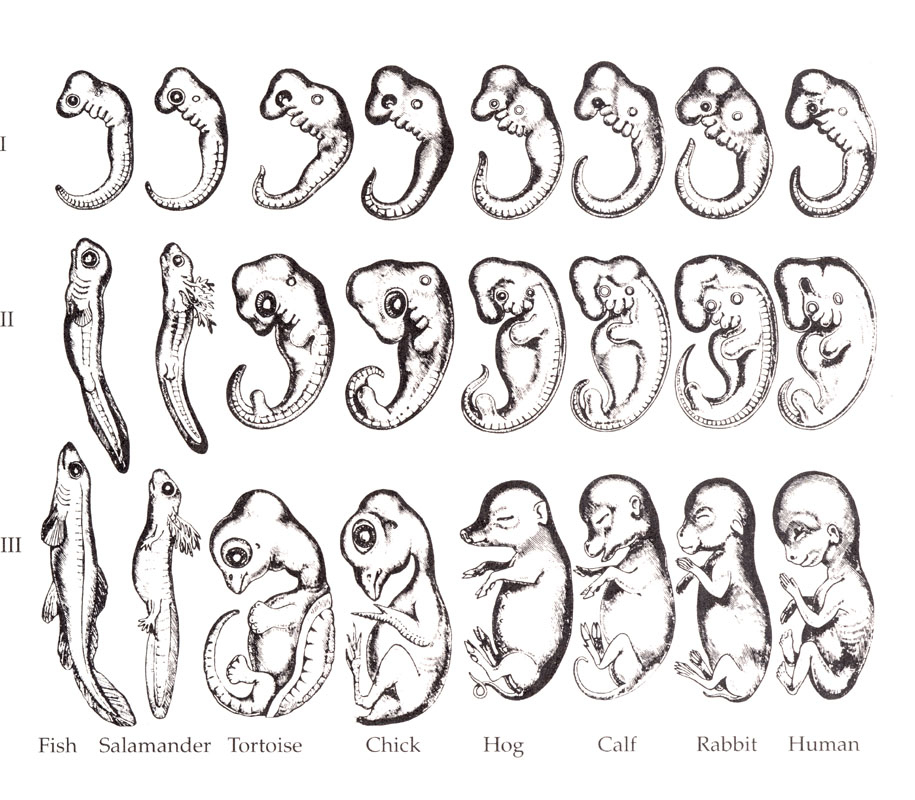
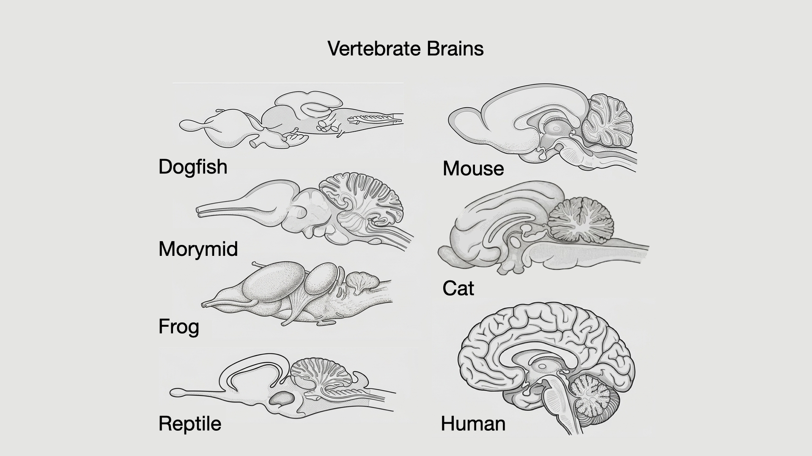

# Evo-Devo {#sec-evo-devo}

## How do you *build* a brain?

In the last chapter, we ended on the fact that humans and chimpanzees share approximately 98.8% of their DNA. That figure is the one most commonly quoted, and it is worth knowing exactly what it measures: it is the rate at which single DNA "letters" differ across the portions of the two genomes that line up cleanly against each other. Count differently — fold in the stretches where one genome has inserted or deleted whole chunks relative to the other — and the number falls, to roughly 96%, and under the strictest accounting of unalignable sequence, lower still. The headline number, in other words, is a statement about single-letter substitutions in comparable regions, not a single verdict on "how similar the genomes are."

But, regardless how we count, one thing holds: the protein-coding genes themselves — the parts list that specifies the actual proteins — are very nearly identical, often differing by only a handful of amino acids or not at all. And yet the two brains are not just 1.2% different in any sense anyone would recognize. So if the parts list is very nearly the same, what is doing the work?

The answer — and it is the spine of this chapter — is that the most interesting differences between closely related brains are often differences in **regulation**: not new proteins, but changes in *when*, *where*, *how long*, and in *what order* shared proteins get switched on during development. When evolution remodels a brain, it more often changes the construction schedule than invents a new brick. There are exceptions. Some genuinely new genes and gene duplications have been recruited into primate and human brain development. But those exceptions do not overturn the main story. The deep story is not that evolution keeps inventing new brain parts from scratch. The deep story is that evolution alters the developmental programs that build brains.

That is what **evo-devo** — evolutionary developmental biology — gives us. It asks how evolution changes organisms by changing the developmental processes that build them. For brains, that usually means changes in timing, boundaries, proliferation, migration, and gene expression. A region can become larger because its progenitor cells keep dividing longer. A boundary can shift, giving one territory more embryonic real estate and another less. A population of cells can migrate along a new route or settle in a new target. A circuit can be elaborated by changing the local rules that guide axons, dendrites, synapses, and pruning.

This way of thinking changes what counts as an explanation. If brains are built by developmental programs, then the way to understand brain *structure* is to understand those programs — the conserved plan they work from, and the levers evolution can pull on them. I am not going to give you a parts catalogue to memorize. Rather, I want to show how a tube of cells gets patterned into a brain. We can then ask, at each step, what evolution can reach in to change.

The paradox we will return to throughout the chapter is this: vertebrate brains are astonishingly conserved and astonishingly variable at the same time. A lamprey, a fish, a frog, a lizard, a bird, a mouse, a macaque, and a human all build brains from the same ancient developmental logic. But the resulting brains differ enormously in size, proportion, cell number, circuit specialization, and behavioral capacity. The point of evo-devo is not to choose between conservation and variation. The point is to explain how the same developmental machinery can produce both.

## The Bauplan is not a blueprint

The German word **Bauplan** is often translated as "body plan" or "building plan." I will use it because it captures something important: vertebrate brains are variations on an ancient architectural theme. But I want to remove one possible misunderstanding immediately. A Bauplan is not a literal blueprint stored in DNA.

That distinction matters. A blueprint specifies a structure by representing it in advance. A blueprint of a building says where every wall, window, and stairwell should go. If genes worked that way, the genome would have to contain something like a detailed diagram of the brain: where each neuron should be placed, which other cells it should connect to, which synapses should survive, which should be pruned, which axons should turn left, and which should cross the midline. That is not how development works.

A better way to think about genes is that they encode **developmental algorithms**: local rules that cells follow in particular contexts. Divide. Stop dividing. Change shape. Move toward this chemical signal. Avoid that one. Express this transcription factor if exposed to that concentration of a morphogen. Stick to cells like this; detach from cells like that. Extend an axon. Retract a branch. Strengthen a synapse that is repeatedly active. Eliminate one that is not.

Peter Robin Hiesinger has pressed this point with unusual force: genes do not encode a complete wiring diagram of the nervous system; they encode rules for self-assembly [@hiesinger2021]. The genome does not need to specify the exact final arrangement of all neurons and synapses, which would be an impossible information problem. Instead, it specifies generative procedures. Those procedures are run by cells, inside tissues, in an embryo, in a body, and eventually in an environment. The adult brain is the outcome of those procedures, not a structure copied from a genetic drawing.

This distinction helps us make sense of both reliability and variation. The brain develops reliably because the rules are ancient, robust, and constrained. Given the same early embryo, the same signaling gradients, the same tissue mechanics, and the same cellular responses, similar structures tend to emerge. But the brain also varies because developmental algorithms have parameters. Make a proliferation period longer and a region can become larger. Change the strength or duration of a guidance cue and axons may reach a different target. Shift a boundary between two gene-expression domains and one brain territory grows at the expense of another.

That is the power of evo-devo. Evolution does not need to write a new blueprint. It can tune the rules.

::: {.callout-note collapse="true"}
## Deeper Dive: Genes are not blueprints

The "blueprint" metaphor is tempting because developed organisms look designed. Eyes look like devices for seeing. Wings look like devices for flying. Brains look like devices for controlling behavior. So it feels natural to imagine that DNA must contain a plan for constructing the device.

But the metaphor breaks down quickly. The human genome contains roughly three billion base pairs and something on the order of twenty thousand protein-coding genes. The brain contains tens of billions of neurons and an even more staggering number of synapses. If each neuron and connection had to be specified individually, the genome would be far too small to hold the instructions.

Development solves this by being **generative** rather than descriptive. A small number of rules, repeated many times, can produce immense complexity. A chemical gradient can give cells positional information without naming each cell. A rule such as "grow toward this signal and away from that one" can guide many axons without specifying every branch. Activity-dependent refinement can improve a circuit after rough targeting has already occurred. Programmed cell death can sculpt a population that was initially overproduced.

This is not hand-waving. It is how biological development works. Tissues self-organize because cells respond locally to signals, neighbors, mechanical forces, and their own internal states. The regularity of the outcome does not require a literal blueprint. It requires reliable developmental rules.

Once you see this, many puzzles become less puzzling. A mutation does not need to encode a new behavior directly. It may alter a developmental parameter — a proliferation rate, a migration route, a synaptic pruning threshold, a receptor gradient — and the behavioral consequence may emerge much later from the changed circuit that results. Likewise, individual experience does not write itself onto a blank brain. It interacts with a developing system that was already built to be modified by activity.

So when I say that vertebrates share a Bauplan, I do not mean that they share a stored drawing of a brain. I mean that they share a deeply conserved set of developmental algorithms that reliably generate brains with recognizable divisions, axes, cell types, and circuits.
:::

## Carving nature at its joints

Understanding a complex system begins with an act of division: we break it into parts and try to see how each contributes to the whole. The aspiration, in Plato's enduring phrase, is to *carve nature at its joints* — to draw the boundaries where function is genuinely divided, so that naming a part and understanding its job become the same act. For the brain, the difficulty is that the functional joints are rarely obvious.

Run a thought experiment with me. Suppose the brain were a uniform, monotonously repeating tissue — the same circuit tiled everywhere, like graph paper. And suppose that damage, disease, and aging produced a correlated decline across everything at once: your vision, your movement, your memory, your mood all dimming together in lockstep. Where would the joints be? There would be none. Function would be distributed evenly across a homogeneous sheet, and the whole research program of relating structure to function would be dead on arrival.

Happily for neuroscience, the brain is not like that. It has visibly different parts, and localized damage produces dissociations: a stroke that robs a person of the ability to produce speech while leaving comprehension intact, or one that erases the ability to recognize faces while sparing the ability to recognize objects. One function falls away while its neighbors hold — the seam between them suddenly visible. These are the functional joints showing through. They license an intuition that runs through all of neuroscience — that *a different structure implies a different function*. I want to flag that this is an intuition, a working heuristic, not a law. Plenty of functions are distributed across structures, and plenty of structures do more than one thing. But the heuristic has been productive, and it is the reason we bother to learn the parts at all: the parts are our first guess at the functions.

::: {.callout-note}
## What you draw depends on what you believe

Anatomy looks like it should be the most objective science imaginable — you open the skull, you draw what is there. It is not that simple. Giulio Casseri (1552–1616) believed the brain was essentially packing material, a vegetative support for the fluid-filled ventricles, which he took to be the true seat of mental life. So he drew the brain as a coil of intestines — because that is roughly what he expected a support structure to look like. His contemporary Andreas Vesalius (1514–1564), who did not buy the ventricular theory, drew the brain faithfully, as it actually appears. Same organ, two centuries of shared anatomical tradition, two very different pictures — and the difference lived in the preconceptions, not the specimen. Keep this in mind every time I show you a "diagram of the brain." A diagram is an argument about what matters, drawn to look like a fact.
:::

Before we start carving, one more piece of humility about the carving itself. A taxonomy — any taxonomy — is a claim about deep relationships, and it is always provisional. The classification of living things by genus and species was originally a claim about shared morphology, later reinterpreted as a claim about shared ancestry, and then repeatedly *rewritten* when molecular data disagreed with the morphology. The same thing is happening inside the brain: divisions that anatomists drew by eye are being redrawn according to which regulatory genes are expressed where.

Every nomenclature has edge cases that refuse to sit still. Is the retina part of the brain, or a piece of it that wandered out to the eye? Developmentally, it is brain. Are the cranial nerves central or peripheral? It depends partly on which cells and sheaths you are talking about. Is a hagfish a vertebrate, given that the modern hagfish has no proper backbone? Consensus says yes: it appears to have *lost* the vertebral column secondarily over evolutionary time, which is a nice reminder that "primitive-looking" and "ancestral" are not the same thing.

My own view is that these boundary disputes are often more heated than they are illuminating. The conventions we adopt are tools for organizing knowledge and talking to each other *now*; they are not sacred, and they will be amended. So learn the names lightly. They are scaffolding, not scripture.

## More-related species share more

I am occasionally uneasy about the fact that this course is called *The Human Brain*. The title smuggles in a suggestion I want to actively resist: that the human brain is discontinuous, a novel device that sprang into being on our lineage and is best studied in isolation. That is simply false. The human brain is an elaborated vertebrate brain, built from a genetic and molecular toolkit that is breathtakingly old.

Consider, as the extreme case, the sponge. A sponge has no brain, no neurons, and no muscles — and yet it can perform slow, coordinated, whole-body contractions, a kind of "sneeze" that flushes irritants out of its canals. When researchers asked what coordinates that behavior, they found that the contractions are triggered and modulated by **glutamate** and **GABA** — the very molecules that serve as the principal excitatory and inhibitory neurotransmitters in your cortex — along with other signaling molecules [@ellwanger2006; @elliott2010]. I want to be careful about what this does and does not show. It does *not* show that sponges have a hidden nervous system, or that their signaling is homologous to ours in the strict sense. The actual mechanism of sponge coordination is still not fully understood, and the system is best described as a *pre-neural* or *non-neural* chemical signaling system [@elliott2010]. What it does show is that the molecular vocabulary of neural signaling long predates neurons themselves. Many of the components of our neural toolkit were available before neurons and brains.

That deep conservation is why so much of what we know about the human brain comes from animals that look nothing like us. The roundworm *C. elegans*, with its 302 neurons mapped synapse by synapse; the fruit fly *Drosophila*; the sea slug *Aplysia*, whose enormous neurons let Eric Kandel work out the cellular basis of simple learning — these are not quaint warm-ups before the real subject. They are the real subject, viewed where the circuitry is simple enough to dissect.

The logic that lets us reason from a slug to a student is the logic of *relatedness*. Humans are vertebrates, like fish and frogs and birds. Among vertebrates we are mammals, like mice. Among mammals we are primates, like macaques. Among primates we are apes. **More-related species share more.** The closer the branch, the more of the developmental program is held in common, and the more confidently we can carry a finding across.

This comparative method has a particular payoff when a genuinely *new* structure appears on some lineage — say, the six-layered neocortex that is unique to mammals, or the great expansion of association cortex in primates. When that happens, we can do two things. We can hunt for the *precursor* circuitry in relatives that lack the new structure, asking what it was built from. And — more usefully for us — we can ask what new *capability* the structure conferred, by comparing what animals with and without it can do. Comparative neurology and comparative psychology are, in this sense, instruments for reading structure-function relationships off the tree of life.

But I want to enter a caution even as I advocate for the comparative approach, because the method has a seductive failure mode. In his survey of evo-devo, Brian Hall reminds us that genes carry plans for structure, but development is not a vending machine that dispenses a phenotype when you insert a genotype [@hall2012]. Development interacts continuously with the environment — temperature, vibration, chemical signals, nutrition, maternal hormones, sensory input — so the realized organism is the product of genetic *and* epigenetic influences. We will have more to say about epigenetics later. For now, the point is simple: "developmental" does not mean "genetically predetermined." Development is the process by which genes, cells, bodies, and environments construct an organism together.

::: {.callout-note collapse="true"}
## Evolution tinkers; it does not design from scratch

François Jacob's famous essay "Evolution and Tinkering" remains one of the clearest statements of how evolution actually works [@jacob1977]. Evolution is not an engineer facing a blank sheet of paper. It is a tinkerer — a *bricoleur* — working with whatever parts are already lying around.

This is especially clear in development. The same signaling pathway can be reused in many organs. The signaling molecule *sonic hedgehog* helps pattern the dorsal-ventral axis of the neural tube, but it also contributes to limb patterning, tooth development, and other embryonic processes. The Pax6 gene is famous for its role in eye development across animals, but it also helps pattern the telencephalon. Developmental mechanisms are promiscuously reused.

That reuse explains both flexibility and constraint. A mutation that slightly extends the expression domain of a growth factor can expand a brain region without inventing a new region-building gene. But because the same pathway may also be used elsewhere in the body, not every change is possible or safe. Evolution can tinker with timing, location, and intensity, but it must do so inside a web of existing dependencies.

This is why evo-devo is so powerful. It lets us see evolution not as the creation of perfect designs, but as the historical modification of developmental systems that already work well enough to survive.
:::

## Two instructive errors

Some wrong ideas are more useful than some right ones, because of *how* they are wrong. The next two boxes present evolutionary accounts of the brain that achieved enormous cultural reach and turned out to be mistaken. I keep them not to mock the dead but because working out precisely *why* each fails teaches the correct principle better than stating the principle ever could.

::: {.callout-note}
## Recapitulation Theory: "ontogeny recapitulates phylogeny"

You have probably heard the slogan *ontogeny recapitulates phylogeny*. It is the compressed form of Recapitulation Theory, advanced by Ernst Haeckel in the nineteenth century. Haeckel produced famous drawings showing that early embryos of fish, salamanders, pigs, and humans look remarkably alike, and proposed that in the course of its own development each organism climbs back through the *adult* stages of its evolutionary ancestors — that a human embryo literally passes through a "fish stage," a "reptile stage," and so on. The prominent **pharyngeal arches** in the embryonic neck, which do look unsettlingly like a row of gill slits, seemed to clinch it.

{#fig-romanes-haeckel width=70%}

It is wrong. Embryos do not relive their ancestors' adulthoods. The pharyngeal arches are not gills and never function as gills; they are neural-crest-rich embryonic segments that go on to form parts of the bones, muscles, glands, and nerves of the face and neck. A human embryo was never a fish.

So why *do* the early embryos look so alike? Because closely related species share a conserved body plan — and, as we will see, a conserved *brain* plan — and the conservation is concentrated early. Here is the mechanism, and it is worth its weight: the success of each developmental stage depends on the stages before it getting built correctly, so mutations that perturb very early development tend to be catastrophic and are weeded out. Divergence is therefore pushed later in development, where the stakes are lower. The shared-looking early embryo is not a snapshot of an ancestor; it is the conserved early scaffold on which lineage-specific differences are later hung. Haeckel saw a real pattern and drew exactly the wrong arrow of causation from it.

A darker footnote on why ideas like this matter beyond the lab: Recapitulation was enthusiastically conscripted into theories of social and racial "development," used to rank human groups as more or less "evolved." Darwin's biology was likewise distorted into "social Darwinism." A scientific idea does not get to choose how it is used, which is one more reason to get the science right and state its limits plainly.
:::

::: {.callout-note}
## The Triune Brain

In the mid-twentieth century Paul MacLean proposed that the human brain is three brains stacked like geological strata, each a relic of a past evolutionary epoch: a "reptilian" core handling primitive drives, a "paleomammalian" limbic layer added for emotion, and a "neomammalian" neocortex layered on top for reason. It is a wonderfully vivid picture — Carl Sagan popularized it, and you can hear its echo in many modern claims about emotion fighting reason — and it is wrong in its central claim.

The error is the word *layered*. The Triune model imagines that ancient structures stopped evolving and were merely buried under newer ones. They did not stop. Subcortical structures grew and elaborated right alongside the cortex; there is no fossilized "reptile brain" sitting inert in your skull. Nor is emotion an ancient residue over which cognition was later poured. Every major vertebrate brain division has its own evolutionary history, and those histories are entangled.

And yet — this is why I keep the box — the model captures something true and important, which is why it refuses to die. Higher structures really do exert control over lower ones, including the power to *inhibit* automatic responses. Your hypothalamus can register a metabolic need and launch food-seeking; your cortex can override that on the strength of a diet you have decided to keep, or, going the other way, can be talked *into* eating by a commercial for something you do not need. That hierarchy of control — and the related phenomenon of **disinhibition**, where damage to a higher structure releases a lower one from restraint, as if you had cut the brake line — is real. MacLean got the *control hierarchy* roughly right while getting the *evolutionary history* wrong. Keep the first, discard the second.
:::

## The vertebrate Bauplan

With the cautionary tales in hand, here is the positive claim. All vertebrate brains are variations on a single conserved architectural plan — a **Bauplan**, a durable developmental architecture inherited from the earliest vertebrates. Reconstructions of the last common ancestor of vertebrates, which lived roughly 500 million years ago, infer a brain that is already recognizably organized into the major divisions we will trace in the human [@sugahara2017]. From the lamprey to the human, across tens of thousands of vertebrate species, you can lay the brains side by side and identify the same major parts in the same order along the neuraxis.

But — and you will rightly object — did we not spend the last chapter on how dramatically brains *differ* in size, both absolutely and relative to the body? How do you square a single conserved plan with that riot of variation?

Look at brains from divergent vertebrates side by side and the resolution is obvious: the *parts* and their *order* are conserved, but their *relative sizes* differ enormously [@kawakami2017]. One animal's optic tectum balloons, another's olfactory apparatus dominates, a mormyrid fish's cerebellum swells to an almost absurd size, a mammal's neocortex expands, and a primate's association cortex becomes especially prominent. Same plan, radically different proportions.

{#fig-vertebrate-brains width=70%}

This is where two ideas that can sound contradictory actually belong together.

The first is **concerted evolution**. Brains are integrated systems. Regions are connected to other regions, developmental stages depend on earlier stages, and cell populations often arise from shared progenitors. So brain parts do not evolve like independent Lego blocks scattered in a box. Change one part and you often change the developmental and functional context for other parts.

The second is **mosaic evolution**. Within that integrated system, particular regions can still be expanded, reduced, delayed, accelerated, rewired, or elaborated. A lineage that relies heavily on electroreception may expand cerebellar and electrosensory circuitry. A lineage that relies heavily on vision may expand visual structures. A lineage whose survival depends on long learning in a complex social environment may stretch development and expand association circuitry. The whole brain evolves as a coordinated system, but not all parts change equally.

The concept that helps explain this conserved-plan-variable-proportions pattern is **heterochrony** — literally "different timing." Heterochrony refers to evolutionary changes in the timing, rate, and duration of developmental events. If a regulatory program that drives proliferation in some brain region runs a little longer, starts a little earlier, or delays differentiation, that region can end up with more cells and a larger adult size. Dial the duration up or down across regions and you can alter the proportions of the brain without redesigning its plan. Heterochrony is one of the central levers I promised evolution would pull.

Which raises the obvious next question: a lever needs something to act *on*. What is the developmental substrate that heterochrony pushes around? To answer that, we have to watch the brain actually get built.

## Building the tube

I find brain development beautiful in its own right, and I will not pretend otherwise. But you do not have to share the aesthetic to care about it, because developmental missteps — some subtle, some severe — underlie a long list of neurological and psychiatric disorders. Preventing and treating those disorders will require understanding the developmental sequences below. The full topic is enormous; I will pull out only the few threads we need.

A few days after fertilization, the human embryo is a hollow ball of cells. During the third week, it undergoes **gastrulation**, reorganizing from a relatively simple structure into one with three distinct germ layers — endoderm, mesoderm, and ectoderm — each of which will give rise to particular organ systems [@ncbi_gastrulation]. The endoderm contributes to the gut and associated organs. The mesoderm contributes to muscle, bone, blood, and connective tissue. The **ectoderm**, the outermost layer, gives rise to skin and nervous system.

That origin is worth pausing over. The brain, which will eventually sit deep inside the skull, begins as part of the embryo's outer surface. There is a nice functional poetry in that: nervous systems evolved to coordinate bodies in relation to the outside world, and the tissue that makes the nervous system begins as the tissue facing the outside.

The relevant step for us is **neurulation**. A strip of ectoderm thickens into the **neural plate**. The plate bends, forming a **neural groove**. The edges of the groove rise as **neural folds**, move toward each other, fuse, and pinch off a hollow cylinder that sinks beneath the surface. This is the **neural tube**, the embryonic precursor of the brain and spinal cord.

The tube's hollow center is not an accident. It will become the ventricular system of the brain and the central canal of the spinal cord. The fluid-filled ventricles are therefore not empty spaces left over after the brain has been built; they are the preserved lumen of the tube from which the brain arose. The lining of that tube gives rise to the neurons and most of the glial cells of the central nervous system. One important exception is microglia, the brain's resident immune cells, which enter from a different embryonic lineage. Even that exception is useful: the brain is not a sealed-off organ with a single developmental source. It is assembled by tissues that later have to cooperate.

Already, the neural tube is not uniform. Its anterior end expands and bends, foreshadowing the brain. Its posterior part remains more tube-like and becomes the spinal cord. The anterior expansion is one of the developmental expressions of **cephalization** — the evolutionary concentration of sensory and control machinery at the head end of the animal. The tube is the raw material. Everything that follows is a matter of **patterning** it: telling different stretches, sides, and cell populations of the tube what they are becoming.

::: {.callout-note}
## When the tube fails to close

Neurulation can go wrong at either end. If the posterior neuropore fails to close, the result is **spina bifida**, a spectrum of conditions in which the spinal cord and vertebral column do not close normally. Mild forms may be discovered incidentally; severe forms can expose neural tissue and produce paralysis, sensory loss, and lifelong neurological complications.

If the anterior end fails to close, the result is **anencephaly**, in which the forebrain and skull do not form normally. Infants with anencephaly may retain some brainstem-mediated reflexes, but the condition is not compatible with conscious life.

The fact that adequate maternal folate dramatically reduces neural-tube defects is one of the genuine public-health triumphs of developmental biology — a place where understanding a mechanism translated directly into prevention. It is also a reminder that early development occurs before many people know they are pregnant. The first steps in building a nervous system are hidden, fast, and consequential.
:::

## Patterning the tube: two axes and a grid

Here is the substrate heterochrony acts on. The neural tube is patterned along two axes at once, like a grid.

Picture the tube lying on a table. The side resting on the table is the **ventral** side; the side facing up is the **dorsal** side. Along this **dorsal-ventral axis**, the tube divides into a top half, the **alar plate**, and a bottom half, the **basal plate**. This division is not merely cosmetic. In the spinal cord, the alar plate becomes primarily sensory input territory, and the basal plate becomes primarily motor output territory. Sensory information enters dorsally; motor commands leave ventrally. That sorting is one of the basic organizational facts of the nervous system.

The molecular basis of this division is a set of opposing signals. From the ventral side, **Sonic hedgehog** diffuses upward from the notochord and floor plate. From the dorsal side, **BMPs** and related signals help specify dorsal identities. Cells read their position partly by reading the concentration and combination of these signals. High Sonic hedgehog pushes cells toward ventral fates, including motor-neuron lineages. Dorsal signals push cells toward sensory interneuron identities. The tube becomes a chemical landscape before it becomes an anatomical structure.

Now picture the tube as also segmented along its length — its **anterior-posterior axis** (equivalently rostral, "toward the beak," to caudal, "toward the tail"). These segments are called **neuromeres**. Each segment is governed by its own combination of regulatory genes. In the hindbrain and spinal cord, **Hox genes** are especially important for giving segments their positional identity. Other transcription factors, including Otx, Gbx, Pax, Dlx, Emx, and many others, help define territories more anteriorly.

The dorsal-ventral and anterior-posterior systems together impose a two-dimensional address on every patch of the tube. A cell is not simply "neural." It is neural tissue at this anterior-posterior level, on this dorsal-ventral side, exposed to this history of morphogens, expressing this combination of transcription factors. That address shapes what the cell can become.

This is the key developmental idea of the chapter. The brain is not carved into parts after the fact. Its parts arise because the early neural tube is assigned molecular addresses, and those addresses control proliferation, migration, differentiation, and connectivity. When evolution changes the timing, strength, or boundary of one of those address systems, it can change the adult brain.

::: {.callout-note collapse="true"}
## Deeper Dive: Hox genes as a molecular numbering system

Hox genes are among the most famous discoveries in evolutionary developmental biology. They were first recognized through homeotic mutations in fruit flies, where one body part can be transformed into another. The classic lesson was startling: genes that help specify body segments in insects have recognizable relatives throughout the animal kingdom.

One remarkable property of Hox genes is **colinearity**. Their physical order on the chromosome corresponds roughly to their expression domains along the anterior-posterior axis of the embryo. Genes located at one end of a Hox cluster tend to be expressed earlier and more anteriorly; genes at the other end tend to be expressed later and more posteriorly. The genome itself is arranged in a way that mirrors the body axis.

In the nervous system, Hox genes are especially important in the hindbrain and spinal cord. Each hindbrain segment, or rhombomere, expresses a characteristic combination of Hox genes — a kind of molecular address. Change that address experimentally and one segment can take on features of another. That is why Hox genes are sometimes described as a molecular numbering system for the body and nervous system.

Vertebrates also carry the historical signature of ancient gene duplications. Rather than a single Hox cluster, most vertebrates have multiple clusters. Duplication created redundancy, and redundancy created room for evolutionary tinkering. One copy could preserve an essential ancestral role while another copy shifted expression, specialized, or was lost.

The point is not that Hox genes explain everything about brain development. They do not. Their role is strongest posteriorly, and the forebrain requires additional patterning systems. But they illustrate the general evo-devo principle beautifully: deeply conserved regulatory genes give cells positional identity, and evolution modifies those regulatory systems rather than inventing body plans anew.
:::

## Rhombomeres, prosomeres, and hidden segmentation

The segmental view of the brain has matured into one of the most important frameworks in developmental neuroanatomy. The simplest place to see it is the hindbrain, or **rhombencephalon**, where the developing tube forms a row of visible swellings called **rhombomeres**. These are not just bumps. Each rhombomere expresses a characteristic combination of transcription factors, generates particular cranial nerve nuclei, and contributes to circuits controlling the face, mouth, throat, breathing, posture, and other basic functions. Hindbrain segmentation is therefore both developmental and functional.

Rhombomeres are textbook examples of developmental modularity. Their boundaries restrict cell mixing, so neighboring territories can maintain distinct identities. Their gene-expression profiles shape which neurons they produce. Their positions help determine which peripheral targets those neurons will innervate. The adult brainstem may not look like a stack of obvious embryonic segments, but many of its circuits still carry the developmental logic of that segmentation.

The more surprising claim concerns the forebrain. For much of the history of neuroanatomy, the forebrain looked different from the hindbrain. It did not show a neat row of visible segments, and its adult structures — cortex, basal ganglia, thalamus, hypothalamus — seemed to require a different organizing scheme. The **prosomeric model**, originated by Luis Puelles and John Rubenstein and revised over several decades, challenged that view [@puelles_rubenstein1994; @puelles2024]. Its core claim is that the forebrain, too, is built from transverse developmental units, called **prosomeres**, each defined by a distinct transcription-factor signature.

This was a conceptual shift. Rhombomeres are visible to the eye. Prosomeres are mostly not. They reveal themselves when you stain for regulatory genes. A forebrain region that looks smooth and undivided under ordinary anatomy may be divided into molecular territories with sharp boundaries. Some of those boundaries become signaling centers — organizers that secrete molecules such as Sonic hedgehog and pattern adjacent tissue. The **zona limitans intrathalamica**, for example, is a signaling region in the diencephalon that helps organize thalamic territories.

The implication is genuinely exciting: nature's joints are not always where the gross anatomist first drew them. Some of the brain's deepest units are visible only developmentally. The adult map and the developmental map are not enemies; they are different resolutions of the same object.

I want to be honest with you about the status of this model. The prosomeric model is not a finished, frozen truth. It has been substantially revised by its own authors over three decades, and it is still moving [@puelles2024]. The updated version redraws boundaries the earlier version had drawn elsewhere. For example, what classical embryology often grouped with the diencephalon as "hypothalamus" is, in the current prosomeric model, treated as part of a separate secondary prosencephalon. The count and naming of segments has shifted as molecular data have accumulated.

This is not a weakness of the field. It is what a healthy field looks like when better instruments arrive. Learning to hold a model as "currently powerful and still under construction" — rather than demanding that it be either Gospel or garbage — is itself a scientific skill, and the prosomeric model is a good place to practice it.

## From three bumps to five

Layered on top of the fine segmental structure is a coarser regional scheme that you *will* use constantly all semester, so it earns memorization in a way the segment names do not.

Early on, the anterior neural tube bulges into **three** primary vesicles, visible in the human embryo around the fourth week:

- the **prosencephalon** (forebrain),
- the **mesencephalon** (midbrain), and
- the **rhombencephalon** (hindbrain).

Soon after, the forebrain and hindbrain each split again, yielding **five** divisions that form the standard address system for the adult brain:

| Embryonic division | Major adult derivatives |
|---|---|
| **Myelencephalon** | medulla |
| **Metencephalon** | pons and cerebellum |
| **Mesencephalon** | midbrain, including tectum and tegmentum |
| **Diencephalon** | thalamic and epithalamic territories; classically also grouped with the hypothalamic region |
| **Telencephalon** | cerebral cortex, hippocampus, amygdala, basal ganglia, olfactory-related forebrain structures |

These vesicles are not balloons inflated on a string. They arise because proliferation, gene-expression boundaries, tissue mechanics, and fluid pressure interact differently along the tube. Cells in some territories divide more rapidly than cells in neighboring boundaries. Boundaries between territories can become organizers that signal to both sides. The tube bends and expands under mechanical constraints from surrounding tissues. The fluid inside the tube also contributes to the physical shaping of the early brain. Molecular patterning and physical morphogenesis are not separate stories; they are the same developmental process viewed at different levels.

Notice how the two schemes relate. The five-vesicle scheme is the *gross anatomy* you will navigate by — it is the street map. The prosomeric model is the *developmental and genetic* picture underneath — it is the geological survey that explains why some of the streets run where they do. They are not competitors. A good neuroanatomist keeps both in view.

## Heterochrony: timing as evolution's lever

Now we can return to heterochrony with a better substrate in mind. The brain begins as a patterned tube. Its territories are defined by gene-expression domains, organizers, gradients, and segmental addresses. Those territories then proliferate, bend, migrate, differentiate, connect, and refine themselves. If evolution alters the timing of any of those events, it can alter the adult brain.

A proliferation period can be extended, producing more neurons. Differentiation can be delayed, keeping progenitors in a dividing state longer. Migration can start earlier, continue longer, or terminate in a different place. Synaptogenesis and pruning can be stretched over a longer developmental window. Myelination can proceed earlier in one pathway and later in another. Timing is not a decorative detail added after patterning; timing is one of the ways patterning becomes anatomy.

This is why heterochrony is such a powerful mechanism for brain evolution. It lets evolution change proportions without discarding the plan. A fish, bird, mouse, monkey, and human can all build a telencephalon, a thalamus, a midbrain, a cerebellum, and a medulla, but they need not run the developmental schedules for those regions for the same length of time. A small shift in duration early in development can be amplified across many rounds of cell division. A delay in differentiation can cascade into changes in connectivity. A longer period of plasticity can create more room for experience to shape circuits.

This is also where concerted and mosaic evolution meet. Brain regions are developmentally and functionally linked, so many changes are coordinated. A larger cortex creates demands on thalamic input, white matter, vascular supply, metabolic support, and motor output. But the developmental program is modular enough that some regions can be emphasized over others. The mormyrid cerebellum, the avian visual and motor forebrain, the mammalian neocortex, and the primate association cortex are all examples of a conserved plan being tuned in lineage-specific ways.

Human brain evolution is one extreme case of this principle, not an exception to it. The human cortex did not appear because a "human cortex gene" was invented wholesale. It expanded because developmental programs regulating progenitor proliferation, neurogenesis, migration, synaptogenesis, and maturation were altered in degree, duration, and coordination. Estimates vary with definitions, but the broad comparative fact is clear: cortical neurogenesis lasts far longer in humans than in mice, and substantially longer than in other primates. A longer developmental schedule gives the system more time to produce cells, organize circuits, and remain open to experience.

But do not turn this into another cartoon. Humans are not simply "more delayed" versions of apes in every respect. Some systems are delayed, some are accelerated, and some are reorganized in ways that are not captured by a single clock. Heterochrony is not one knob labeled "make brain more human." It is many timing knobs distributed across many developmental processes.

::: {.callout-note collapse="true"}
## Deeper Dive: Neoteny and prolonged human development

One historically influential version of heterochrony is **neoteny**: the retention of juvenile traits into adulthood. Stephen Jay Gould famously argued that humans resemble juvenile apes in several respects — large brain relative to face, reduced jaws, prolonged dependency, and extended learning [@gould1977]. Whatever one makes of the strongest version of that claim, prolonged development is undeniably central to human biology.

Human brains remain developmentally plastic for a long time. Synaptogenesis, pruning, myelination, and changes in network organization extend through childhood and adolescence, with some association systems maturing into early adulthood. This prolonged schedule creates opportunities. It gives language, skill learning, social knowledge, tool use, music, mathematics, and cultural practices time to shape neural circuits.

It also creates vulnerabilities. A long developmental window is a long window during which nutrition, stress, infection, toxins, social deprivation, and other insults can matter. The same plasticity that makes human learning so powerful also means the developing brain is not invulnerable.

The safe conclusion is not that humans are simply "juvenile apes" or that the human brain never matures. The safer conclusion is that human evolution altered developmental timing in multiple systems, preserving plasticity in some domains for unusually long periods while still allowing other systems to mature on their own schedules. Neoteny is a useful idea when handled carefully; it becomes misleading when treated as a master key.
:::

## Building the telencephalon

The **telencephalon** deserves its own section for two reasons. First, in mammals it gives rise to much of what students most associate with "higher" brain function: cerebral cortex, hippocampus, amygdala, basal ganglia, and olfactory forebrain. Second, it is one of the most evolutionarily variable parts of the vertebrate Bauplan. The conserved plan holds tightest in the brainstem and loosens as you move forward. By the time you reach the telencephalon, vertebrate lineages have done dramatically different things with the same starting material.

### Pallium and subpallium

During development the telencephalon divides into a dorsal **pallium** — literally, a cloak — and a ventral **subpallium**. As a first approximation, the pallium gives rise to the cerebral cortex, hippocampus, some olfactory cortical territories, the basolateral complex of the amygdala, and many excitatory glutamatergic projection neurons. The subpallium gives rise to the basal ganglia, parts of the amygdala, and many inhibitory GABAergic neurons.

That division is molecular before it is anatomical. Pallial territories are shaped by transcription factors such as Pax6 and Emx genes; subpallial territories by genes such as Dlx and Nkx families. Do not memorize those names yet unless you like that sort of thing. What matters is the principle: dorsal and ventral telencephalon run different developmental programs, and those programs produce different cell types and adult structures.

The boundary between pallium and subpallium is not just a line on a map. It is a developmental interface. Competing molecular programs meet there. Transitional territories form there. Some structures that look unified in the adult, especially parts of the amygdala and claustral complex, turn out to have complicated developmental origins because they arise near or across these boundaries. Again, development redraws the joints.

The pallium itself can be subdivided by molecular markers into several territories. One of these, the **medial pallium**, develops into the anatomically obvious **hippocampus** in mammals. Here the comparative method pays off beautifully. By tracking molecular markers of the medial pallium into non-mammalian vertebrates, researchers have identified regions in birds and reptiles that look nothing like a mammalian hippocampus anatomically but appear to support related functions, including spatial memory. An evo-devo homology, read off shared gene expression rather than shared shape, becomes evidence for a structure-function relationship across hundreds of millions of years of divergence.

### Migration: cells do not always stay where they are born

One of the most important lessons of telencephalic development is that birth place and final address are not always the same. Excitatory cortical projection neurons are born in pallial proliferative zones and migrate mostly radially, outward along glial guides, to form the cortical plate. Inhibitory cortical interneurons, by contrast, are born largely in subpallial territories called the **ganglionic eminences**, especially the medial and caudal ganglionic eminences, and then migrate tangentially over long distances into the cortex.

Pause over that. The excitatory and inhibitory elements of cortical circuitry have different birthplaces. The cells that will become many of the cortex's inhibitory interneurons are not born in the cortex at all. They are born in the ventral telencephalon, travel across the developing forebrain, enter the cortex, and then integrate into local circuits.

This is not an incidental detail. It means that the cortex is assembled by convergence. Cells born in different embryonic territories, under different gene-expression regimes, migrate into a common structure and become partners in a circuit. The adult balance of excitation and inhibition — one of the most important functional properties of cortical tissue — depends on the successful coordination of those developmental streams.

Clinically, that fact has a long reach. Severe failures of neuronal migration can produce malformed cortex and epilepsy. More subtle alterations in interneuron number, subtype, maturation, or connectivity have been implicated in disorders including epilepsy, schizophrenia, and autism spectrum conditions. I am deliberately saying "implicated" rather than "explains." These are complex conditions, and no single developmental mechanism owns them. But the general point is secure: if a circuit requires cells to be born in one place, travel a long distance, and integrate in another, then the circuit has many possible points of vulnerability.

::: {.callout-note collapse="true"}
## Deeper Dive: The long road of cortical interneurons

In mammals, many cortical inhibitory interneurons arise in transient embryonic structures called the **ganglionic eminences**. The medial ganglionic eminence contributes many parvalbumin-positive and somatostatin-positive interneurons, which later become crucial for fast inhibition, oscillations, and dendritic control. The caudal ganglionic eminence contributes other interneuron classes, including many VIP-positive and reelin-positive cells. Additional populations arise from nearby ventral territories.

Their migration is guided by a mixture of attraction, repulsion, permissive corridors, and intrinsic programs. Some cues keep interneurons out of inappropriate regions. Others draw them toward the cortex. Once they enter the cortex, they switch from broad tangential migration to more local radial movement, settling into layers and circuits.

This is a wonderful example of developmental algorithm rather than blueprint. No gene says, "put this interneuron exactly here." Instead, cells follow local rules through a changing landscape. The result is reliable enough to build a cortex, but flexible enough that changes in timing, cue strength, or migratory route can alter circuit composition over evolution and development.
:::

### The amygdala settles the Triune question

Recall the Triune Brain. One of its central mistakes was to imagine the brain as evolutionary layers: ancient emotional structures below, newer rational structures above. The amygdala gives us a clean way to see why that picture fails.

The **amygdala** is not a single simple thing. It is a cluster of nuclei in the anterior temporal lobe, involved in emotion, motivation, salience, memory modulation, social signals, and defensive learning. Developmentally, its nuclei do not all come from one place. Some components have pallial affiliations; others have subpallial affiliations; still others reflect boundary territories and migratory histories [@briscoe2019]. The basolateral complex, which is central to many forms of fear conditioning and emotional learning, is strongly pallial. Other amygdalar components, especially central and medial territories, have different developmental relationships.

This is the clean refutation of the layered-over story. A structure often treated in popular accounts as part of an ancient emotional brain is developmentally mosaic. Its parts have different origins, different histories, and different evolutionary trajectories. The amygdala did not stop evolving and wait to be buried under cortex. It grew up with the rest of the forebrain. When the developmental data and the tidy evolutionary narrative disagree, bet on the developmental data.

## Does a bird have a cortex?

Now to the controversy I most want you to see *as a controversy*, because it is live, consequential, and an excellent example of how evo-devo changes the questions we ask.

The puzzle is this: the six-layered **neocortex** is a mammalian invention. Reptiles have simpler laminated pallial structures, and birds have no mammalian-style six-layered neocortex. Much of the bird pallium is organized into nuclei rather than layers, including territories historically called the **dorsal ventricular ridge** and the **Wulst** or hyperpallium. And yet birds are not cognitively impoverished. Corvids and parrots perform on tool use, planning, flexible problem-solving, vocal learning, and social cognition at a level that embarrasses the old assumption that you need a mammalian neocortex to be smart. So how do birds manage sophisticated cognition with a brain organized so differently from ours?

There are two major answers, and they make genuinely different claims.

The first, associated above all with Harvey Karten, is the **cell-type homology** hypothesis. On this view, the same canonical cortical circuit elements — thalamic input neurons, intrapallial associative neurons, and subcortical output neurons — exist in the bird brain, but they are packaged into nuclei rather than spread across layers [@karten2015]. Mammals and birds would then share a deep ancestral circuit that was arranged differently in each lineage. Same basic wiring logic, different physical architecture.

The second is the **convergence** hypothesis. On this view, the bird's cortex-like circuitry is real, but it was assembled independently — built from different developmental territories under different rules, arriving at a functionally similar solution because similar computational problems have similar good answers. The deep tell, on this view, is developmental origin. The mammalian neocortex arises from dorsal pallial territories, whereas key avian pallial structures arise from more lateral or ventral pallial territories. Similar adult function need not imply strict homology of the adult structure [@briscoe2019].

For many years, this debate could be argued from anatomy, connectivity, development, and behavior. Recently, **single-cell transcriptomics** has changed the terrain by reading out the gene-expression identity of individual neurons across birds, reptiles, and mammals [@colquitt2021; @zaremba2024; @vergaelen2024]. The results are more interesting than a simple victory for either camp.

Several findings stand out. First, many inhibitory GABAergic and non-neuronal cell types appear broadly conserved across amniotes. Second, excitatory neurons of hippocampal-related regions also show deep conservation, consistent with a medial pallial system that predates the mammal-bird split. Third, many other excitatory pallial neuron types — the ones most often compared to neocortical neurons — show substantial divergence, with some similarities emerging late in development in ways that look more like convergence than simple inheritance. To complicate the tidy dichotomy further, some studies have found unexpected correspondences that neither the strict homology nor strict convergence story would have predicted.

So the honest summary is not "homology won" or "convergence won." It is that the brain is a **mosaic**. Some cell types and circuits are deeply conserved across hundreds of millions of years. Others appear to have diverged and then converged on similar functional solutions. Still others may occupy ambiguous middle ground, depending on whether you compare embryonic origin, adult gene expression, connectivity, physiology, or behavior.

This is not a dodge. It is what progress often looks like. A blunt question — "Does a bird have a cortex?" — gets replaced by sharper questions. Which bird cells correspond to which mammalian cells? Which circuits are inherited? Which were built independently? Which functions require six layers, and which can be carried by nuclear architecture? The new data are not merely answering the old question. They are improving it.

And notice how this cuts against human exceptionalism from both directions at once. Where circuitry is conserved, we share it with birds outright. Where it converged, evolution found sophisticated cognition more than once, independently. Either way, the comfortable story that our kind of intelligence required our kind of brain does not survive contact with the bird.

## Development is not sealed off from the world

At this point, it would be easy to hear the phrase "developmental program" and imagine a sealed genetic machine. That would be another mistake. Developmental programs run in environments. They are affected by temperature, nutrition, hormones, toxins, infection, mechanical forces, sensory input, social contact, and activity itself.

Some environmental influences occur very early. Folate availability changes the risk of neural tube defects. Maternal hormones and immune activation can alter fetal developmental trajectories. Viral infections can target neural progenitors. Nutrition matters because building a brain is metabolically expensive. Other influences occur later. Visual cortex requires patterned visual input to develop normally. Language systems require exposure to language. Social and stress-regulatory systems develop inside relationships, not in isolation.

This does not mean the brain is infinitely plastic. Plasticity is structured. Critical and sensitive periods open and close. Some developmental events are highly constrained; others are deliberately left open to experience. A useful way to put it is this: genes do not specify a finished brain, but neither does the world write on a blank slate. Development is the process by which inherited rules and lived conditions construct a particular nervous system.

For evo-devo, the key question is how those inherited rules evolved. What developmental machinery makes a vertebrate brain possible? Which parts of that machinery are conserved? Which parameters can be changed? Which changes produce viable variation, and which break the system? Those are the questions that let us connect embryology to evolution.

::: {.callout-tip collapse="true"}
## What we're sure of, and what we're not

After a chapter spent flagging uncertainty, it is worth tallying the ledger — because the column of things we *are* sure of is long.

**We are confident that:**

- Vertebrate brains develop from a deeply conserved Bauplan, recognizable across lineages and traceable to the earliest vertebrates.
- The Bauplan is not a literal genetic blueprint. Genes encode developmental algorithms — local rules for proliferation, patterning, migration, differentiation, connectivity, and refinement.
- The nervous system arises primarily from ectoderm via neurulation, forming the neural tube, whose lumen becomes the ventricular system.
- The neural tube is patterned along dorsal-ventral and anterior-posterior axes by gradients and regulatory genes, creating molecular addresses that guide cell fate.
- The three primary vesicles become five major divisions that remain useful landmarks for adult anatomy.
- Boundaries between developmental territories can function as organizers, not merely as passive dividers.
- Heterochrony — changes in the timing, rate, and duration of developmental events — is a major mechanism by which evolution changes brain size and proportion.
- The telencephalon divides into pallial and subpallial territories; many cortical inhibitory interneurons are born subpallially and migrate into cortex.
- The amygdala has multiple developmental origins, which refutes simple layered accounts such as the Triune Brain.

**We are genuinely unsure about:**

- The exact segmentation of the forebrain. The prosomeric model is powerful and influential, but it continues to be revised.
- How best to map molecularly defined developmental territories onto adult anatomical names in every vertebrate lineage.
- Whether particular bird and mammal pallial circuits should be called homologous, convergent, or something more granular; current evidence points to a mosaic of conservation and divergence.
- How many distinct pallial subdivisions and cell-type correspondences should be recognized as single-cell and spatial transcriptomic data accumulate.

The unsure column is where the next decade of progress will come from.
:::

## Coda: a patterned tube is a controllable tube

Step back and see what we have built, and why it matters for the frame that runs through this unit. In the previous chapter, we argued that the expensive brain earns its keep by *buying prediction* — by moving an animal from reactive homeostasis, the thermostat correcting an error after it occurs, to predictive **allostasis**, the brain forecasting a need before the error arrives. That is a story about control. What this chapter adds is the story of how you build a controller out of cells.

The answer turns out to be deeply compatible with the control-system frame. A brain is not assembled from a wiring diagram handed down whole. It is grown. A tube of cells is given molecular addresses by regulatory genes. Boundaries become organizers. Progenitors divide, migrate, differentiate, and connect. Some cells stay near where they are born; others travel across the forebrain before settling into circuits. Timing controls how much tissue is produced, when it differentiates, and how long it remains plastic. Experience then helps finish the system, because a controller must be tuned to the world it controls.

That is precisely the kind of substrate you would want if natural selection were going to tune a control system over deep time: not a fixed blueprint, but a set of developmental rules with parameters that can be adjusted incrementally. The conserved Bauplan gives vertebrates a working controller. Developmental algorithms build it. Heterochrony tunes its proportions. Migration assembles distant partners into local circuits. Plasticity lets the controller finish building itself in contact with the world.

We now have the developmental logic and the major divisions in hand. In @sec-embodied-brain, we put them to work, walking through the brain's structures organized by what they do rather than by the order their names appear in a textbook. We will ask of each part not just "what is it called and where does it sit?" but "what control problem is it solving?" — which is, after all, the question this entire unit is built around.

## Key terms

**Evo-devo** — Evolutionary developmental biology; the study of how evolutionary change occurs through changes in developmental processes.

**Regulatory gene** — A gene or regulatory element that affects when, where, and how other genes are expressed.

**Developmental algorithm** — A local rule or set of rules that cells use during development, such as divide, migrate, differentiate, connect, or die.

**Bauplan** — A conserved architectural plan; in this chapter, the shared developmental organization of vertebrate brains.

**Gastrulation** — The developmental process that establishes the major germ layers of the embryo.

**Ectoderm** — The outer germ layer that gives rise to skin and most of the nervous system.

**Neurulation** — The folding process by which the neural plate forms the neural tube.

**Neural tube** — The embryonic precursor of the brain and spinal cord.

**Alar plate** — The dorsal portion of the neural tube, associated especially with sensory territories in the spinal cord.

**Basal plate** — The ventral portion of the neural tube, associated especially with motor territories in the spinal cord.

**Neuromere** — A segment of the developing neural tube with a distinct molecular identity.

**Rhombomere** — A segment of the developing hindbrain.

**Prosomere** — A proposed segmental unit of the developing forebrain, defined by gene-expression patterns.

**Heterochrony** — Evolutionary change in the timing, rate, or duration of developmental events.

**Concerted evolution** — Coordinated evolutionary change across brain regions or systems because development and function are integrated.

**Mosaic evolution** — Evolutionary change in which particular structures or regions change disproportionately relative to others.

**Pallium** — The dorsal telencephalic territory that gives rise to cortex-like and hippocampal structures across vertebrates.

**Subpallium** — The ventral telencephalic territory that gives rise to basal ganglia and many inhibitory neurons.

**Ganglionic eminence** — A transient embryonic subpallial structure that generates many cortical inhibitory interneurons in mammals.

**Homology** — Similarity due to shared ancestry.

**Convergence** — Similarity that evolves independently in different lineages, often because similar problems favor similar solutions.
