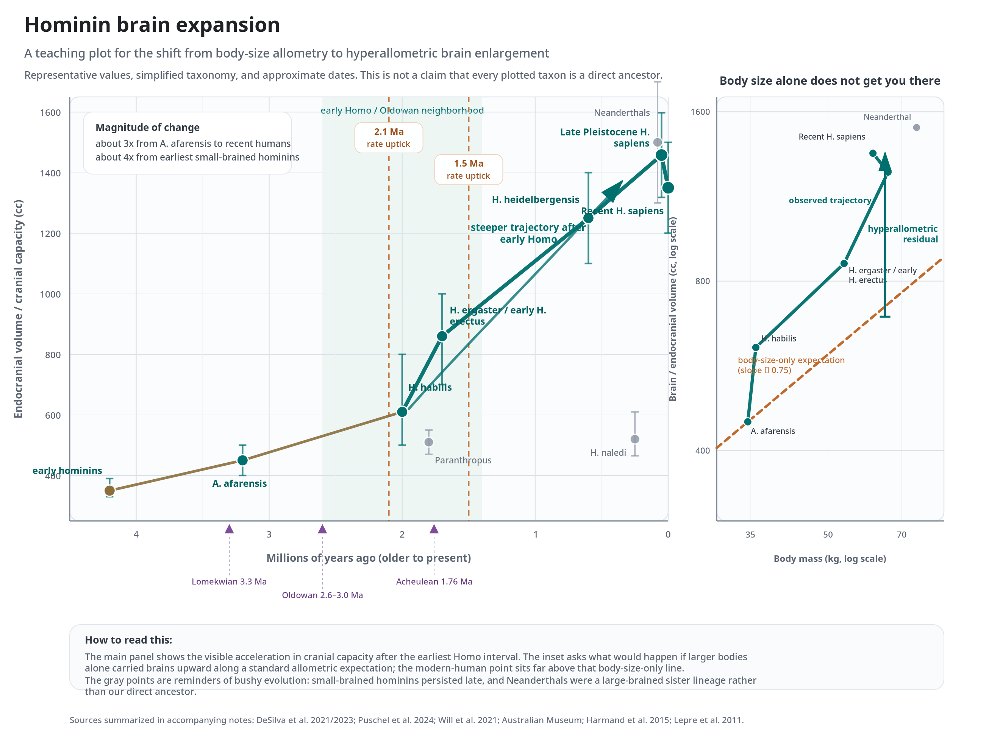

# Why Have a Brain? {#sec-why-brain}

> *Nothing in biology makes sense except in the light of evolution.*
> — Theodosius Dobzhansky

## The adaptive problem: fitness and movement

The evolutionary biologist Theodosius Dobzhansky left us a line that has hardened into a slogan precisely because it keeps turning out to be true: nothing in biology makes sense except in the light of evolution [@dobzhansky1973]. Applied to the brain, the slogan does real work. Seen on its own, the brain is an intimidating three-pound tangle of tissue, a "pile of sundry facts," in Dobzhansky's phrase, that resists any unifying account. Seen in the light of evolution, it becomes something more tractable: an organ shaped, over an enormous span of time, to solve particular problems for the body that carries it. The whole strategy of this book is to keep that light switched on.

The problems in question are set by **biological fitness**. Fitness, in the evolutionary sense, is not health or vigor or longevity; it is *reproductive success* — the business of passing one's genes to the next generation. This is the only outcome evolution ultimately keeps score of. Of course, an organism must survive long enough to reproduce, so survival — finding nutrients, avoiding predators — are tightly bound up with fitness. But it is worth remembering that when survival and reproduction come into conflict, reproduction wins. Indeed, in many species mating is outright fatal, typically for the male, and natural selection tolerates this without the slightest hesitation, because a male who mates and dies has done better, in the only currency that counts, than a male who survives and does not.

Two cautions need stating before we go further.

The first is that **evolution does not plan**. It has no foresight and no goals. It is a serious error — though a seductive and grammatically convenient one — to say that a structure evolved "in order to" perform some function. What actually happens is blinder than that: random mutations alter structure, and the environment then selects, after the fact, for whatever variants happen to leave more descendants. So when, later in this chapter, I ask *why* the brain grew larger, I am using "why" only as shorthand. The careful version of the question is always: *what advantage did a larger brain happen to confer that improved the fitness of the individuals who had it?* I will use the loose phrasing because it reads better, but I mean the careful thing every time.

The second caution is that a costly trait will not be favored merely because it *could* be useful. The psychologist Nicholas Humphrey put the point with real force: "nature is at least as careful an economist as Henry Ford, and does not tolerate needless extravagance on her production lines. Superfluous capacity gets trimmed; new capacity is added only when it pays its way. We should therefore be suspicious of any claim that an animal — and humans most of all — is dramatically *cleverer than it needs to be*, because such a claim asks us to believe that selection paid for an expensive capacity that conferred no advantage." As we will see, the brain is one of the most expensive organs an animal can carry, which makes this economic logic unusually sharp when applied to brains. Whatever the brain is for, it has to have earned its keep.

So: what is the most basic thing a brain buys? The answer is **adaptive movement**. A nervous system lets an organism connect an external sensory event to a motor command — to move *toward* what is rewarding (food, a mate) and *away* from what is punishing (a predator). That linkage of sensation to action, mediated by an internal nervous system, is the foundational service brains provide, and nearly everything else is an elaboration of it.

It is important to understand that a brain is not strictly necessary for life, nor even for movement as such. The single-celled amoeba has no nervous system and no brain, yet it moves adaptively, extending pseudopods toward nutrients and away from harm. It manages this because its outer membrane is in direct contact with the world: the same surface that senses the environment is the surface that responds to it. The amoeba needs no *internal representation* of an external world, because for an organism that small and that simple, the world is, in effect, already pressed against its skin. A brain becomes worth having only when an organism is large and complex enough that sensation and action can no longer be collapsed onto a single membrane — when there is a gap between perceiving and acting that something has to bridge.

### The sea squirt and the cost of a brain

If you want a single organism that dramatizes both the value *and* the cost of a brain, it is the sea squirt — a marine animal that belongs, surprisingly, to our own phylum, Chordata. In its larval stage the sea squirt is a tadpole-like swimmer. It has a notochord (the precursor structure that, in vertebrates, becomes the backbone) and a small cluster of neurons, a ganglion, that serves as a primitive brain. That proto-brain has exactly one job: to guide the larva's swimming as it searches for a good place to anchor.

And here is the instructive part. Once the larva finds its rock and cements itself in place, it transforms into a sessile adult that no longer moves. It feeds by drawing seawater through internal chambers and filtering out microscopic food; it reproduces, being hermaphroditic, by releasing both eggs and sperm into the water (and can also bud asexually). It does, in short, none of the things that require steering a body through space. And so the adult sea squirt digests its own brain. The ganglion that guided the larva is reabsorbed as surplus once adaptive movement is no longer needed.

A brain is metabolically expensive. Devoting a proportion of an organism's strictly limited energy budget to maintaining a brain that no longer improves its fitness is not neutral; it is *maladaptive*. Selection will favor the individual that stops paying for what it no longer uses. The sea squirt simply makes the accounting vivid: no movement, no brain.

This already tells us something about how to read the rest of the story. Brains are not free goods that accumulate whenever they might be handy. They are costly investments that have to be continuously justified by the returns they bring — and the central puzzle of human evolution, the one this chapter builds toward, is how our lineage came to afford an organ this expensive when the books are balanced so tightly.

:::{.callout-note}
## Sensation and movement are not the whole story
It is fair to ask whether the brain is *entirely* devoted to sensing and moving. Plainly it does a great deal more, and the proportion devoted to raw sensory and motor processing is itself revealing. A human body sends a torrent of signals inward — roughly twenty square feet of skin to be monitored, on the order of 650 named skeletal muscles to be controlled — and yet, across mammals, the fraction of cortex given over to *primary* sensory and motor functions actually *shrinks* as one moves from simpler species toward more complex ones. The hedgehog devotes most of its cortex to primary sensorimotor work; the prosimian less; the human less still. What expands in that series is the cortex that lies *between* sensation and action — the so-called association cortex, where the predictive, integrative work of an allostatic control system gets done. The trend is itself a clue: encephalization is, in large part, the growth of the tissue that sits between input and output, the tissue that lets an animal forecast rather than merely react.
:::

## Is a larger brain just a larger body? Allometry

A natural deflationary hypothesis now presents itself. Perhaps brains get bigger simply because *bodies* get bigger, and brain size is nothing but a passive consequence of body size. The reasoning is not silly: a larger body has more skin to sense with, more muscle to command, more of everything to look after, so perhaps a larger brain is just what you get, automatically, when you scale an animal up. On this view the big brain would be **epiphenomenal** — a secondary byproduct, riding along on body size, rather than anything selection acted on directly.

This is exactly the kind of hypothesis that the paleontologist Stephen Jay Gould and the geneticist Richard Lewontin taught a generation of biologists to take seriously, in their famous warning against "just-so stories" and overly enthusiastic adaptationism. Their architectural metaphor, the *spandrels of San Marco*, is worth keeping in mind throughout this book: a spandrel is the roughly triangular space left over where two arches meet, and in the cathedral of San Marco those spaces are filled with such beautiful mosaics that one could easily mistake them for the *purpose* of the structure. But the spandrel is a byproduct of putting arches side by side; it was not built in order to hold a mosaic. Gould and Lewontin's point was that many biological traits are spandrels too — structural leftovers to which we wrongly attribute adaptive stories. Before we tell a heroic tale about *why* the human brain is large, we are obliged to rule out the deflationary possibility that its size is a spandrel of body size.

The tool for ruling it out is **allometry**, the quantitative study of how the size of one body part scales against another, or against the body as a whole, over developmental or evolutionary time. The key insight is that many biological relationships follow **power laws** — one quantity proportional to another raised to some exponent — and a power law has a tidy signature: plotted on log–log axes, it appears as a straight line whose slope is the exponent. The classic example is Kleiber's law, which relates an animal's metabolic rate to its body mass and holds across an astonishing range of sizes. When we make the analogous plot for brains, putting body size on one axis and brain size on the other for many species, we do indeed find an overall straight-line (power-law) relationship. A large fraction of the variation in brain size across species really *can* be accounted for by body size. So far, the deflationary hypothesis looks healthy.

But the interesting biology is in the *departures* from the line, and there is a vocabulary for them:

- **Isometry** — proportions are preserved as size changes; the trait scales exactly as the baseline predicts.
- **Hypoallometry** (negative allometry) — the trait is *smaller* than the isometric baseline predicts.
- **Hyperallometry** (positive allometry) — the trait is *larger* than the baseline predicts.

(If you plot brain against body weight for vertebrates, incidentally, you find not one line but two roughly parallel ones — a higher line for mammals and a lower one for fish, amphibians, and reptiles. The offset reflects a real architectural difference: mammals possess a six-layered cortex that the others lack, which raises brain weight for a given body size and so lifts the whole mammalian line.)

The deflationary hypothesis predicts that every species should sit *on* the line — that brain size should be pure isometry with respect to body size. The story gets interesting exactly because some lineages, ours  among them, sit well *above* it.

### The encephalization quotient, and a warning about it

Comparing brains across wildly different species is genuinely hard, and a naive comparison can mislead in either direction. Consider the raw numbers. A blue whale's brain weighs about 15 pounds against our roughly 3; an elephant's about 12 pounds. By absolute mass, then, we are nowhere near the top. Nor does taking brain as a *fraction of body* rescue human exceptionalism in any simple way: a blue whale is about two thousand times our body weight but only about five times our brain weight, so its brain is around 0.5% of its mass while ours is about 2% — but a mouse's brain is roughly 10% of its body mass, and an ant's a remarkable 17%. By the "percentage of body" measure, we are humiliated by rodents and insects. Clearly neither absolute brain size nor brain-as-fraction-of-body is, by itself, capturing whatever we are trying to capture.

To do better, the psychologist Harry Jerison introduced, in his influential 1973 book *Evolution of the Brain and Intelligence*, the **encephalization quotient** (EQ) [@jerison1973]. The idea is to measure not a brain's size but its *deviation from expectation*. Build the regression line of brain size against body size for some reference group — all mammals, say, or all primates — and then ask, for a given species, how far above or below that line it falls. A species with exactly the predicted brain for its body has an EQ of 1; a species with twice the predicted brain has an EQ of 2. This is a real improvement on raw mass, because it explicitly factors out the body-size effect that the deflationary hypothesis was built on. And by this measure, robustly, across whatever sensible reference group you choose, **humans come out on top**. The hyperallometry is not an artifact of one particular comparison; it is a stable fact about where our lineage sits relative to the line.

We must be cautious here, however, because EQ is exactly the sort of number that invites over-interpretation, and some critics believe it invites fabrication. The anthropologist Ralph Holloway has been pointedly skeptical, and his objection is worth quoting because it is a useful corrective to any triumphalism:

> Just as the human animal is curious, it is also vainglorious, always trying to find a measure that places it at the top. Thus we can fabricate a device, the Encephalization Coefficient or EQ, which shows that relative to any database, the human animal is the most encephalized animal living [@holloway2015].

Holloway's deeper point is conceptual, not merely sardonic: *EQs do not evolve*. What evolves is the underlying relationship between brain weight and body weight in real populations; EQ is a derived statistical convenience that has no existence outside the reference database you happen to choose, and that was never designed to describe variation *within* a species. (His own example: by EQ, human females come out "more" encephalized than males, owing to their smaller bodies and greater proportion of non-innervated fat — a difference with no known behavioral consequence whatsoever, since the sexes are of equal overall intelligence. The number moves; nothing real moves with it.) There is a related and substantive empirical worry, too. Robert Deaner and colleagues have argued that *within* the primates, the best predictor of cognitive performance is not EQ at all but **absolute** brain size — that scaling brain by body, far from clarifying things, may actually throw away the signal you care about [@deaner2007].

So we should hold EQ at arm's length: it is a useful instrument for organizing brain–body relationships across the diversity of animals, and the human position above the line is real and demands an explanation. But EQ is a lens, not a fact about the world, and a more honest comparison is often available — namely, to compare brains among *closely related* species, where differences in ecology, behavior, and brain function can be matched up against differences in size in a controlled way. That is the strategy we will lean on when we ask, shortly, *why* the brain expanded. The cross-species line tells us human brains are unusual. To learn why, we have to look within our own corner of the tree.

## The trajectory of hominin brain evolution

To understand human brain expansion we have to locate ourselves precisely on the tree of life, because the expansion is a feature of one specific twig. Taxonomically, a human is a chordate, a vertebrate, a mammal, a primate, and a member of the family Hominidae — the **great apes**, which today comprise four living genera: *Pongo* (orangutans), *Gorilla* (gorillas), *Pan* (chimpanzees and bonobos), and *Homo* (us). Stepping back through deeper time: primates diverged from other mammals somewhere around 55–85 million years ago, and the great apes split from the lesser apes (the gibbons) perhaps 12–18 million years ago. Within the great apes, the lineage leading to chimpanzees and to modern humans separated from the lineage leading to modern gorillas around 12 million years ago, and our last common ancestor with chimpanzees lived roughly 6 to 8 million years ago. This is illustrated in @fig-clade.

::: {#fig-clade}
[**View the Interactive Primate–Hominin Teaching Clade (opens in new tab) ↗**](figs/primates-hominin-teaching-clade.html){target="_blank"}

The primate–hominin clade, with the relevant subset highlighted.
:::

That last figure invites a misconception worth dismissing immediately, because it distorts how people picture the whole process. **Humans did not evolve from chimpanzees.** Chimpanzees are not an earlier draft of us; they are our contemporaries, the product of just as many millions of years of independent evolution since our shared ancestor as we are. The relationship is collateral, not lineal — cousins, not grandparent and grandchild.

And here is a fact that should genuinely surprise you, given those millions of years apart: modern humans and modern chimpanzees share approximately **98.8% of their DNA**. The phenotypic gulf between us and them is vast; the genetic gulf is slender. The resolution of this apparent paradox is one of the most important ideas in modern biology, and it will recur throughout this book: most of the difference lies not in *which* genes we have but in *how they are regulated* — the timing, sequence, and duration of their expression during development. Chimpanzees and humans are built largely from the same genes making largely the same proteins; what differs is the developmental *program* that switches those genes on and off. This is the first appearance of a theme that @sec-evo-devo will make central. Evolution, working on the regulatory machinery of development, can produce enormous changes in form while barely touching the protein-coding parts list. The genome is less a blueprint than a recipe, and the same ingredients, added in a different order and cooked for different times, yield a strikingly different dish.

### The hominins, and the company we used to keep

The members of the lineage leading specifically to modern humans — after the split from the chimpanzee line — are the **hominins**. Today, *Homo sapiens* is the only hominin left alive, and this solitude is so familiar that we mistake it for the natural order of things. It is not. For most of hominin history, *several* species of *Homo* coexisted. The fossil and genetic records make this unmistakable. *Homo neanderthalensis* — the Neanderthals — overlapped with *Homo sapiens* in Europe before going extinct around 40,000 years ago, and they did not merely coexist: most living people outside sub-Saharan Africa carry roughly 1–4% Neanderthal DNA, the genetic residue of interbreeding (the exact percentage varies by population).

A couple of caveats belong here, because this is a domain where confident textbook statements often outrun the evidence. Whether Neanderthals were a distinct species (*Homo neanderthalensis*) or a subspecies of our own (*Homo sapiens neanderthalensis*) is not settled — different researchers use different names, and the disagreement reflects a genuine lack of consensus about how distinct they really were. More broadly, the dating of fossils, and the question of whether a given fossil represents a known species or a new one, is frequently revised and occasionally contentious. The ability to extract ancient DNA has revolutionized the field, but it comes with a built-in bias that is easy to overlook: DNA survives best in cold conditions — it has been recovered from a million-year-old mammoth tooth in Siberia — and worst in exactly the warm, equatorial African environments where the hominin story began. So our most powerful new window into the past is systematically cloudier over the very region we most want to see. This is not a reason to distrust the field; rather, it is a reminder that our knowledge is inherently asymmetrical: while our picture of ancient Eurasia is increasingly drawn in high-resolution genetics, our deepest African chapters must still largely be read through the older, harder science of stones and bones.

### Four million years, a fourfold increase

For our purposes the single most arresting fact about hominin evolution is the growth of the brain itself. Over roughly the last four million years, brain size in our lineage **quadrupled** relative to the earliest hominins. Some of that increase was merely allometric — the brain growing in step with a growing body, sitting on the line. But much of it was *hyperallometric*: the brain pulled away from the line, growing faster than body size alone can explain. When the cranial-capacity data are plotted against time, the most striking feature is an *acceleration* — a distinct steepening of the curve beginning around 2.5 million years ago, coincident with the emergence of *Homo habilis* and *Homo erectus* and with the first clear archaeological signatures of stone tools. (More recent change-point analyses of the fossil record place sharp upticks in the *rate* of brain evolution at roughly 2.1 and 1.5 million years ago, again coinciding with the early radiation of *Homo* and with technological change in the record [@desilva2021].) Something happened around the dawn of our genus that put brain expansion onto a new and steeper trajectory, and most of the rest of this chapter is an attempt to say what.

::: {#fig-brain}
[{width="100%" .nolightbox}](figs/hominin-brain-expansion.html){target="_blank"}

Hominin brain expansion. Click the figure to open the interactive version in a new tab.
:::

### A genuine controversy: did our brains recently shrink?

Here the story takes a turn that, in the decade I have been teaching this material, has gone from a curiosity to a lively dispute in the field — and it makes an excellent case study in how science actually proceeds when the data are thin and the stakes are interpretive.

If one looks closely at the very recent end of the cranial-capacity record, you find something unexpected: a *decrease* in brain size in *Homo sapiens*. The comparison with Neanderthals is part of the puzzle. Neanderthal brains were, if anything, somewhat *larger* than ours, and differently shaped — more elongated, against the more globular *sapiens* skull — though Neanderthals also had larger bodies, which complicates any direct read. But the more provocative claim concerns *sapiens* alone, in the very recent past, after the Neanderthals were already gone.

There are, at present, at least three positions, and rather than smooth them into a single tidy narrative I think it is more useful — and more honest — to lay out the actual exchange, because watching a disagreement unfold teaches more about science than any settled conclusion can.

*The face-shape account.* Zollikofer and colleagues argued that changes in the *sapiens* skull over the past 200,000 years were driven not by the brain at all but by a change in **diet**. As diets shifted and required less heavy chewing, the extensive facial musculature and the robust bone needed to anchor it were no longer necessary, and the face became smaller and more childlike. On this view, much of what looks like cranial change is about the face, not the brain.

*The self-domestication account.* A widely discussed 2021 analysis by DeSilva and colleagues used change-point methods on a large compilation of crania and reported something startling: that human brain size did genuinely decrease, and that the decrease was *surprisingly recent* — within roughly the last 3,000 years, coincident with the rise of complex, information-storing societies [@desilva2021]. Their proposed mechanism drew an analogy to **self-domestication**. Domesticated animals reliably have smaller brains than their wild ancestors — domesticated cattle, for instance, have brains roughly a quarter smaller than their wild progenitors — and the leading idea is that domestication selects against aggression, with reduced brain size following as a correlate of increased docility. Applied to humans, the suggestion is that increasingly social, cooperative living purged the most aggressive individuals and *offloaded* cognitive work onto the group, so that an individual could get by with somewhat less brain — collective intelligence, in effect, subsidizing a reduction in the individual organ. DeSilva and colleagues drew an explicit parallel to eusocial insects such as ants, where collective organization and individual brain investment trade off.

*The "it didn't happen, or not then" account.* This is where the dispute became genuinely instructive. Villmoare and Grabowski (2022) reanalyzed portions of the same dataset and were **unable to detect any reduction in brain volume** over the claimed window at all [@villmoare2022]. They argued that the sample mixed together populations from regions where agriculture and complex society arose at very different times, so that a single global "change point" at 3,000 years ago is not the right thing to look for; pool such heterogeneous data and you can manufacture an inflection that corresponds to nothing real. DeSilva and colleagues then replied (2023), defending a recent reduction and noting that brain-size decrease in the Holocene has in fact been reported by many researchers over nearly a century, while conceding that the precise timing and cause remain open [@desilva2023].

I am presenting these arguments at length on purpose. It would be easy to write a confident paragraph asserting that human brains shrank 3,000 years ago because of self-domestication, and easier still to write one asserting that they did no such thing. The truthful statement is that **there is no consensus about whether, when, or why** *Homo sapiens* brain size has recently changed. The candidate explanations — reduced body size, dietary and developmental shifts, self-domestication, the externalization of memory into culture and the group — are not even agreed to be explaining a real phenomenon yet. This is not a failure of the field; it is what the frontier of a data-limited science looks like. The habit of accepting uncertainty is one of the most valuable things this book can teach you — and because, as we are about to see, the very same pattern of productive, unresolved disagreement runs straight through the central question of the chapter.

## Why did brains get larger?

We arrive at the chapter's central question, with the careful translation firmly in mind: *what advantage did a larger brain confer that improved biological fitness, such that larger-brained individuals out-reproduced their smaller-brained rivals and the trait spread?* The acceleration around 2.5 million years ago tells us that something changed; the hypotheses below are competing accounts of what. I will lay out the major ones roughly in the order they entered the literature, and then — this is the important part — resist the temptation to declare a winner, because the honest state of the evidence does not support one.

A word of method before we start. Several of these hypotheses make the same general kind of argument: find a contrast between closely related species that differ in some ecological or social variable, and check whether the species facing the greater demand also has the larger (or more elaborated) brain. This is the "compare close relatives" strategy that EQ pushed us toward, and it is far more trustworthy than any cross-the-whole-animal-kingdom comparison.

### Foraging and diet

The first family of hypotheses proposes that a larger brain is an adaptation for finding, remembering, and extracting **food**. Calories are the currency of survival, and food that is hard to locate or hard to process places a premium on the neural machinery for doing so.

The cleanest illustrations come from matched comparisons. Among New World monkeys, the howler monkey is a folivore — a generalist leaf-eater — while the closely related spider monkey is a frugivore, specializing in fruit. The two are about the same body size, yet the frugivorous spider monkey has a notably larger and more folded brain. Why should fruit demand more brain than leaves? Because leaves are everywhere and fruit is not. Finding fruit requires spatial memory for where the trees are and seasonal memory for when they bear; spotting ripe fruit against a backdrop of foliage demands acute, often color-discriminating vision; and getting at the edible part frequently calls for manual and cognitive skill, up to and including cracking nuts. Leaves ask almost nothing of an animal beyond the willingness to chew. The contrast between two similar-sized monkeys with very different diets isolates diet as the variable and points at it as the driver.

Birds tell a parallel story with a different organ. Among corvids (crows and their relatives) and among the titmice, the species that **cache** food — hiding seeds in scattered locations to recover through the winter — have a markedly larger **hippocampus**, the structure most associated with spatial memory and navigation, than closely related non-caching species. For a bird like the mountain chickadee, this is not a luxury but a matter of life and death: it survives the winter on seeds it hid months earlier and must remember where, so a larger hippocampus translates fairly directly into surviving to breed — into fitness. (Remember the chickadee; it returns when we discuss sexual selection.)

### The cognitive buffer

A second hypothesis is subtler and harder to pin to a single organ. The idea is that a larger brain provides a general-purpose **buffer** against the unexpected — that intelligence pays off most when the environment throws a novel problem at an animal, one no fixed behavioral routine anticipates.

The suggestive evidence again comes from birds: across species, larger-brained birds (corrected for body size) tend to have *lower* mortality in the wild. The favored interpretation is that bigger-brained birds are behaviorally more flexible and more inventive, and so can improvise solutions when conditions change — a hard winter, a new predator, a vanished food source — where a less flexible bird would simply die. Exactly *why* the correlation holds is not known with certainty, and one should be candid that "behavioral flexibility" is doing a lot of unexamined work in the explanation. But the buffering idea has a further implication worth stating, because it punctures any lingering assumption that intelligence is a primate specialty. When researchers try to measure intelligence across species — using metrics that emphasize behavioral and mental flexibility and the generation of novel solutions — they find that intelligence has evolved **more than once**. There are more- and less-intelligent species among the mammals, and, independently, among the birds; and the bird and mammal lineages diverged over 300 million years ago. Whatever intelligence is, evolution has built it at least twice, on independent neural substrates. That fact will matter a great deal in Chapter 2, and it is fatal to any story in which human intelligence depends on some unique structure that evolution had to invent from scratch.

### Sexual selection

The third hypothesis comes from a different evolutionary mechanism altogether, one Darwin himself identified: **sexual selection**, which operates *within* a species through mating choice and competition rather than through differential survival. Sexual selection is worth distinguishing sharply from ordinary natural selection because it can act with surprising speed and can drive traits to extremes that survival selection would never tolerate — when a trait that females prefer comes to dominate, it can sweep through a population quickly, even if it is useless or worse for staying alive.

The textbook examples are the extravagant ones: the peacock's tail, the colossal antlers of the extinct Irish elk. These ornaments are costly and serve no direct survival function — you cannot fight or forage better for having them — and that uselessness is precisely the point. Because they are expensive, only a genuinely healthy, well-provisioned animal can afford to grow them fully, so the ornament becomes an *honest signal* of underlying quality. Gould noted that a healthy Irish elk could grow antlers weighing 40 kilograms, while a sickly or malnourished one managed only 20: the antler is, in effect, a hard-to-fake readout of the male's condition and, indirectly, his genes. A female choosing the larger-antlered male is choosing good genes, even though the antlers themselves do nothing for her offspring but advertise.

Geoffrey Miller, in *The Mating Mind*, extended this logic to the brain itself: perhaps the human brain is, in part, **sexual ornamentation** — a showpiece. How could a brain advertise? Through the complex, skilled behaviors it makes possible — art, music, athletic display, wit, storytelling — none of which is obviously necessary for survival, and all of which are hard to do well. Think of a Swiss watch: it is valued not only for telling time but as evidence that every one of its intricate internal parts is flawless, because only a perfect mechanism keeps perfect time. On this view, a dazzling display of artistic or verbal or athletic skill is prized by a prospective mate as evidence that the underlying machinery — the brain, and the genome that built it — is in excellent order. It is an interesting idea, and it accounts naturally for some otherwise puzzling features of human behavior, such as our extravagant investment in arts that seem to do nothing for survival. I would only repeat our standing caution: it is also exactly the kind of adaptive story that is easy to tell and hard to test, and Gould and Lewontin's spandrel should hover at the back of the mind. That said, sexual selection need not act only on showy traits. Recall the mountain chickadee: females have been shown to prefer males with better *spatial-navigation* ability — an unglamorous skill, but a survival-critical one in a bird that lives or dies by recovering cached food. Sexual selection can select for a practical capacity just as it can inflate a useless ornament.

### The social brain

The fourth hypothesis is the one this book pays the most attention to, partly because it has been so influential and partly because its rise and partial fall is such a clean illustration of how science works.

The seed was planted by the primatologist **Alison Jolly**, working with lemurs in Madagascar in the 1960s, who was perhaps the first to argue that the principal selective pressure on primate intelligence was not the physical environment at all but the *social* one — the demands of living among other clever, scheming conspecifics. Nicholas Humphrey developed the thought: in a complex society, an individual gains by both maintaining the group (which it needs) and exploiting other members of it (which serves its own ends), and threading that needle — cooperating and competing with the same individuals at once — requires considerable intellectual machinery, a continual game of "social plot and counter-plot." Byrne and Whiten gave the idea its memorable, slightly sinister name, the **Machiavellian intelligence hypothesis**, emphasizing the cognitive demands of social deception. And deception is cognitively special, because to deceive another individual you must first model what that individual *believes* — you need a **theory of mind**, an internal representation of another's mental states, a capacity we will return to in detail in later chapters. The thread running through all of this is that the toughest problem a primate faces is *other primates*.

**Robin Dunbar** built this into the explicit **Social Brain Hypothesis**, and did so quantitatively, which is what gave it teeth. Dunbar considered the ecological hypotheses we have just surveyed — diet, mental maps, extractive foraging — and *rejected* them as the primary driver, proposing instead that the single critical variable is the size of an animal's primary social group, its "clique." His evidence was an allometric relationship: across primate species, the relative size of the neocortex scales linearly with the size of the typical social group. Bigger groups, bigger neocortex. Extrapolating the primate line out to humans yields the famous **Dunbar's number** — roughly 150, the supposed cognitive ceiling on the number of genuine, two-way social relationships a person can maintain. (Dunbar's number entered popular culture largely through Malcolm Gladwell's *The Tipping Point*. I will admit I have always found 150 rather high; the gloss I like best is that it is the number of people you would be comfortable having a drink with if you ran into them unexpectedly at an airport — and even that, for me, overstates it.)

It is hard to overstate how generative this hypothesis was. It launched the entire field of *social neuroscience* and a search for brain regions specialized for social life. But it is also where I have to introduce a serious note of caution, of two kinds.

The first concerns a tempting but problematic extension. Dunbar's original relationship is a claim *across species*: it relates a species' typical group size to that species' typical neocortex ratio. A series of later studies — several co-authored by Dunbar — instead correlated individual differences in the size of particular brain structures with individual differences in the size of a person's social network, using non-invasive MRI. Two of the most attention-grabbing were a 2010 report from Lisa Feldman Barrett's lab linking amygdala volume to real-world social network size, and a 2012 study extending this to the number of a person's Facebook friends. Now, this is a large leap in the level of explanation, and the leap is not automatically valid. It is entirely possible that something like Dunbar's number explains differences in sociability between species while telling us nothing about why one individual human has a larger amygdala or a larger network than another. I will be frank that I have always been skeptical of this individual-differences literature, and that skepticism has been vindicated: large-scale replication attempts have since found no reliable evidence for these correlations (e.g., Boekel et al., 2015). I want you to understand why these initial findings failed to hold up: there are many brain regions one could measure, many ways to quantify the "size" of each (raw volume, volume corrected for total brain size, and so on), and many ways to operationalize a person's "social network." With that many investigator degrees of freedom, combined with the small sample sizes typical of early MRI research, the probability of turning up some significant-looking correlation by chance is staggeringly high. It is a vital lesson in why we must maintain methodological skepticism even toward published, attention-getting findings.

The second caution is more damaging to the Social Brain Hypothesis itself, and it returns us to the productive-disagreement theme. The ecological and dietary explanations that Dunbar dismissed were never actually *refuted* — and they have come roaring back. In 2017, DeCasien and colleagues directly pitted social against ecological variables in a sample of **140 primate species** — far more than Dunbar originally examined — using updated phylogenetic methods. Their result was a direct challenge: brain size was predicted by **diet** (frugivores having larger brains than folivores), and they found *no* evidence that social complexity, by any of several measures, explained additional variation once body size and phylogeny were accounted for [@decasien2017]. For a few years this looked like it might have settled the matter in favor of ecology.

But it did not settle it, and the way it failed to is the real lesson. Dunbar pushed back hard, and on a substantive point: he argued that diet and sociality are not even the same *kind* of thing, and so should not be pitted against each other as rival "causes." On his view, diet is a *constraint* — better food supplies the energy a big brain needs — while social complexity is the *selective pressure* that makes the big brain worth paying for. "What they essentially claim," Dunbar objected, "is that improvements in diet drove the evolution of large brains so as to allow improvements in diet." He also disputed DeCasien's methodological choices, particularly the use of total brain size rather than neocortex size. And then, crucially, a 2023 reanalysis by Grabowski, Kopperud, Tsuboi, and Hansen — using a larger sample again and more sophisticated phylogenetic models — found that **both** diet and sociality independently predict primate brain size [@grabowski2023]. Not one or the other: both. Dunbar, in turn, has continued to defend and refine the social hypothesis at length, including in a thirty-year retrospective on the idea [@dunbar2024].

So where does that leave us? Not with a winner. It leaves us with a genuine, ongoing scientific argument in which the most recent and most careful analyses point toward **integration** — diet and sociality as complementary rather than competing, the one supplying energy and the other supplying the reason to spend it. This is unsatisfying if what you wanted was *the answer*, but it is nonetheless appropriate. The extended back-and-forth, as new data are marshaled first for one side and then the other, is the *normal* condition of a hard empirical science, not a sign that something has gone wrong. Hypotheses thought dead are revived when a new method gives them fresh support; consensus, when it comes, comes slowly. This can be genuinely uncomfortable for a student who, reasonably enough, wants to know the facts *now*. My advice is that learning to live with that discomfort — to hold several live hypotheses at once without collapsing prematurely onto one — is itself a central scientific skill. (And do not despair: there is plenty in this book that we *are* sure of. Just not this, not yet.)

### Interdependence: maybe the question is wrong

I have wondered if the framing of the whole debate — *which* single hypothesis is correct — may be subtly mistaken, and for a reason we established at the very beginning: **evolution does not have a plan**. There is no rule that says one and only one pressure drove brain expansion. It is entirely reasonable, and probably correct, to expect that a mutation enlarging the brain improved *several* things at once — better spatial memory for foraging *and* better bookkeeping for social relationships — and that the resulting larger brain was *paid for* by an improved, meat-rich, cooked diet, by calories saved from shrinking other expensive tissues, and by the energetic economy of walking upright (bipedalism uses roughly 25% fewer calories than knuckle-walking). On this view, asking whether the answer is "diet" or "sociality" is like asking whether the answer to "why is this company profitable" is "revenue" or "low costs." Both, obviously, and they interact.

A 2022 analysis by Kraft and colleagues develops exactly this integrative picture, and develops it in terms of **energy capture**, which I find the most illuminating way to frame the whole problem [@kraft2021]. Kraft's group compared how human hunter-gatherers (the Hadza, among others), slash-and-burn horticulturists, and great apes spend time and energy acquiring food. The results are genuinely counterintuitive. Humans, it turns out, expend *more* total energy on subsistence than great apes do — despite our more efficient upright locomotion. But we get a far higher *rate of return* on that investment, and farming returns more than hunting and gathering does. Kraft's bottom line overturns a natural assumption: humans did *not* primarily solve the energy problem by becoming more efficient — by using tools or upright posture to do the same work for fewer calories. We solved it by spending *more* energy to capture *much* more energy, producing a caloric *surplus*. We are not penny-pinchers; we are high-rollers who have historically won.

This reframing does something elegant: it dissolves the diet-versus-society dichotomy by showing how each *requires* the other. A high-cost, high-return extractive strategy — hunting large game, processing and cooking, eventually farming — is not something a lone individual can sustain. It demands **cooperation and a division of labor**, and a division of labor in turn demands the social machinery to coordinate it, to track who contributed what, to manage the relationships that hold a cooperative group together. Diet and sociality are not rival explanations on this account; they are two faces of a single strategy, each unworkable without the other. And the surplus that strategy generates is spent in a revealing place: on **reproduction**. Surplus calories support pregnant females and the famously needy human infant — and this was especially true of farming, which (despite requiring less work per calorie) yielded enough of a reproductive subsidy to raise fertility and drive the explosion of human population density that followed the dawn of agriculture. The energy did not just build bigger brains; it built more people to carry them.

We will pick up the cost side of this ledger in earnest in the next section, because the flip side of "how did we pay for a big brain" is "what stopped us from buying an even bigger one." But notice what the energy-capture framing has done to the chapter's central question. We began by asking *why* brains got larger and surveyed a set of seemingly rival answers. We end by suspecting that the rivalry was partly an artifact of expecting a single answer from a process that never promised one — and that the deepest account is not "diet" or "sociality" but the *interdependence* of foraging, diet, social cooperation, and reproduction, knit together by the economics of energy. That is a less tidy conclusion than a single winning hypothesis. I think it is also a truer one.

## What limits brain size?

If a larger brain improves fitness, an obvious question follows, and it is the question that makes the whole subject hang together: why not a larger brain still? Why are our heads not the vast, bulging domes that science fiction reliably gives to advanced aliens? The fact that brain expansion *stopped* — and, on some readings, even reversed — tells us that the advantages we have been cataloguing run into hard constraints. Those constraints are physical, developmental, and, above all, metabolic, and working through them turns out to illuminate the *whole* story, because the limits are simply the cost side of the same ledger whose benefit side we have been adding up.

### The energy constraint

Follow the energy. It is the first rule of this subject and the last. Brains are, gram for gram, among the most metabolically expensive tissue an animal can build, and the human brain is an extreme case. A few numbers fix the scale:

- The brain is roughly **2%** of adult lean body weight.
- It consumes about **20%** of an adult's total metabolism.
- It consumes more than **60%** of an *infant's* metabolism.

Read those again together. A fifth of everything an adult human eats goes to run an organ that is a fiftieth of the body; in a baby, the brain commandeers most of the entire energy budget. This is the "brain–brawn trade-off," and it is unforgiving. To support a given body and a given brain, an animal must take in a certain number of calories each day, and there is a ceiling on how many hours a day can be spent eating. Gorillas press right up against that ceiling: they spend close to the maximum feasible number of hours per day feeding, just to sustain the body and brain they already have. A gorilla cannot evolve a markedly bigger brain because it has no surplus in its energy budget to pay for one; the day is already full of chewing. To change the ratio, a species must either *extract more calories* from its environment or *spend fewer* elsewhere. The human story, as we saw, is that we did both — and the "did both" is what bought us the headroom that the gorilla lacks.

On the *extraction* side, we have already met the key moves and can now see them as solutions to a budget problem rather than as isolated facts. **Meat** is energy-dense, and hominins eat more of it than any comparable species. **Cooking** is, if anything, more important still: heat gelatinizes starches and breaks down the collagen in meat, making calories dramatically more available than they are in raw food, and so doing part of digestion's work *outside* the body before the food is ever swallowed. And more recent evidence points to **carbohydrates** as an underrated third factor — humans carry more copies of the gene for salivary amylase, the enzyme that begins breaking starch into sugar, than chimpanzees do, a genetic signature of a diet that came to lean on starchy foods. Each of these is a way of getting more calories out of the same foraging effort, loosening the energy constraint enough to afford more brain.

On the *savings* side, there are several converging strategies, and one of them deserves a closer look because the evidence around it has shifted.

The classic proposal is Leslie Aiello and Peter Wheeler's **Expensive Tissue Hypothesis** [@aiello1995]. Its logic is elegant. If the brain is an expensive organ, perhaps the calories to run a larger one were freed up by shrinking some *other* expensive organ — and the prime candidate is the gut. A diet of raw, fibrous plant matter requires a long, metabolically costly alimentary canal to extract enough nutrition. A shift to a calorie-dense, easily digested diet — meat, and above all cooked food — relaxes that requirement, permitting a shorter gut, whose energy savings can be redirected to the brain. And it is true that humans have a notably shorter large intestine than other apes, just as the hypothesis predicts. For years this was presented as more or less established.

But here is an update that the older textbook treatments miss. When Navarrete, van Schaik, and Isler tested the gut–brain trade-off across a large sample — about 100 mammalian species, including 23 primates — they could *not* confirm it: controlling for fat-free body mass, brain size was **not** negatively correlated with the mass of the digestive tract, or of any other single expensive organ [@navarrete2011]. The clean, direct gut-for-brain swap, at least as a general mammalian rule, did not survive contact with the broader dataset. (The picture within primates specifically remains murkier and contested, and the original intuition still has defenders.) But — and this is why the result is so much more interesting than a simple debunking — the same study found a trade-off that the older account had not emphasized: brain size traded off against **adipose tissue**, against fat. Animals that invested in larger brains tended to carry *smaller* fat reserves, suggesting that the relevant energetic competition may be less brain-versus-gut than brain-versus-body-energy-stores more broadly.

That finding dovetails with one of the most striking facts about human body composition, and lets us state it more precisely than the gut story alone allowed. Humans have a far higher ratio of fat to muscle than other primates — and muscle is expensive in a way fat is not: at rest, a pound of muscle burns roughly three times the calories of a pound of fat. From a comparative standpoint, humans are, bluntly, *under-muscled and over-brained*. We traded the metabolic cost of a powerful primate musculature for the metabolic cost of an oversized brain. (And bipedalism contributes here too: walking upright requires about 25% fewer calories than knuckle-walking, another standing economy that can be redirected toward the brain.) The general principle survives intact and is in fact strengthened: *any* adaptation that lowers the caloric demand of some other tissue frees calories to support a larger brain. What the modern data revise is the *specific* bookkeeping — the dominant saving was probably not a gut-for-brain swap but a broader reallocation away from muscle and fat stores toward neural tissue.

### The connectivity constraint

Energy is the most obvious limit but not the only one. There is a second, more geometric problem, and it sharpens beautifully into a single number.

A bigger brain means more neurons. But neurons are useful only insofar as they *connect*, and connections scale near exponentially. If the number of neurons grows linearly, the number of *possible* connections among them grows as roughly the square — formally, $N(N-1)$ for $N$ neurons. So even a modest increase in neuron count implies an enormous increase in potential wiring. And wiring is not free or weightless: neurons connect through axons, which are physical processes with real mass, occupying real space and consuming real energy. A brain cannot simply scale up while keeping every neuron richly connected to every other, because the connections themselves would balloon the organ past any workable size.

The decisive insight is that *not all brains wire themselves the same way*, and the difference is quantitative and measurable. Rodent brains, it turns out, are more **densely** connected — more connections per neuron — than human brains. This sounds like a point in the rodents' favor until you do the arithmetic, which is where the number lands with real force. Suzana Herculano-Houzel and colleagues estimate that if you took a human brain, with its roughly **86 billion neurons**, and wired it with the *connection density of a rodent brain*, the result would weigh on the order of **77 pounds** [@herculano2009]. A human brain built on rodent wiring rules would be a grotesque, unliftable object, metabolically and mechanically impossible. The only way to build a brain as large as ours is to wire it *sparsely* — to give up dense, uniform, all-to-all connectivity in favor of selective, modular connection, where most neurons talk directly to relatively few others and long-range links are comparatively rare. We will take up sparse connectivity and the modular organization of brain function in detail in later chapters; for now the point is that connectivity, not neuron number alone, is a fundamental brake on brain size, and that scaling up forced our lineage into a particular *style* of wiring.

I will add a caveat in the spirit of the rest of this chapter, because the "77 pounds" figure, striking as it is, rests on a simplification. Brain volume and weight are set by more than neuron number and connection count. The *packing density* of neurons, the *size* of individual neurons, and the number of non-neuronal cells — the **glia**, which we will return to and which turn out to be roughly as numerous as neurons rather than ten times as numerous, as older textbooks claimed — all contribute. Herculano-Houzel's body of work, which is the best modern entry point to this whole literature, shows that these cellular factors place real and species-specific limits on how large a brain can grow before the timing and energetic costs of neural communication become unviable. The wiring argument is valid and important; it is also, like everything here, a simplification of a richer cellular reality.

### Gestational and maternal limits

The third constraint operates not on the adult brain but on getting it *built* in the first place, and it is the site of yet another instructive reversal.

Human infants are born remarkably **altricial** — underdeveloped and helpless — and their brains are strikingly unfinished: a newborn has only about **25%** of the neurons it will eventually possess, with rapid brain growth continuing until around age seven. This extended, externalized brain growth is one of the most distinctive features of human life history, and the obvious question is why we are born so early, in such an unfinished state.

The traditional answer, repeated as settled fact in a great many textbooks, is the **obstetrical dilemma**. The story is appealingly simple: bipedalism reshaped the pelvis and narrowed the birth canal, while encephalization enlarged the fetal head, and these two demands collided. The "solution," supposedly, was to truncate gestation and deliver the baby early, before its head outgrew the available opening — hence our helpless, half-built newborns. It is a tidy, memorable narrative, and it has the structure of exactly the kind of just-so story Gould and Lewontin warned us about. When I have gone looking for hard evidence that it is actually *true*, I have come up surprisingly empty, and I am not alone: recent biomechanical work casts real doubt on it. Holly Dunsworth and colleagues have pointed out, among other problems, that there is no good evidence that a pelvis wide enough to deliver a more developed baby would actually impair walking — treadmill studies find no penalty in locomotor economy for wider hips — which knocks out the load-bearing assumption of the whole account [@dunsworth2012]. If wider hips cost nothing, then a narrow birth canal cannot be the thing forcing early birth.

The leading alternative shifts the constraint from *geometry* to *energy*, and it should sound familiar by now, because it is the same energetic logic that has governed the entire chapter. The **Maternal Energy Hypothesis** (sometimes the "energetics of gestation and growth" hypothesis) proposes that the timing of birth is set by a metabolic ceiling: a mother can supply only so many calories to a growing fetus, and birth is triggered when the fetus's escalating energy demands begin to outrun what her own metabolism can sustain. The baby is born not because its head no longer fits but because its growth rate has hit the limit of what can be paid for in utero. This relocates the dilemma from the pelvis to the maternal energy budget — and it ties the gestational limit on brain size back to the same currency, calories, that constrains everything else.

I should note that the pelvis has not been entirely exonerated, and the most recent work suggests the truth is intermediate. A 2024 analysis using a very large sample of human pelvic measurements found a genetic correlation between the dimensions of the birth canal and the dimensions of the head — evidence that pelvis and brain have, to some degree, **coevolved**, the birth canal widening in partial response to the demands of the head and thereby *partially mitigating* the dilemma rather than simply imposing it [@waxenbaum2024]. So the honest current picture is neither the old textbook certainty nor its flat rejection: bipedalism and birth do interact, but the relationship looks more like a negotiated coevolutionary compromise than a brute geometric conflict, and maternal energy is doing much of the work the pelvis was once assumed to do alone.

Whatever sets the moment of birth, the *consequences* of delivering such an energetically demanding, unfinished infant are profound, and they loop us straight back to the social brain. A newborn whose brain will consume 60% of its metabolism for years, and who cannot feed or protect itself, is an enormous ongoing energetic liability — one a mother often cannot meet alone. This selects powerfully for social arrangements that *subsidize* the cost of building a brain: **cooperative breeding**, in which group members beyond the mother help provision the young, and the pattern sometimes called **"grandmothering,"** in which post-reproductive individuals — who, unusually among animals, survive well past their fertile years — contribute calories and care to their grandchildren. The expensive brain, in other words, does not merely require a clever, cooperative social group as a *result*; it requires one as a *precondition*, because without the group's energetic subsidy the brain could not be grown at all. The cost side and the benefit side of the ledger turn out to be the same entries read in two directions.

### Pulling the constraints together

There is, almost certainly, **no single reason** the human brain is as large as it is — and, just as importantly, no single reason it is not larger still. The size we observe is the resolution of a tension between a set of advantages and a set of constraints, and the same factors appear on both sides of the balance. A brief inventory of what we have assembled:

- An **improved diet**, through meat, cooking, and starch, extracting more calories per unit of foraging effort.
- **Energetic savings** redirected to the brain — from bipedal locomotion, from a high fat-to-muscle ratio (and, on the older account, a shorter gut), all freeing calories for neural tissue.
- **Cognitive buffering** against environmental unpredictability, the general payoff of behavioral flexibility.
- **Maternal and social subsidies** — cooperative breeding and grandmothering — that pay the steep cost of building an altricial infant's brain after birth.
- The demands of **managing social relationships**, the bookkeeping of life in a complex group.

These are not five competing answers to be adjudicated. They are interlocking pieces of a single system in which energy capture, diet, social cooperation, and reproduction are mutually dependent — exactly the integration the energy-capture framing pointed us toward. The brain grew as large as this system could afford and no larger, and where the system's accounting shifted — as it may have shifted in the very recent past, if the brain-shrinkage data hold up — brain size may have edged back down. The organ is, from first to last, a creature of its budget.

## Are human brains special? {#sec-why-brain-special}

We come to the question that has animated the subject since antiquity, and that hovers behind everything in this chapter: is there something *qualitatively* unique about the human brain — some special structure, some magical component, that sets us apart from the rest of the animal kingdom? Or are we simply, in the relevant respects, a very large version of an ordinary primate brain?

The history of the search for a uniquely human brain structure is, frankly, a history of false alarms, and the pattern of those false alarms is itself the most important data point. In the nineteenth century, the great anatomist Sir Richard Owen argued that the **hippocampus** was a structure unique to humans, absent in apes, and made it a centerpiece of his case for human distinctiveness. He was simply wrong: the hippocampus is an ancient structure found across all mammals and beyond, and the claim provoked a famous and bitter dispute with Thomas Huxley. (The Victorian public found the whole affair irresistible, and Charles Kingsley satirized it in *The Water Babies*, mocking the solemn scientific hunt for a "hippopotamus major" in the brain.) More recently, history repeated itself in miniature. A distinctive class of large neurons called **spindle cells** (von Economo neurons) was heralded as uniquely human, and their restricted location even led some to nominate them as the seat of consciousness — until they were promptly found in elephants, great apes, whales, and other species. Time and again, a structure proposed as the magic ingredient of humanity has turned out, on closer inspection, to be present in other animals too.

This recurring failure is not bad luck; it reflects something deep about how evolution works, and it is worth stating as a principle because it will guide us through the entire book. **Evolution does not work by bolting wholly novel structures onto an existing brain.** It overwhelmingly modifies, extends, duplicates, and re-tunes what is already there. The conserved vertebrate blueprint we met in the unit introduction — and that @sec-evo-devo will develop in detail — means that the components of the human brain are, almost without exception, components we share with our relatives. My standing advice to any aspiring scientist, and the moral of the spindle-cell and hippocampus episodes both, is to be deeply skeptical of *any* claim that humans possess some unique brain structure. The base rate of such claims surviving scrutiny is dismal, and for a principled reason: evolution rarely operates that way.

If the answer is not a unique *structure*, the natural alternative is **quantity** — that human capabilities reflect not some special quality of brain matter but simply *more* of it, or more of certain parts, scaled up from an ordinary primate plan. This is where Suzana Herculano-Houzel's work, which we met among the constraints, reshapes the question, and reshapes it in a way that is both deflationary and oddly satisfying. By dissolving brains into a uniform suspension and counting the cell nuclei directly — the "isotropic fractionator," or, less formally, brain soup — she and her collaborators replaced decades of guesswork with hard numbers, and the numbers tell a consistent and humbling story.

First, the famous "100 billion neurons" of the older textbooks is wrong; the real figure is about **86 billion**. That sounds like a pedantic correction until you appreciate what the *missing* 14 billion means — as Herculano-Houzel likes to point out, the discrepancy is roughly "an entire baboon brain, and change." We had been overcounting ourselves by a whole monkey. Second, and more telling, the human brain has the neuron number, *and the neuron density*, of a **scaled-up primate brain** — it is almost exactly what you would predict for a primate with a brain our size. There is nothing anomalous in our cellular composition; we obey the primate scaling rules. Third, and most deflating to any lingering cortical chauvinism: of those 86 billion neurons, only about **19%** sit in the cerebral cortex — the wrinkled outer sheet that gets nearly all the attention in popular neuroscience and that we instinctively identify with thought. The lion's share, roughly **80%**, lives in the **cerebellum**, a fist-sized structure tucked beneath the back of the brain that the older "cortex equals cognition" picture had largely sidelined. The seat of our supposed uniqueness contains a *minority* of our neurons. And even our glia, long claimed to outnumber neurons ten to one, in fact roughly *match* them in number — another inherited "fact" that the counting quietly demolished.

What, then, is left of human specialness? Less than tradition assumed, and that is the point. We do deviate from the brain–body line, and we do have the highest EQ. But this looks more and more like a story of *quantity* than of *quality* — of being a primate brain scaled up past some threshold, rather than a primate brain endowed with some new and magical part. Herculano-Houzel's own summary, which I think is close to right, is that the human brain is *remarkable but not extraordinary*: remarkable in that it packs more neurons into the cerebral cortex than any other species, including the elephant whose brain is larger overall; but not extraordinary, in that it breaks none of the rules of evolution and contains no component we can point to as uniquely ours.

I will be candid that the field has not fully settled even this. The question is usually posed against other primates: is the human brain simply a "scaled-up" monkey or ape brain, or is there something more? There are still reports that particular structures show genuine hyperallometry in humans — the neocortex, on some analyses, is larger than primate scaling predicts — and the issue remains contentious. The most famous version of the "something more" claim concerned the **frontal lobes**. For years it was close to dogma that the frontal lobes were the part of the brain that made us human: disproportionately enlarged relative to other primates, and (as later chapters will discuss) heavily involved in abstract, high-level behavior. But more recent and more careful measurement has undercut even this. The human frontal lobes appear to be **isoallometric** — very nearly the size you would expect for a primate of our body mass, neither more nor less. They are not disproportionately large after all. What *does* appear genuinely elaborated is something subtler: prefrontal **gyrification**, the degree of folding. The human prefrontal cortex is proportionally *more folded* than that of other primates, packing more surface area into the same cranial volume. Whether that extra folding is merely a space-saving trick for fitting more cortical sheet into a finite skull, or whether it carries additional functional consequences of its own, is not yet clear, and is exactly the kind of question the coming chapters will have to grapple with.

A recent comparative study of primate cortical folding makes this last point concrete.

::: {.callout-note collapse="true"}

## Deeper Dive: The capuchin anomaly — when more becomes different {#sec-why-brain-capuchin}

A recent preprint by Heuer and colleagues offers a striking example of how a quantitative change in brain size may produce a qualitative change in brain organization [@heuer2025capuchin]. The authors analyzed cortical folding across a wide range of primate species and found that both the *amount* of folding and the *pattern* of folding track brain volume surprisingly well. In other words, primates with similarly sized brains can have similarly folded cortices even when they are not especially close relatives.

The most vivid case is the capuchin monkey. Capuchins are New World monkeys, but their relatively large, folded cortices resemble those of Old World monkeys with similar brain sizes more than they resemble the smoother brains of smaller New World monkey relatives. The authors call this the **capuchin anomaly**. Their proposed solution is not that capuchins and macaques independently evolved the same detailed genetic instructions for every fold. Instead, they argue that conserved developmental programs produce cortex with broadly similar thickness and mechanical properties, while evolutionary changes in growth alter how much the cortical sheet expands. Once expansion crosses a critical threshold, physical forces can cause the cortical sheet to buckle into gyri and sulci.

The visual argument is especially clear in the authors' movie, which orders primate brains by size rather than by phylogeny: [watch the cortical-folding movie](https://zenodo.org/records/16033813#:~:text=organisation%20and%20behaviour_Video_1_Evolutionary-,expansion,-trajectory_54species.mp4){target="_blank"}.

This matters for the question of human specialness. A larger cortex is not simply the same sheet made bigger. As cortical surface area expands inside a finite skull, the geometry of the system changes. Folding alters distances, neighborhoods, white-matter routing, and possibly the developmental conditions under which cortical areas mature. The lesson is not that genes are unimportant, or that folding explains human cognition by itself. The lesson is subtler: evolution may change a developmental parameter — how much the cortical sheet expands — and physical morphogenesis may turn that quantitative change into a new anatomical and functional landscape.

This is one way **more** can become **different**.
:::

So I will give you my own view, with the appropriate hedge that it is a view and not a settled fact. I do not think the evidence supports a magical, uniquely human brain structure; the long graveyard of such claims, from the hippocampus to the spindle cell, argues strongly against one, and the cellular accounting says we are a typical primate brain scaled up and slightly refolded. And yet — here is the hedge, and it matters — I do not think "merely quantitative" is the dismissal it sounds like. A quantitative increase, if it is large enough, can produce what is, for all practical purposes, a *qualitative* change in function. Water heated degree by degree does nothing dramatic until, at a particular temperature, it abruptly becomes steam; the change is continuous in its cause and discontinuous in its effect. My own best guess about the human brain is that something similar is true of it: that there is no new ingredient, only more of the old ones and a bit more folding, but that "more" crossed a threshold past which genuinely new capacities — language, cumulative culture, the works — became possible. Quantity, pushed far enough, can look exactly like quality. The vertebrate blueprint did not need to be redesigned. It only needed to be scaled, and scaled, until something new fell out the far side.

## Coda: a control system, scaled

It is worth stepping back, at the close, to see what we have actually been describing, because the answer connects directly to the frame this unit opened with and points toward the two chapters that follow.

We began by asking the most basic question — why have a brain at all — and the answer was *adaptive movement*: the brain exists to link sensation to action, to steer a body toward what helps and away from what harms. That is the irreducible core, the job the sea squirt's ganglion did and then, having anchored, no longer needed. Everything else in the chapter has been an elaboration of that control function, made under a relentless energetic budget. The expansion of the hominin brain was not, on the evidence, the construction of a disembodied thinking machine. It was the scaling-up of a *control system* — one that grew steadily better at *anticipating* the body's needs rather than merely *reacting* to them, and that paid for this gift of prediction in the hardest currency there is, calories, drawn from a richer diet, a reallocated body, and the cooperative labor of a social group.

This is where the distinction from the unit introduction earns its place. A thermostat reacts: it waits for the error and corrects it — *homeostasis*. The elaborated vertebrate brain forecasts: it uses sensory cues and the residue of experience to act *before* the error arrives — *allostasis*. Read the whole chapter in that light and a unifying interpretation emerges. The buffering value of intelligence is the value of *anticipating* novel challenges. The foraging payoff of memory is the payoff of *predicting* where and when food will be. Even the social brain, at bottom, is a machine for *predicting* the behavior of other agents — a theory of mind is precisely an engine for forecasting what another individual will do. What our lineage was buying, as it spent more and more energy on neural tissue, was *prediction* — and the association cortex that ballooned between sensation and action, the tissue whose relative expansion we noted near the start, is exactly the machinery in which that predictive, allostatic control is carried out. The brain got big, in the end, because prediction is expensive and, for our particular ancestors in their particular world, worth the price.

That reframing also tells us, finally, why the computer metaphor we set aside in the unit introduction was the wrong place to start, and why beginning with control was the right one. A brain that evolved to *predict and regulate a body* is not well understood as a von Neumann machine shuttling symbols between a processor and a passive store. It is better understood as a physical control system whose architecture *is* its function — and whose more abstract capacities, the ones traditional neuroscience puts first, arrived late in evolution as heavily elaborated outgrowths of the ancient business of keeping a body alive in an uncertain world.

To understand that architecture, we now have to ask how it is *built* — how evolution and development together produce a brain, and what the deeply conserved vertebrate plan actually is, the plan that we share with the fish and the frog and that has been running, with modifications, for more than half a billion years. That is the subject of **@sec-embodied-brain and @sec-connected-map**.

::: {.callout-tip collapse="true"}

## A note on what this chapter is sure of, and what it isn't

Because this chapter has dwelt so much on open questions, it is worth separating, plainly, the settled from the unsettled — both so you are not left thinking the whole subject is quicksand, and so you know exactly where the live edges are.

**We are confident that:** the brain's core function is to link sensation to adaptive movement; brains are metabolically extremely expensive; brain size scales with body size as a power law across species, with humans sitting well above the line; hominin brain size roughly quadrupled over ~4 million years, with an acceleration around the origin of *Homo*; intelligence evolved independently in birds and mammals; the human brain has about 86 billion neurons, most of them in the cerebellum, and is cellularly a scaled-up primate brain; and dense rodent-style wiring is physically impossible at human brain scale.

**We are genuinely unsure whether:** human brain size has decreased in the very recent past (and if so, when and why); diet, sociality, or — most likely — their integration was the principal driver of brain expansion; the expensive-tissue (gut-for-brain) trade-off holds in primates specifically; the obstetrical dilemma, the maternal-energy hypothesis, or a coevolutionary compromise best explains human altriciality; and whether any human brain region is truly hyperallometric beyond overall scaling.

The first list is the foundation. The second is where the science is currently being done.
:::
