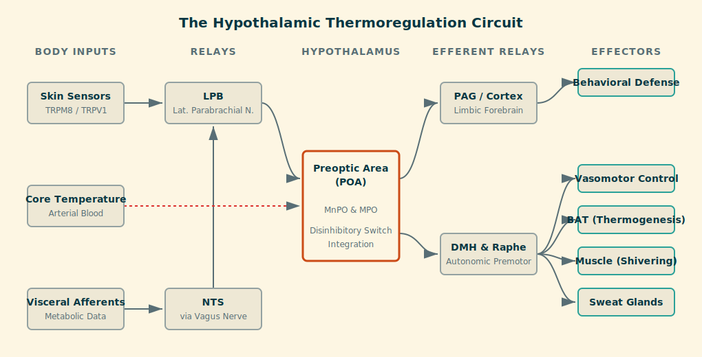

# Thermoregulation {#sec-thermoregulation}

## The adaptive problem: the thermodynamics of life

Temperature constrains every biochemical process. Enzymatic reaction rates follow predictable thermodynamic rules: cooling slows kinetics exponentially, while overheating destabilizes protein structure and membrane integrity. For a complex nervous system, even minor deviations impair synaptic transmission and cognition. For ectotherms, body temperature tracks the environment, and behavior must compensate after the fact. Mammals solved this dependency through endothermy—generating internal heat—but at the cost of a demanding control problem. Heat production is energetically expensive, heat loss is continuous, and environmental conditions can change much faster than core temperature can safely drift.

The central challenge is therefore not simply maintaining a set point, but preventing dangerous oscillations. A controller that waits until the brain cools down is already too late. Thermoregulation must be anticipatory, high-gain, and hierarchically organized. This makes it the clearest example of predictive hypothalamic control, serving as the perfect template against which the later systems in this unit can be read.

## Sensors and signals: distributed detection

Thermoregulation integrates two fundamentally different error signals: feedforward information from the body surface, and feedback information from the core. The hypothalamus treats them differently, weighting early warnings far more heavily than late confirmations.

### Peripheral and visceral sensors: feedforward control

The skin functions as our early-warning system. Free nerve endings expressing Transient Receptor Potential (TRP) channels detect changes in ambient temperature. Cold-sensitive afferents (TRPM8) and warm-sensitive afferents (TRPV1/TRPV3) project to lamina I of the spinal dorsal horn, from which distinct, parallel pathways ascend to the brainstem. Crucially, these autonomic signals bypass the thalamic circuits of conscious perception, projecting instead to the **lateral parabrachial nucleus (LPB)** in the pons.

The LPB segregates this thermal data before it ever reaches the hypothalamus: cold signals target the external lateral subdivision (LPBel), while warm signals target the dorsal subdivision (LPBd). In parallel, the **nucleus of the solitary tract (NTS)** receives metabolic and thermal information from visceral vagal afferents—the massive sensory conduit we mapped out in @sec-embodied-brain-vagus. The NTS projects to the LPB, integrating deep somatic status with surface signals. This convergence lets the hypothalamus anticipate thermal threats based on a synthesis of environmental conditions and internal metabolic state.

### Central sensors: feedback control

The final arbiter of your thermal state is the temperature of the brain itself. The preoptic area is densely vascularized, keeping local tissue temperature in direct equilibrium with arterial blood arriving from the core. Within it, intrinsically warm-sensitive neurons express heat-gated ion channels that act as literal molecular thermometers: as thermal energy rises, the channels open, depolarizing the membrane and increasing the firing rate monotonically. (This mechanism, it should be noted, is distinct from the chemical hijacking of these same neurons during a fever.) Additional feedback arises from thermoreceptors in the large veins and abdomen, which monitor blood returning from metabolically active tissue. This is especially important during exercise, when heat is generated internally rather than imposed from the outside.

{#fig-thermoregulation-thermoregulation width="80%" fig-align="center" .lightbox fig-alt="flow chart of signals for control of thermoregulation"}

## Hypothalamic circuits: the preoptic controller

As mapped out in @fig-thermoregulation-thermoregulation, the **preoptic area (POA)** acts as the brain's thermostat, but understanding it requires some anatomical precision.

Located in the rostral hypothalamus, just anterior to the optic chiasm and wrapping around the anterior commissure, the POA is not solely a "temperature center". It is a cluster of sub-nuclei (median, medial, lateral, and ventrolateral preoptic) that regulate a diverse range of homeostatic systems, including sleep (@sec-sleep) and fluid balance (@sec-fluid). This reinforces the caution raised in our unit overview (@sec-organization): hypothalamic nuclei are not isolated functional islands with simple one-to-one mappings.

In the specific context of body temperature, the POA serves as the principal integrative node. Rather than issuing motor commands directly, it implements a **disinhibitory control architecture** that ensures the mutually exclusive activation of heat-gain and heat-loss mechanisms, built on the interaction between the median preoptic nucleus (MnPO) and the medial preoptic area (MPO).

{#fig-thermoregulation-disinhibition width="90%" fig-align="center" .lightbox fig-alt="flow chart of signals for control of thermoregulation"}

### The disinhibitory switch

The core logic is a mutually inhibitory relationship between heat-gain and heat-loss circuits. The dominant population consists of GABAergic warm-sensitive neurons (WSNs) in the MPO. When activated by local warmth or feedforward signals from the LPBd, these neurons inhibit downstream cold-defense centers, effectively acting as a brake on thermogenesis. Cold defense requires releasing that brake: cold signals from the LPBel drive glutamatergic projections to the MnPO, whose neurons activate GABAergic interneurons that, in turn, inhibit the warm-sensitive MPO population. This inhibition of the inhibitor—disinhibition—releases the downstream effectors. This push–pull arrangement ensures that heat conservation and heat dissipation cannot occur simultaneously, producing a sharp state transition rather than a muddled, graded mixture.

### Downstream relays: DMH and raphe pallidus

The preoptic controller does not reach the body's effectors directly. Its commands are relayed through the **dorsomedial hypothalamus (DMH)** and the **raphe pallidus** in the medulla, which house the premotor circuitry for thermogenesis and cardiovascular adjustments. This separation of sensing from action—a decision node situated upstream, with dedicated motor relays downstream—is an architectural motif that recurs across hypothalamic systems.

### Causal evidence

Modern causal tools have confirmed this organization and pinned down the molecular identity of the command neurons. In 2016, Tan and colleagues identified warm-sensitive preoptic neurons defined by the co-expression of the neuropeptides **PACAP (Adcyap1)** and **BDNF**. Optogenetic activation of these neurons in awake mice triggers a rapid, dramatic drop in core temperature. This is driven by coordinated effectors: profound tail vasodilation to dump heat, and immediate suppression of brown-adipose-tissue thermogenesis to stop producing it. These neurons also control behavior—their activation induces robust cold-seeking, prompting mice to leave a warm environment to find cooler temperatures while suppressing natural cold defenses like nest-building. These effects appear within seconds, demonstrating that a single molecularly defined cell type can orchestrate the entire homeostatic response to heat, seamlessly integrating autonomic adjustment and motivated behavior.

More recent work has identified a complementary **cold-sensitive** population operating in the exact opposite direction. Piñol and colleagues (2021) described preoptic neurons expressing **bombesin-like receptor 3 (BRS3)**, whose activation *increases* core temperature and heart rate. Selectively recruited by cold exposure—and unlike most previously characterized preoptic populations—their activation drives thermogenesis rather than heat loss. Functionally, POA^BRS3^ neurons engage multiple downstream pathways (projections to the DMH, the paraventricular hypothalamus, and the periaqueductal gray) to activate brown adipose tissue, raise sympathetic tone, and successfully defend temperature in the cold.

Crucially, chronically silencing POA^BRS3^ neurons does not abolish thermoregulation entirely; instead, it increases **temperature variability**, producing exaggerated overshoots during both heating and cooling challenges. This reveals a fascinating control-theoretic role: these neurons do not merely trigger cold defense; they **stabilize feedback control**, reducing biological noise and preventing wild oscillations around the set point. Together, these studies prove that the preoptic area contains interdigitated, molecularly distinct populations that bidirectionally control temperature, providing the cellular physical substrate for the disinhibitory switching architecture we just explored.

## The Affective and Behavioral Drive

The autonomic effectors—sweating, shivering, vasoconstriction—are vital, but they are metabolically expensive and inherently reactive. For a truly predictive controller, the most efficient response is to avoid the physiological deficit altogether. This is where **behavioral thermoregulation** serves as the ultimate allostatic defense.

In both rodents and humans, behavioral responses are initiated by minimal, localized changes in skin temperature (such as a cold breeze on the face or hands) long before the core temperature is ever threatened. By initiating a behavioral change—moving into the sun, huddling, or putting on a sweater—based on these distal, early-warning signals, the body successfully avoids the massive cardiovascular and metabolic perturbations that autonomic regulation would eventually require. The brain constantly computes a "thermopreferendum"—a preferred thermal state—and uses behavior to actively defend it, minimizing the physiological load.

But how does the brain actually drive this behavior? It does not merely read temperature like a sterile thermometer; it evaluates it affectively. If you have ever stepped into a hot shower after a freezing winter walk, you know that the heat does not just feel "warm"—it feels intensely pleasurable. This phenomenon, where the affective quality of a sensory stimulus depends entirely on the internal state of the organism, is called **alliesthesia**.

Human neuroimaging provides a clear window into this process. Functional MRI (fMRI) studies reveal that experiencing thermal discomfort, and subsequently resolving it, activates a widespread cortical network that includes the medial prefrontal cortex, posterior parietal cortex, and anterior cingulate. Crucially, thermal stimuli that correct a physiological deficit strongly activate classic reward circuitry—including the ventral striatum, nucleus accumbens, and the ventral tegmental area / periaqueductal gray (VTA/PAG) network. In fact, these reward-related regions often activate early in the processing stream, driving the *urge* and motivation to seek warmth or cooling before primary somatosensory regions have even fully mapped the precise location and intensity of the stimulus on the skin. The drive to regulate temperature is not just a homeostatic reflex; it is a deeply ingrained, reward-seeking behavior.

## Effectors: balancing the heat equation

The hypothalamus regulates temperature by manipulating both heat loss and heat production, operating through a strict **hierarchy of energy costs**. A thermal "deadband," or interthreshold zone, allows only low-cost vascular changes near the set point. High-cost effectors like shivering and sweating are only engaged when that zone is definitively breached.

The first line of defense is **behavioral**, and it is the cheapest. Moving into the shade or adding a layer of clothing prevents the thermal load from ever challenging the body's internal capacity, minimizing the metabolic cost of regulation. Next, and fastest among the physiological options, is **vasomotor** control: sympathetic vasoconstriction reduces skin blood flow to conserve heat, while sympathetic withdrawal allows cutaneous vasodilation, essentially turning the skin into a radiator. Both are achieved without altering overall metabolism.

When insulation is insufficient, **metabolic heat production** kicks in. Shivering generates heat through the rhythmic activation of skeletal muscle, while non-shivering thermogenesis relies on brown adipose tissue. Here, mitochondria express uncoupling protein 1; sympathetic noradrenergic input allows protons to dissipate their gradient as heat rather than ATP, converting chemical energy directly into warmth. This is especially important in infants and small mammals, but remains functionally significant in human adults. Finally, when heat gain entirely exceeds the capacity to lose it, **evaporative cooling** is recruited. Cholinergic sympathetic fibers activate human sweat glands (while other mammals pant). Because these responses are metabolically costly and risk dehydration, they are the systems of last resort.

## Clinical and lifecycle variations

Thermoregulation is continuously remodeled by endocrine status and age, and it can fail outright under extreme load. These variations perfectly illustrate the system's underlying logic and its limits.

**Fever** is perhaps the most profound example of an allostatic shift; it is not a loss of thermoregulatory control, but a highly coordinated, temporary reprogramming of the system. During an infection, the immune system recognizes that many pathogens replicate poorly at higher temperatures. As we discussed regarding sickness behavior (@sec-embodied-brain), immune cytokines induce prostaglandin E2 (PGE2) synthesis in the hypothalamic vasculature. PGE2 binds EP3 receptors on warm-sensitive preoptic neurons and directly inhibits them. This inhibition effectively raises the brain's thermal set point. The controller is still working perfectly, but it is now defending a target of, say, 39°C (102°F) instead of 37°C. Because your core is suddenly lower than this new set point, you feel freezing. The resulting responses—the overwhelming behavioral drive to crawl under heavy blankets, combined with autonomic shivering and severe vasoconstriction—are not malfunctions. They are working exactly as designed to drive your body temperature up to the new, hostile-to-pathogens target. Antipyretics (like ibuprofen) break a fever not by cooling the body directly, but by blocking prostaglandin synthesis, which restores the preoptic area's normal set point and instantly triggers heat-loss behaviors like sweating.

**Hot flashes** illustrate how gonadal steroids normally tune preoptic sensitivity. The circuit involves KNDy neurons (expressing kisspeptin, neurokinin B, and dynorphin) in the arcuate nucleus, which are normally restrained by circulating steroids. When hormone levels fall rapidly—such as during menopause or androgen-deprivation therapy—that restraint lifts. The KNDy neurons become hyperactive, and their massive neurokinin B release onto the preoptic area mimics the neural signature of overheating. The hypothalamus responds to this false alarm with sudden vasodilation and sweating. The thermoneutral zone narrows, meaning the controller has become hypersensitive, losing the stability buffer that normally keeps minor fluctuations from triggering major physiological corrections.

**Aging** compromises both limbs of the circuit. On the effector side, brown adipose tissue and muscle mass naturally atrophy, reducing metabolic heat production, while skin vasculature becomes less responsive to constriction, letting heat easily escape. This forces the elderly to rely heavily on warmer ambient temperatures. On the sensory side, the conscious perception of temperature change is blunted, meaning behavioral compensation might be delayed until core temperature has already drifted dangerously, raising the risk of accidental hypothermia.

The system can also completely collapse. In severe **hypothermia**, muscular and vascular effectors fatigue, vasoconstriction fails, and warm core blood floods the skin—causing patients to feel paradoxically hot. This is a breakdown of control, not a deliberate regulatory response. **Heat stroke** is a catastrophic positive-feedback failure: above roughly 40–41 °C, the metabolic rate accelerates, generating still more heat, while protein denaturation in the preoptic area physically disrupts sensing and control, leading to multi-organ failure. Unlike a fever, this state is utterly unregulated and demands immediate, external physical cooling.

## Integration: thermoregulation as predictive control

Thermoregulation is the canonical case of the hypothalamus as a predictive regulator. By privileging feedforward skin signals over delayed core feedback, the system prevents oscillation and keeps the brain securely inside a narrow thermal window. It illustrates a logic that will be repeated across the hypothalamic systems we cover next: early cues trigger anticipatory corrections, downstream relays separate sensing from action, and disinhibitory switching ensures clean state transitions. Thermal stability is not a simple reflex; it is an active, continuously computed outcome—and it is one of the foundational biological achievements that made large, energetically demanding brains possible in the first place.