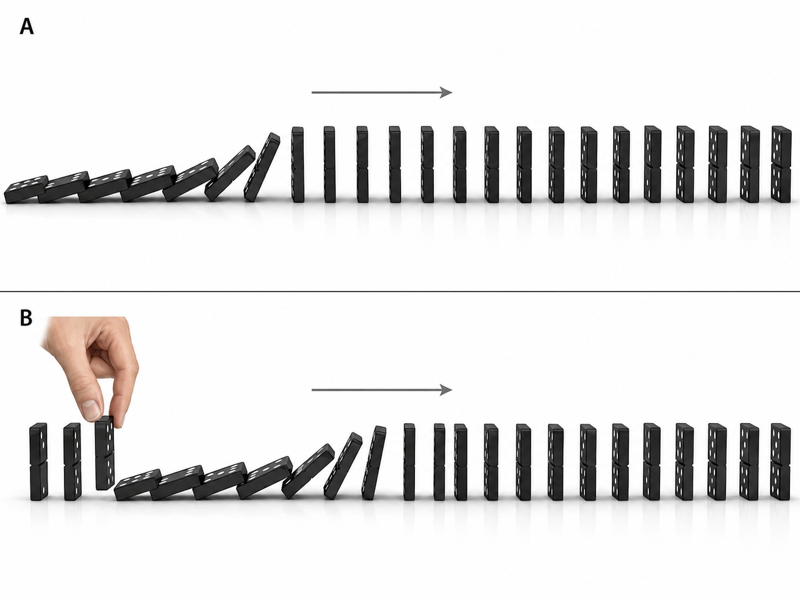
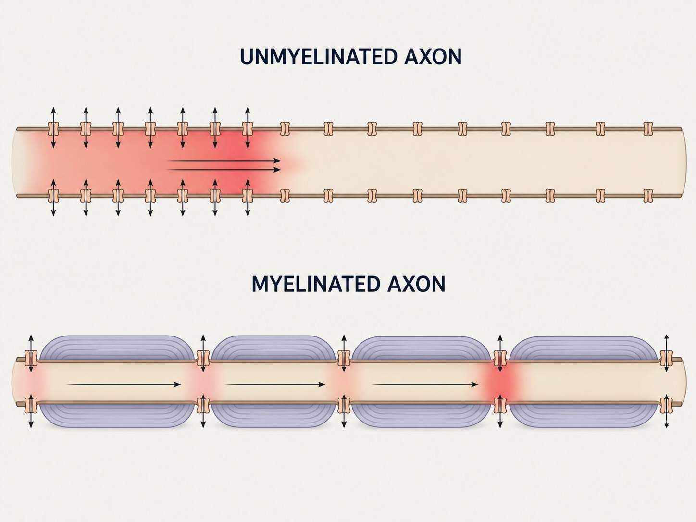

# How a neuron is excited {#sec-excitation}

The previous chapter introduced the main cell types: neurons and glia, the shapes neurons take, and the tripartite synapse formed with a pre- and post-synaptic neuron and astrocyte. It ended with circuits: a neuron influences its target by excitation or inhibition. This chapter turns to the fast electrical layer of signaling, the millisecond machinery by which one neuron excites or inhibits another.

The unit's organizing claim is that signaling happens across many timescales, and that the fast electrical layer is the most recent, most specialized, and most expensive in terms of energy use. The reason was previewed in the overview: an animal cell, having given up the rigid wall for the freedom to move, must pump ions across its membrane for its whole life simply to maintain its state. Those pumped gradients are a store of energy that the neuron later learned to spend in quick, controlled bursts. The thread running through this chapter is the interaction of two gradients, a **chemical** gradient and an **electrical** gradient, acting on the same ions at the same time. Almost everything that follows is a consequence of those two forces, sometimes cooperating and sometimes opposed, and of the channels that decide, moment to moment, which ions are allowed to cross the cell's membrane.

The chapter proceeds from the two gradients and the equilibrium that results when they balance, first for a single ion (the Nernst equation) and then for a real membrane with several ions at once (the Goldman–Hodgkin–Katz equation). It then turns to the resulting disequilibrium, a membrane poised like a loaded spring, and the pump that keeps it loaded. Next come the gated channels that release it: the locked gate, the doorbell, and the emergency door. These produce the small, local, graded events at synapses (post-synaptic potentials), which a neuron combines through summation. Finally, the chapter reaches the large, regenerating, all-or-none event that carries the result down a long axon (the action potential), together with the myelin that makes it fast. The historical development follows the work of Walther Nernst, David Goldman, Alan Hodgkin and Andrew Huxley, and Bernard Katz, linking the concepts to the problems their discoverers were trying to solve.

## Two gradients acting on one ion

Begin with the simplest possible question. An ion sits in solution on one side of a membrane. Which way will it move, and why? There are exactly two reasons an ion moves, and keeping them separate is the key to the whole chapter.

The first is the **chemical gradient**, also called the concentration gradient. A dissolved substance tends to spread from where it is crowded to where it is sparse. This is just diffusion, the same process by which a drop of ink disperses through a glass of water or a smell fills a room. There is nothing mysterious in it: molecules are in constant random motion, and random motion carries more of them out of a crowded region than into it, until the crowding is even everywhere. At that point motion has not stopped — individual molecules still jostle in every direction — but there is no longer any *net* movement in one direction. That balanced condition is **equilibrium**. An ion, being a dissolved substance, feels this concentration force like any other: if there is more sodium outside the cell than inside, sodium tends to diffuse in.

The second reason is the **electrical gradient**. An ion, unlike a drop of ink, carries a charge, and charge responds to charge: opposite charges attract, like charges repel. If the inside of a cell is electrically negative relative to the outside, a positive ion will be pulled inward toward the negativity, and a negative ion will be pushed outward away from it, regardless of how the concentrations stand. A positively charged ion is a **cation** and a negatively charged one is an **anion**. The terminology can seem counterintuitive because cations move toward the negative electrode, the cathode, whereas anions move toward the positive electrode, the anode.

These two forces act on the same ion at the same time, and they need not agree. The chemical gradient might push an ion one way while the electrical gradient pulls it the other. Neither gradient alone determines what the ion will do; the two must be combined. Their combination is the **electrochemical gradient**, and the net push it produces on an ion is the **electrochemical driving force**. When chemists and physiologists speak of an ion "wanting" to move, this combined force is what they mean, a convenient shorthand rather than a claim that ions have desires.


A few ions do most of the work in neurons: **sodium** ($\text{Na}^+$), **potassium** ($\text{K}^+$), **chloride** ($\text{Cl}^-$), and **calcium** ($\text{Ca}^{2+}$), with **magnesium** ($\text{Mg}^{2+}$) making a cameo later when we discuss the NMDA receptor in @sec-learning. Sodium and potassium are the protagonists of this chapter. Their distributions across the membrane are nearly mirror images of each other, and that asymmetry is the raw material of every fast signal a neuron sends.

The asymmetry is worth seeing as numbers, because the rest of the chapter is, in a sense, a long commentary on this one table. The values below are representative concentrations for a typical mammalian neuron; exact figures vary by cell type, region, and method, so treat them as orders of magnitude rather than constants of nature. The unit **mM** means *millimolar*, or millimoles of a substance per liter of solution; 1 mM is one-thousandth of a mole per liter.

| Ion | Inside (mM) | Outside (mM) | Gradient points | Equilibrium potential |
|---|---|---|---|---|
| **Sodium** ($\text{Na}^+$) | ~10–15 | ~145 | inward | $\approx +60$ mV |
| **Potassium** ($\text{K}^+$) | ~140 | ~4–5 | outward | $\approx -90$ mV |
| **Chloride** ($\text{Cl}^-$) | ~5–10 | ~110–120 | inward | $\approx -70$ mV |
| **Calcium** ($\text{Ca}^{2+}$) | ~0.0001 | ~1–2 | inward | $\approx +120$ mV |
| **Magnesium** ($\text{Mg}^{2+}$) | ~0.5–1 | ~1–1.2 | inward (weakly) | shallow |

The table foreshadows much of the chapter. Sodium is crowded outside and drawn toward the negative inside, so both of its gradients point the same way and its equilibrium potential is strongly positive: sodium is the loaded spring. Potassium is the mirror image, crowded inside, with a deeply negative equilibrium potential. Chloride has an equilibrium potential close to the resting potential derived below, which is why it often inhibits gently. Magnesium is the unusual case: its gradient is shallow, almost flat, so it is not a signal-carrier in the same sense as the others. That property later makes it useful as a voltage-sensitive plug rather than as a current carrier.

Calcium and magnesium require one qualification. For sodium, potassium, and chloride, the concentration in the table is essentially the free, dissolved ion, because these ions are mostly free in solution. Calcium and magnesium are different. The *free* intracellular calcium is the ~0.0001 mM listed, but much larger quantities are bound to proteins or sequestered in intracellular stores, especially the endoplasmic reticulum in neurons and glia. The *free* intracellular magnesium is the ~0.5–1 mM listed, but the *total* intracellular magnesium is far higher, on the order of 14–20 mM, because most of it is bound to ATP and other phosphate compounds or sequestered in organelles. It is the free ion that matters for the membrane, so that is what the table reports. The distinction is a reminder that "concentration" in a living cell is not always a simple quantity. Magnesium will return with the NMDA receptor in the chapter on plasticity.


## Equilibrium for a single ion: the Nernst equation

Consider a membrane with potassium crowded on the inside and essentially none on the outside. Trapped inside with the potassium is a population of large negatively charged molecules, proteins and nucleic acids, that are far too big to pass through any pore. Real cells are in fact full of such large anions because many of the molecules of life are both large and negatively charged. Now suppose the membrane contains holes (@fig-excitation-channels, leak channels) just wide enough for potassium to pass.

What happens? At first, potassium does what any crowded substance does: it diffuses outward, down its concentration gradient, toward the empty outside. But each potassium ion that leaves carries a positive charge with it, and it leaves behind one of those big negative anions that cannot follow. So with every ion that exits, the inside grows a little more negative relative to the outside. That growing negativity is an electrical gradient, and it pulls the positive potassium back in. The two forces now oppose each other: the concentration gradient pushing potassium out, the electrical gradient — which the outflow itself created — pulling it back.

The outflow does not continue until the concentrations are equal. It stops well short of that, at the point where the inward electrical pull exactly cancels the outward chemical push. There, once again, individual ions cross in both directions, but there is no net movement. The membrane voltage at which this balance occurs, for a single ion species, is that ion's **equilibrium potential** (also called its Nernst potential). It is the voltage that exactly offsets the ion's concentration gradient — the electrical bribe required to make the ion content to stay put.

We can calculate it. The relationship was worked out by the German physical chemist **Walther Nernst** in the 1880s, and it is named for him. The **Nernst equation** looks more intimidating than it is:

$$
E_{\text{ion}} = \frac{RT}{zF} \ln \frac{[\text{ion}]_{\text{out}}}{[\text{ion}]_{\text{in}}}
$$

The constants surround a simple central ratio: the concentration of the ion outside the membrane divided by its concentration inside. $R$ is the gas constant and $T$ is the absolute temperature; together they capture the fact that diffusion is driven by thermal motion, so the force depends on temperature. $F$ is Faraday's constant, which converts between amounts of charge and amounts of substance. The term $z$ is the **valence** of the ion, its charge with sign: $+1$ for potassium or sodium, $-1$ for chloride, and $+2$ for calcium. This gives the equation the correct polarity for negative versus positive ions. The natural logarithm appears because the relationship between a concentration ratio and a voltage is logarithmic rather than linear. The central concept is that the equation converts a concentration ratio into the voltage that balances it.

Run the numbers for potassium, using concentrations typical of a mammalian neuron — roughly 140 millimolar inside and 5 millimolar outside — and the equilibrium potential comes out near **$-90$ to $-97$ mV**. The sign tells the story we just narrated in words: to keep potassium from leaving a cell in which it is so heavily concentrated, the inside must be held strongly negative. That negativity is the electrical price of potassium's concentration gradient.

Now do the same for sodium, whose distribution is nearly the reverse — about 145 millimolar outside and only 5 to 15 millimolar inside. Sodium's equilibrium potential comes out around **$+60$ mV**, positive. Again the sign is doing real work. Sodium is crowded *outside* and would diffuse *in*; to hold it out, you would have to make the inside strongly *positive* to repel it. The contrast between potassium's deeply negative equilibrium potential and sodium's strongly positive one is not a numerical curiosity. It is the loaded spring of the whole system, and we will return to it in a moment.

::: {.callout-note collapse="true"}
## Deeper dive: reading the Nernst equation without fear

If you would like to see why the equation has the shape it does, here is the intuition behind each piece.

The logarithm of a concentration ratio appears because the *entropic* tendency to spread out depends on relative crowding, not absolute numbers. Doubling both concentrations changes nothing about which way diffusion pushes; only the ratio matters, and the natural measure of a ratio's "size" in thermodynamics is its logarithm.

The factor $RT$ scales the whole thing by thermal energy. Diffusion is just thermal jostling, so the harder the molecules are jostling (the higher the temperature), the larger the voltage needed to hold them against their concentration gradient. At body temperature, $RT/F$ works out to about $26$–$27$ mV, and if you convert from natural log to base-10 log the prefactor becomes the famous $\sim 61$ mV that appears in many textbooks: $E_{\text{ion}} = \frac{61\,\text{mV}}{z}\log_{10}\frac{[\text{ion}]_{\text{out}}}{[\text{ion}]_{\text{in}}}$ at $37°\text{C}$.

The valence $z$ in the denominator handles charge. A divalent ion like calcium ($z = +2$) carries twice the charge per ion, so a given concentration ratio is balanced by half the voltage. A negative ion like chloride ($z = -1$) flips the sign, which is exactly right: for an anion, the polarity that balances a given gradient is reversed.

None of this is required to follow the rest of the chapter. Just remember that the Nernst equation turns a concentration ratio into the voltage that balances it, for one ion in isolation.
:::

## The resting membrane: the Goldman–Hodgkin–Katz equation

The Nernst calculation answers a question no real neuron actually faces, because no real membrane has only one ion crossing it. A living neuron's membrane is permeable to several ions at once — potassium and sodium and chloride all have routes across it — and each of them has its own, different equilibrium potential. They cannot all be satisfied simultaneously. If the membrane sits at potassium's equilibrium potential of $-90$ mV, then sodium, whose equilibrium potential is $+60$ mV, is wildly out of balance and floods inward; if it sits at sodium's $+60$ mV, potassium floods out. The membrane has to settle somewhere, and where it settles is a compromise. We call that compromise the **resting membrane potential**.

Two things determine the compromise. The first is each ion's equilibrium potential. The second is the membrane's **permeability** to each ion, or how easily that ion can actually cross. Permeability is not the same as the concentration gradient. An ion can have an enormous gradient and yet contribute almost nothing to the resting voltage if the membrane gives it almost no route through. At rest, the neuronal membrane is studded with potassium channels that are always open, the **leak channels**, and has very few open sodium channels by comparison. The membrane is roughly twenty to thirty times more permeable to potassium than to sodium at rest. In the tug-of-war over the resting voltage, potassium therefore has far more leverage, and the resting potential ends up much closer to potassium's equilibrium potential than to sodium's.

The equation that combines all of this is the **Goldman–Hodgkin–Katz equation**, usually shortened to the GHK or Goldman equation, after **David Goldman**, who published it in 1943, and Alan Hodgkin and Bernard Katz, who applied it to nerve. It is the Nernst equation grown up: instead of one ion it includes a term for each, and instead of bare concentrations it weights each concentration by that ion's permeability, written $P$.

$$
V_{m} = \frac{RT}{F} \ln \frac{P_{\text{K}}[\text{K}^+]_{\text{out}} + P_{\text{Na}}[\text{Na}^+]_{\text{out}} + P_{\text{Cl}}[\text{Cl}^-]_{\text{in}}}{P_{\text{K}}[\text{K}^+]_{\text{in}} + P_{\text{Na}}[\text{Na}^+]_{\text{in}} + P_{\text{Cl}}[\text{Cl}^-]_{\text{out}}}
$$

Despite its size, the equation repeats the same idea. Three points are worth noting. First, each ion enters weighted by its permeability $P$, so an ion the membrane barely admits contributes little no matter how steep its gradient; permeability acts as the volume control on each ion's contribution. Second, chloride appears with its inside and outside concentrations *swapped* relative to the positive ions. This bookkeeping accounts for its negative charge and lets the equation handle anions and cations in one expression. Third, there is no valence term out front as there was in the Nernst equation, because the swap-and-sum handles the signs internally; the GHK equation as written assumes the ions are singly charged, which is appropriate for potassium, sodium, and chloride.

Using representative permeabilities, with potassium set to 1 as a reference, sodium to about 1/20 of that, and chloride somewhere in between, together with representative concentrations, the result is near **$-65$ to $-70$ mV**. This is the **resting membrane potential** of a typical neuron, the voltage measured with one electrode inside the cell and one outside while the neuron is at rest. If sodium and chloride permeabilities are set to zero, leaving potassium alone, the GHK equation collapses back into the Nernst equation for potassium and returns a value near $-90$ mV. The resting potential is more positive than potassium's equilibrium potential precisely because the small but nonzero sodium permeability constantly leaks a little positive charge inward, pulling the compromise upward from where potassium alone would set it.

The resting potential is **not the equilibrium potential of any ion**. At $-70$ mV, potassium (equilibrium $\sim -90$ mV) is not balanced and has a net force pushing it out. Sodium (equilibrium $\sim +60$ mV) is far out of balance and has a powerful net force pushing it in, with both gradients pointing the same way because sodium is crowded outside and attracted to the negative inside. Chloride sits close to balance because its equilibrium potential falls near the resting potential. The resting neuron is therefore in a **dynamic equilibrium**: a steady voltage maintained not because the ions have no tendency to move, but because their unsatisfied forces are held in check. The membrane remains a loaded spring.

Try manipulating ion concentrations and permeabilities in the GHK calculator provided below, and observe the changes in the resting membrane potential.

::: {#fig-excitation-ghk}

```{=html}
<iframe src="figs/GHK.html" width="100%" height="480px" style="border:none;"></iframe>
Interactive Goldman-Hodgkin-Katz equation calculator. Adjust the permeabilities and concentrations to see how the dynamic equilibrium shifts.

:::

## Keeping the spring loaded: the sodium–potassium pump

If sodium is forever leaking in through the few open sodium channels and potassium forever leaking out through the many open potassium channels, then given enough time, the carefully maintained asymmetry would dissipate, the gradients would flatten, and the tension of our 'loaded spring' would dissipate to nothing. Something must continually reload it. That something is a molecular machine: the **sodium–potassium pump**, also called the sodium–potassium ATPase.

The pump does exactly the opposite of what the leak channels do. Where the leaks let ions slide *down* their gradients, the pump pushes them *up* against their gradients, grabbing the sodium that has leaked in and forcing it back out, grabbing the potassium that has leaked out and hauling it back in. On each cycle it ejects three sodium ions and imports two potassium ions. Moving ions against their electrochemical gradients is uphill work, and uphill work costs energy. The pump pays for it by spending one molecule of **ATP**, the cell's energy currency, per cycle — which is why it is called an ATPase. The water-tower image from the overview captures the asymmetry exactly: water runs down out of the tower on its own, freely, the way ions slide down their gradients; but getting water back up into the tower takes a pump burning energy, the way restoring the gradients takes the sodium–potassium pump burning ATP.

This single machine is most of the reason the brain is so metabolically expensive. The overview noted that the human brain is about two percent of body weight yet consumes roughly twenty percent of the body's energy at rest, and that a large share of that goes to one molecular machine doing nothing glamorous. This is the machine. The brain spends something on the order of a fifth of the body's caloric intake, much of it simply running these pumps to keep the membranes of billions of neurons poised to fire. The fast end of signaling is fast precisely because it is expensive, and the pump is where the energy bill comes due.

Two facts underline how fundamental, and how vulnerable, this machinery is. The pump is not a neuronal invention; every animal cell has it, from sponges and jellyfish to insects and humans, because every animal cell faces the osmotic problem described in the overview and solves it by active transport. Because the pump is indispensable, poisoning it is lethal: **ouabain**, a compound once used on poison arrowheads, blocks the sodium–potassium pump. The sodium channel has its own famous poison, **tetrodotoxin**, the toxin of the pufferfish prepared as the delicacy fugu; it will return when the voltage-gated channels of the action potential are discussed. The machinery that neurons exploit for signaling is the same machinery cells need merely to stay alive, and interfering with it can be lethal.

At this point, the setup can be summarized:

- There is an asymmetry of ions across the membrane: much potassium inside, much sodium outside, maintained by the pump.
- The membrane is selectively permeable, with many open potassium leak channels and few open sodium channels, so potassium dominates the resting voltage.
- Each ion has its own equilibrium potential, and they differ, so at the resting potential every ion has an unsatisfied driving force.
- The result is a steady but strained resting potential near $-70$ mV — a loaded spring, held in check, waiting for a release.

A system this poised needs only a small nudge to do something dramatic. The rest of the chapter is about the nudges.

## The triggers: gated channels {#sec-excitation-gated-channels}

The GHK equation makes the mechanism explicit: membrane voltage depends on the permeabilities $P$. Ion concentrations barely change during a single signaling event, so rapid changes in membrane potential come primarily from **changing a permeability** by opening or closing channels for a particular ion. Opening a route for sodium makes the membrane more permeable to an ion already under a strong inward driving force, moving the voltage toward sodium's positive equilibrium potential. The membrane **depolarizes**, becoming less negative inside. Opening a route for chloride moves the membrane toward chloride's equilibrium potential, typically hyperpolarizing or stabilizing it. Permeability is therefore a key determinant of neuronal excitability, and neurons manipulate it by opening and closing channels selective for different ions.

The always-open leak channels set the resting baseline and do not respond to the moment-to-moment signals considered here. More dynamic are the **gated** channels, which open or close in response to particular cues. They help make a neuron *excitable*: capable not merely of maintaining a resting potential, as every cell does, but of changing it sharply in response to a signal. What distinguishes these channels is the trigger that controls them. Together with leak channels, they form four membrane mechanisms considered here. Additional gating mechanisms, including mechanically gated channels, appear in the unit on sensation.

![**Four ways neurons control neuronal excitability and ion flow.** Leak channels provide continuously open, selective pathways; ionotropic receptors open directly when a signaling molecule such as a neurotransmitter binds; metabotropic receptors activate intracellular intermediaries that may regulate a separate channel or initiate a biochemical cellular cascade; and voltage-gated channels open in response to changes in local membrane potential. Once a channel is open, net ion movement follows the ion’s electrochemical gradient.](/unit_3/figs/channels.jpeg){#fig-excitation-channels}

@fig-excitation-channels uses architectural analogies for these different channels and receptions. A **leak channel** is an open alleyway between two buildings — no gate at all, nothing deciding whether to admit anyone, though its width imposes selectivity by determining who can fit through. Ions of the right size pass freely in either direction, always. The proportion of leak channels that admit particular ions determines the permeability of the membrane to that ion species and hence determines the resting membrane.

An **ionotropic receptor** is that same alleyway with a locked gate across it, and the signaling molecule is the key. When the molecule — a neurotransmitter — binds the receptor, the gate swings open and ions pass directly through. Because binding *is* opening, the response is nearly immediate: a permeability change, and so a voltage change, within a millisecond or two. The full name is a **ligand-gated ion channel** ("ligand" meaning the molecule that binds), and the speed is its signature. These are the channels of fast, precise, point-to-point synaptic transmission. There are relatively few neurotransmitters that act this way — glutamate, GABA, acetylcholine, serotonin among them — and we will lean on the first two, glutamate and GABA, throughout.

A **metabotropic receptor** is a doorbell. The signaling molecule presses it from outside, but nothing passes through the wall directly; instead the binding sets off machinery *inside* the cell, and that internal machinery decides what happens next — perhaps opening a channel elsewhere on the membrane, perhaps doing something that never opens a channel at all. The indirection takes time, so metabotropic effects are slower (tens to hundreds of milliseconds) and can outlast the signal that triggered them. We met cortisol's surface receptor in the overview as one example of this kind of receptor in @fig-signaling-glucocorticoids. While certainly relevant to neuronal excitability, we will defer additional discussion of metabotropic receptors and slower time course signaling until @sec-neuromodulation.

The fourth type has no ligand at all and solves the distance problem addressed at the end of the chapter. A **voltage-gated channel** opens not when a molecule binds it but when the membrane voltage around it crosses a threshold. The visual analogy is an emergency door fitted with a heat sensor: it stays locked under ordinary conditions but springs open if it detects a fire, with no key required. A voltage-gated channel senses voltage rather than heat; charged structures in its walls physically move when the membrane potential shifts, and past a critical voltage they swing the channel open. These channels allow a neuron to respond to its *own* electrical state, and that capacity for self-triggering is the basis of active propagation. A fifth type, the **mechanically gated** channel, opens when physically stretched or pressed and will appear in the sensory chapters, where it helps the skin detect pressure and the ear detect sound.

With the triggers in hand, we can finally watch a neuron be excited.

## Post-synaptic potentials: the small, local, graded events

Recall the synapse from the previous chapter: the end of one neuron's axon (the **pre-synaptic** side) lies a hair's breadth from a patch of another neuron's membrane, often a dendritic spine (the **post-synaptic** side), separated by the narrow **synaptic cleft**. When the pre-synaptic neuron is active, it releases neurotransmitter into the cleft; the transmitter diffuses across in a fraction of a millisecond and binds receptors on the post-synaptic membrane, opening gated channels. We can now say precisely what that accomplishes.

Although the brain uses more than a hundred neurotransmitters, two account for the overwhelming bulk of fast point-to-point signaling, often described colloquially as **wired transmission**. These two transmitters also form an opposed pair. **Glutamate** is the principal excitatory transmitter of the central nervous system and the most abundant neurotransmitter in the brain; by one widely cited estimate it is used at on the order of ninety percent of the synaptic connections in the human brain. **GABA** (gamma-aminobutyric acid) is its inhibitory counterpart, the principal inhibitory transmitter, present at something like a third of all synapses, more than any transmitter except glutamate. The same opposition appears when neurons rather than synapses are counted: in the cerebral cortex, roughly eighty percent of neurons are excitatory and glutamatergic and roughly twenty percent are inhibitory and GABAergic, a four-to-one ratio that holds with remarkable consistency across mammalian species. There is also a biochemical economy in the pairing: GABA is manufactured directly from glutamate in a single enzymatic step, so the brain builds its principal inhibitory transmitter from its principal excitatory transmitter. Between them, glutamate and GABA form the fast vocabulary of the brain, the molecular basis of the excitation and inhibition that the previous chapter called the first grammar of neural signaling. The dozens of other transmitters are not unimportant, but most modulate this fast traffic rather than carry it and are considered in @sec-neuromodulation.

### Excitation: the glutamate synapse

Take the most common case first, an **excitatory** synapse using **glutamate**. Glutamate binds ionotropic glutamate receptors on the post-synaptic membrane and opens channels permeable to sodium. And we know what sodium does when given a route: it is crowded outside and attracted to the negative inside, both gradients pointing the same way, so it floods in under a strong electrochemical driving force. The inrush of positive charge makes the local membrane less negative — it depolarizes it, nudging the voltage from $-70$ mV up toward zero. This local depolarization is a post-synaptic potential, and because it is depolarizing — because it pushes the cell *toward* activity — it is an **excitatory post-synaptic potential**, or **EPSP**.

![**Glutamatergic synaptic transmission and the glutamate–glutamine shuttle. 1:** An action potential arrives at the presynaptic terminal. **2:** Depolarization opens voltage-gated Ca²⁺ channels, allowing Ca²⁺ to enter the terminal. **3:** The rise in intracellular Ca²⁺ triggers fusion of glutamate-containing synaptic vesicles with the presynaptic membrane and release of glutamate into the synaptic cleft. **4:** Glutamate binds to receptors on the postsynaptic membrane, producing an excitatory postsynaptic response. **5:** The resulting depolarization spreads through the postsynaptic neuron and can contribute to generation of subsequent electrical activity. **6:** Glutamate is cleared from the extracellular space in part by uptake into neighboring astrocytes. Within the astrocyte, glutamate (Glu) is converted to glutamine (Gln). Glutamine is then transported back to the presynaptic neuron, where it is converted again to glutamate and packaged into synaptic vesicles. This glutamate–glutamine shuttle recycles transmitter while helping keep extracellular glutamate concentrations low.](/unit_3/figs/glutamate-synapse.jpeg){#fig-excitation-glutamate-synapse}

@fig-excitation-glutamate-synapse shows the sequence of events at an excitatory glutamatergic synapse. A presynaptic terminal, or **axon bouton** (**yellow, upper right**), arising from a myelinated axon (**yellow and segmented, upper left**), forms a synapse with a postsynaptic dendrite (**lower right**). A closely apposed astrocyte (**light green**) surrounds part of the synapse and helps regulate its chemical environment.

1. **Arrival of the action potential.** An action potential, represented by the **blue voltage trace in the upper-right inset**, travels along the myelinated axon and reaches the yellow presynaptic bouton. The resulting depolarization provides the electrical signal that initiates neurotransmitter release.

2. **Calcium entry.** Depolarization opens voltage-gated calcium channels, shown as purple-blue channels in the presynaptic membrane. Calcium ions (blue spheres) enter the bouton and activate the molecular machinery that controls synaptic-vesicle fusion.

3. **Glutamate release and vesicle recycling.** Glutamate-filled vesicles move from reserve pools toward the active zone, dock at the membrane, and fuse with it, releasing glutamate (green spheres) into the synaptic cleft. Vesicular membrane is then retrieved, re-formed into vesicles, refilled with glutamate, and returned to the reserve or ready-to-release pools; mitochondria (orange-red) supply ATP for this cycle.

4. **Activation of postsynaptic receptors.** Glutamate diffuses across the cleft and binds to ionotropic glutamate receptor-channels (green) in the postsynaptic membrane. These channels open, allowing positively charged ions—especially sodium (**red spheres**)—to enter the dendrite.

5. **Generation of an EPSP.** The inward flow of positive charge produces an **excitatory postsynaptic potential**, or EPSP, represented by the thick yellow arrows within the dendrite. This graded potential spreads passively along the dendritic membrane toward the cell body and axon hillock, where it may combine with other postsynaptic potentials.

6. **Astrocytic clearance and recycling.** Processes of the astrocyte (light-green) remove glutamate from the synaptic cleft, sharpening the signal and preventing persistent receptor activation and excitotoxicity. The astrocyte, which contains a nucleus (purple) and orange-red mitochondrion (orange-red), converts glutamate to glutamine for return to the presynaptic terminal and also buffers extracellular potassium, making this a **tripartite synapse** in which glial regulation is essential to reliable transmission.

The ionotropic glutamate receptors are not all alike. The **AMPA receptor** depicted in @fig-excitation-glutamate-synapse is the workhorse: it opens quickly when glutamate binds, admits sodium, and produces the brief EPSP just described. The **NMDA receptor** looks similar but has an additional feature: at the resting potential its channel is physically plugged by a magnesium ion, so glutamate alone cannot open it; the plug is displaced only when the membrane is already depolarized. This makes the NMDA receptor a detector of two events occurring together, and its **coincidence-detecting** property is central to synaptic learning in @sec-learning. This is also why magnesium appeared in the ion table. Its role here has little to do with carrying current down a steep gradient and much to do with occupying a channel until voltage causes it to leave. Its shallow gradient makes it well suited to act as a plug rather than as a signal carrier. Glutamate also binds slow **metabotropic** receptors, the doorbell type, on the post-synaptic neuron and the surrounding astrocyte. Those receptors act over a longer timescale and are set aside here in favor of fast, millisecond signaling.

![**Coincidence detection by the NMDA glutamate receptor**. The NMDA receptor is controlled jointly by ligand binding and membrane voltage. Left: Glutamate and the co-agonist glycine are bound, but at a negative membrane potential Mg²⁺ occupies the channel pore and blocks ion flow. Right: Depolarization of the surrounding membrane relieves the voltage-dependent Mg²⁺ block. With glutamate and glycine still bound, the channel conducts Na⁺ and Ca²⁺ into the neuron. Thus, substantial NMDA receptor current requires the coincidence of glutamate release, glycine binding, and postsynaptic depolarization; none is sufficient by itself. Relief of the Mg²⁺ block is gradual rather than governed by a strict threshold, but becomes pronounced as the membrane approaches approximately −20 to −30 mV.](figs/NMDA-receptor.jpeg){#fig-excitation-NMDA-receptor}

The unit overview introduced the principle that the *meaning* of a signaling molecule is not carried by the molecule but decided by the receptor it meets. Glutamate is the cleanest proof. One and the same glutamate molecule produces a fast brief depolarization at an AMPA receptor, opens the coincidence-detecting NMDA receptor only when the membrane depolarization is right, or sets off a slow internal cascade at a metabotropic receptor lasting hundreds of milliseconds. One molecule, several receptors, several different consequences on several different timescales. The transmitter is not the message; the receptor is.

### Inhibition: the GABA synapse

Now the inhibitory case. When an inhibitory neuron fires, it releases **GABA** onto the post-synaptic membrane, and GABA — like glutamate — has both a fast ionotropic receptor and a slow metabotropic one. The fast one, the **GABA-A receptor**, is an ionotropic channel permeable not to sodium but to **chloride**, and here the two-gradient logic plays out differently than it did for sodium. As we shall see, inhibition is gentler and more conditional than excitation.

Chloride is more concentrated outside the cell, so its concentration gradient points inward; because chloride is negative and the inside of the cell is already negative, its electrical gradient points outward. The two forces very nearly cancel, which is why chloride's equilibrium potential falls close to the resting potential and why its net driving force is weak. When a GABA-A channel opens with the membrane near rest, the small net movement of negative charge tends inward, making the inside slightly *more* negative and pushing the voltage away from zero and from the firing threshold. This hyperpolarizing change is an **inhibitory post-synaptic potential**, or **IPSP**, the opposite sign from an EPSP.

But the cancellation of chloride's two gradients has a subtler consequence. Because chloride's equilibrium potential sits so near the resting potential, the direction chloride moves depends on the exact local voltage at the moment the channel opens. If the membrane has been depolarized by nearby excitation, chloride flows inward and pulls the voltage back down; if the membrane is already at or below rest, chloride may barely move at all, or even flow outward. Either way, the open chloride channel does something beyond shifting the voltage: it makes the membrane *leaky*. An open channel is a hole, and a hole lets charge escape. So when an excitatory current arrives at a patch of membrane riddled with open GABA-A channels, much of that current leaks straight back out through the chloride holes instead of spreading toward the axon — the excitation is bled away before it can do its work. This is called **shunting inhibition**, and it is often more important than hyperpolarization itself. It is also why the *placement* of inhibitory synapses matters so much: an inhibitory synapse sitting near the axon hillock, or on the cell body, or even on the axon's initial segment — recall the chandelier and basket cells of the previous chapter, positioned at exactly these points — can shunt away the summed excitation of the entire dendritic tree just as it is about to trigger a spike. Inhibition placed at a chokepoint is worth far more than its small voltage change suggests.

![GABAergic synaptic transmission and transmitter recycling. (1) An action potential arrives at the presynaptic terminal. (2) Depolarization opens voltage-gated Ca²⁺ channels, allowing Ca²⁺ to enter the terminal. (3) The increase in intracellular Ca²⁺ triggers fusion of GABA-containing synaptic vesicles with the presynaptic membrane and release of GABA into the synaptic cleft. (4) GABA binds to postsynaptic GABA\(_A\) receptors, ligand-gated Cl⁻ channels whose opening increases chloride conductance and typically produces hyperpolarizing and/or shunting inhibition. (5) The resulting inhibitory postsynaptic effect makes the neuron less likely to generate an action potential. (6) GABA is removed from the extracellular space by transporters on neurons and neighboring astrocytes. Within astrocytes, GABA can enter metabolic pathways that ultimately contribute carbon and nitrogen to glutamate and then glutamine (Gln). Glutamine is transported back to the presynaptic neuron, where it is converted to glutamate (Glu) and then to GABA by glutamic acid decarboxylase. This astrocyte–neuron shuttle helps replenish the presynaptic GABA supply while limiting extracellular transmitter accumulation.](/unit_3/figs/GABA-synapse.jpeg){#fig-excitation-GABA-synapse}

GABA's slower receptor, the metabotropic **GABA-B receptor**, works by the doorbell mechanism rather than by opening a channel directly. Its internal cascade opens potassium channels, and potassium — which, as the table shows, is concentrated inside and has an outward gradient — flows out, carrying positive charge out of the cell and hyperpolarizing it over a longer, slower time course (hundreds of milliseconds). So GABA inhibits twice over: a fast chloride-based IPSP through GABA-A, and a slow potassium-based hyperpolarization through GABA-B.

The contrast between GABA and glutamate ionotropic channels is the molecular root of an asymmetry that runs through all of neural computation. Glutamate opens a sodium channel onto an ion straining to enter, and excitation arrives hard, fast and unconditionally: sodium always rushes in. GABA opens a chloride channel onto an ion sitting nearly at equilibrium, and inhibition arrives gently and conditionally, doing much of its work not by driving the voltage down but by holding it near rest and shunting excitation away. Excitation and inhibition are opposite in sign, but they are not simply mirror images; they have different characters, and those characters fall directly out of where each ion's two gradients happen to leave it.

### Why a local event spreads, and why it fades

A post-synaptic potential begins as a strictly local affair — sodium enters at one small patch of membrane, on one spine — yet its job is to influence the distant axon hillock, where the decision to fire is made. How does a local voltage change reach a faraway place? And, just as important, why does it weaken on the way?

It spreads because the charge that enters does not stay put. Sodium ions that rush in are positive, and like charges repel; they push away from one another and from the other positive ions nearby, so the positivity diffuses along the inside of the membrane, away from the point of entry. The depolarization, in other words, propagates sideways from the synapse, a spreading wave of "less negative."

The neuron is a closed system governed by the simple conservation of charge: charge that enters at one location must be balanced by charge that leaves elsewhere. As a wave of positive depolarization spreads internally from a synapse, it forces potassium out through the membrane's ever-present leak channels, bleeding away the signal as it travels. Picture an irrigation hose with regularly spaced holes along its length and a capped far end: turn on the tap briefly, and the holes nearest the source spray the hardest, while those at the far end barely dribble. Yet, no matter how long the hose, a little water always reaches the end. The post-synaptic potential behaves just like this—short-lived because the synaptic channels quickly close, and graded because it falls off smoothly with distance rather than failing all at once. This passive, decremental spread is called electrotonic conduction, and its defining feature is that nothing regenerates the signal along the way. Because it is all downhill from the synapse, a single EPSP originating at a distant spine will reach the axon as a mere whisper, and to matter, those whispers must combine.

{#fig-excitation-garden-hose}

## Summation: the neuron as an analog computer

A real neuron may carry hundreds or thousands of synapses scattered over its dendrites and soma, many of them active at once, each launching its own little graded wave toward the axon. The place where these waves converge is the **axon hillock** (also called the initial segment or trigger zone), the specialized patch where the axon leaves the soma. The hillock experiences the running total of all those arriving potentials — the EPSPs as positive contributions, the IPSPs as negative ones — and it is this continuous adding-up that constitutes the neuron's information processing. The neuron is, in this sense, an **analog computer**: it sums graded inputs into a graded result.

Return to the garden hose, but now imagine many hoses, all their capped far ends resting on the same small patch of grass. Pulse water through all of them at once and that patch receives a little from each; the total is the sum of the dribbles, and with enough hoses the total can be substantial. The axon hillock is that patch of grass. It registers the sum of every PSP the neuron is currently experiencing. Three things shape that sum, and each is worth stating plainly because each becomes a lever the brain can pull.

The first is **sign**: EPSPs and IPSPs add as positive and negative numbers. A neuron receiving strong excitation and strong inhibition at the same time may sum to nothing at all — the inhibition cancels the excitation — which is exactly what makes inhibition useful. The grammar of excitation and inhibition from the previous chapter is, at the membrane, literally arithmetic.

The second is **space**, or **spatial summation**. Because every PSP decays with distance, a synapse near the axon hillock delivers more of its effect than an identical synapse far out on a distal dendrite. Location is leverage. An excitatory synapse and an inhibitory synapse placed near each other can largely annul one another, whereas the same synapses placed at different distances from the hillock can allow excitation to dominate. The brain exploits this geometry by positioning particular inhibitory synapses, including those of the chandelier and basket cells described in the previous chapter, at points of high leverage.

![Schematic illustration of how excitatory and inhibitory postsynaptic potentials (EPSPs and IPSPs) influence spike initiation at the axon initial segment. A, inputs located closer to the soma and axon initial segment produce larger voltage changes at the spike trigger zone than more distal inputs. B, inhibition is most effective when it lies on the path of excitatory current flowing toward the axon initial segment, thereby reducing depolarization and decreasing the likelihood of reaching threshold.](figs/proximity-axon-hillock.jpeg){#fig-promixity-axon-hillock}

The third is **time**, or **temporal summation**. Each PSP has a brief duration, and PSPs that arrive close together in time overlap and add, whereas those spread too far apart decay between arrivals and never accumulate. Synchrony is therefore powerful: inputs that fire together sum together. A simple classroom demonstration captures the principle. If a room full of people clap at the same instant, the sound is loud; if they clap one after another, the result is only a patter, even though the same number of claps occurred. The same total input, concentrated in time, has a much larger effect.

![Temporal coincidence determines whether converging EPSPs reach threshold. In A, three EPSPs arrive synchronously and overlap at the axon initial segment, producing a summed depolarization that crosses threshold and triggers an action potential. In B, the same inputs arrive at different times, allowing each EPSP to decay before the next occurs; the resulting depolarizations remain below threshold. Colored traces show the individual EPSPs, and the black trace shows their combined effect on membrane potential.](figs/temporal-summation.jpeg){#fig-excitation-temporal-summation}

Putting it together: the axon hillock computes a spatiotemporal sum over dozens to thousands of synapses, weighting each by where it sits and when it fires, treating excitation and inhibition as opposite signs. If that sum depolarizes the hillock past a critical **threshold** — typically around $-50$ mV — something new and qualitatively different happens. Up to threshold, everything has been graded and passive and local. At threshold, the neuron stops summing and starts shouting.

::: {.callout-note collapse="true"}
## Deeper dive: cable properties and dendritic spikes

The garden-hose analogy hides some real and consequential physics. How far a post-synaptic potential spreads before fading depends on the **cable properties** of the dendrite — the same mathematics that engineers use to describe signal loss in undersea telegraph cables, imported into neuroscience by Wilfrid Rall. The decisive variable is the dendrite's diameter: a thick dendrite carries a potential farther, and faster, than a thin one, because a wider cable offers the internal current less resistance. Branching pattern matters too, and so does a subtler structural feature — the dendritic **spine** itself, whose narrow neck can electrically amplify the local potential it receives. Two synapses delivering identical input can therefore have very different effects depending on the caliber, branching, and spine geometry of the dendrite that carries them. The "analog computer" is not a uniform summing device; it is shaped by its own anatomy.

There is a further wrinkle that complicates the tidy picture of passive dendrites and active axons. The standard textbook story says voltage-gated channels are located in the axon and the dendrites merely conduct passively. But voltage-gated channels turn out to inhabit some dendrites as well, and where they do, a distant dendritic region can generate its own regenerating event — a **dendritic spike** — that carries a far-flung input toward the soma without the usual decay. Imagine a synapse stranded at the end of a long apical dendrite, ordinarily too remote to matter; if its branch can mount a dendritic spike, it suddenly has an express line to the hillock instead of a slow leak. This effectively turns parts of the dendritic tree into semi-independent processing units, each integrating its local inputs and then forwarding the result actively. It is one of several ways, foreshadowed in the previous chapter's discussion of where the neuron doctrine fails, that real neurons are richer than the simple model of passive dendrites and a single trigger zone.
:::

## The action potential: the large, regenerating, all-or-none event

This brings the chapter to the distance problem. Post-synaptic potentials decay with distance; over a millimeter of dendrite they can fade to a whisper. Yet a neuron may need to send its output much farther, from the spinal cord to the foot or, in a giraffe, down an axon some fifteen feet long. A signal that dies out over a millimeter cannot cross a meter by passive spread. Passive conduction, by its nature, only loses. Long-distance signaling therefore requires **active regeneration**, rebuilding the signal to full strength again and again so that what arrives at the far end remains as strong as what left.

The means of regeneration is the third kind of gated channel, the **voltage-gated channel**, deployed in a particular arrangement. The axon hillock and the axon are packed with voltage-gated sodium channels, and these are the emergency doors that open in response to voltage. Here is the sequence, the event called the **action potential**, and it is worth following ion by ion because every step is a consequence of the gradients we have already established.

The summed PSPs depolarize the axon hillock toward threshold. At about $-50$ mV, the voltage-gated sodium channels there sense the change and snap open. Now sodium has a wide-open route, and we know what sodium does with a route — it floods in, driven hard by both its gradients. This inrush depolarizes the membrane further, which opens still more voltage-gated sodium channels, which admits more sodium, which depolarizes further still: a self-reinforcing avalanche. The membrane potential does not drift gently upward; it rockets toward and past zero, overshooting until the inside is briefly *positive* — around $+30$ mV — relative to the outside. This is the upstroke of the spike, sodium's loaded spring discharging all at once.

The switchover that follows gives the spike its shape. As the membrane climbs toward $+30$ mV, two events occur in close succession, ending the upstroke and beginning the downstroke. First, the voltage-gated **sodium** channels **inactivate**. Inactivation is not the same as simply closing: a separate part of the channel, often pictured as a hinged plug on the channel's inner mouth, swings shut and corks it. The channel cannot reopen until the membrane has repolarized and the plug has reset. This one-way valve cuts off the sodium inrush abruptly. Sodium's own equilibrium potential is about $+60$ mV, so the channels inactivate while sodium would otherwise continue entering; the spike shuts itself off well before the sodium gradient is exhausted. Second, at almost the same high voltage, the slower voltage-gated **potassium** channels sense the same depolarization but respond with a built-in delay. They finally open. Potassium is concentrated inside and is now also repelled by the freshly positive interior, so both gradients point outward and potassium rushes out, carrying positive charge with it.

![Channel states at a representative region of axonal membrane during an action potential. At rest, voltage-gated Na⁺ channels are closed but available, whereas voltage-gated K⁺ channels are closed. Threshold depolarization rapidly opens Na⁺ channels, producing inward Na⁺ current, while K⁺ channels begin opening more slowly. Near the action-potential peak, Na⁺ channels inactivate and outward K⁺ current becomes dominant. Continued K⁺ efflux repolarizes the membrane. Because K⁺ channels close slowly, the membrane briefly hyperpolarizes before returning toward its resting potential. Arrows indicate net ionic current; the bulk Na⁺ and K⁺ concentration gradients change negligibly during a single action potential.](figs/action-potential-efflux.jpeg){#fig-excitation-action-potential-efflux}

So the changeover is a relay: sodium channels open fast and inactivate at the peak; potassium channels open slow and take over just as sodium quits. The outrush of potassium drives the membrane potential back down — the **downstroke**, or **repolarization**. And because the potassium channels are sluggish to close, potassium keeps leaving a moment too long, so the membrane overshoots its resting value and dips briefly *more* negative than rest, down toward $-80$ mV, a phase called the **afterhyperpolarization**. The whole event — rest to $+30$ mV and back below rest — takes only about a millisecond or two.

Two features distinguish the action potential sharply from the post-synaptic potentials that precede it. First, it is **all-or-none**. Below threshold, no action potential occurs; once threshold is reached, the full event is triggered, and a stronger-than-threshold stimulus produces no larger spike. There is no graded, partial action potential. The neuron's analog summation therefore feeds into a **digital** event. Second, the action potential is **self-propagating**. When a patch of axon fires, the sodium that enters depolarizes the neighboring patch past *its* threshold, opening *its* voltage-gated channels, which depolarizes the next patch in turn. Voltage-gated channels open in sequence like a line of **dominoes**, each one knocking over the next. Because every patch rebuilds the spike to full amplitude, the signal reaching the end of a meter-long axon is as strong as the one that left the hillock. The decay problem is solved not by preventing decay but by regenerating the signal faster than it can decay.

Now account for what the spike has left behind, because this is where the metabolic bill and the limits on firing both come from. During the upstroke, sodium poured *in*; during the downstroke, potassium poured *out*. The net result, in the thin shell of axon just under the membrane where the action potential happened, is that the two ions have partly traded places: there is now excess sodium *inside* and excess potassium *outside* — the local concentrations have been nudged toward reversal by the very event that exploited them. (The amounts are small relative to the total ion content, which is why a single spike barely dents the gradients and a neuron can fire many times before exhaustion; but the direction of the change is exactly opposite to the resting arrangement the cell works to maintain.) Restoring the resting distribution is not something the gradients can do on their own — it means pushing sodium back out and potassium back in, *against* their gradients, which is uphill work. This is the job of the **sodium–potassium pump**, grinding away on ATP, three sodium out and two potassium in per cycle, reloading the spring for next time. The action potential spends the gradient; the pump restores it; and the brain's enormous resting energy budget is, in the end, largely the bill for running this cycle across billions of neurons firing again and again.

{#fig-excitation-dominoes}

This cleanup requirement has a direct and important consequence: a neuron cannot fire arbitrarily fast, and the action potential is therefore a discrete, countable event rather than a continuous one. The limit is called the **refractory period**, and it comes in two stages. Immediately after a spike, while the sodium channels are still inactivated — corked by that inner plug, which resets only once the membrane has repolarized — the neuron simply *cannot* fire again, no matter how strong the input. This is the **absolute refractory period**, and it lasts about one to two milliseconds. It sets a hard ceiling on firing rate (a neuron with a one-millisecond absolute refractory period cannot exceed roughly a thousand spikes per second), and it does something else useful: because the patch of membrane just behind an advancing spike is absolutely refractory, the spike cannot back-propagate *along the axon* into territory it has already crossed, so the action potential is forced to travel in one direction only, from hillock to terminal. After the absolute period comes a **relative refractory period**, during which the afterhyperpolarization still has the membrane below its resting value and the sodium channels are only partway reset; here the neuron *can* fire, but only in response to a stronger-than-usual input, because it is starting from farther below threshold. Together these two phases ensure that spikes stay separated in time, that there is a ceiling on how fast a neuron can signal, and that the wave runs cleanly in one direction down the axon.

The action potential is not a new kind of energy, nor does it depend on fundamentally different machinery from the post-synaptic potential. It still consists of ions moving down their electrochemical gradients through channels. The organizational difference is that the channels are voltage-gated and arranged in a line, so each patch's discharge triggers the next. The action potential is the controlled release of the loaded spring maintained by the pump. No new force is required for long-distance signaling; the existing one is arranged so that it regenerates itself.

The refractory period prevents an action potential from reversing direction *along the axon*, but depolarization also spreads from the axon initial segment back into the soma and dendritic tree. This is the **back-propagating action potential**. Part of this spread is passive, like other depolarizations, and in many neurons dendrites also contain voltage-gated channels, the basis of the dendritic spikes described in the earlier deeper dive. These channels allow the returning signal to invade the dendrites with less decay than passive spread alone would permit. The consequence is important: when a neuron fires, much of its dendritic tree briefly receives information that the cell has fired. A wave of depolarization passes back over recently active synapses, arriving after their input and carrying information about the neuron's output.

This matters for learning because a synapse that changes selectively when it contributes to a neuron's firing needs two pieces of information: that the synapse was active and that the postsynaptic neuron was strongly depolarized or fired. The first is available locally from glutamate released at that synapse. The second can be supplied by the back-propagating action potential. The **NMDA receptor** provides a molecular detector for their coincidence: it can be glutamate-bound yet remain magnesium-blocked until sufficient postsynaptic depolarization relieves the block. A back-propagating action potential is one source of that depolarization, allowing calcium to enter at a recently active synapse when presynaptic activity and postsynaptic activation occur close together in time.

The electrical events themselves disappear within milliseconds, but their biochemical consequences need not disappear with them. Calcium entry and the intracellular reactions it initiates can leave a recently active synapse in a temporary altered state—a short-lived **eligibility trace** indicating that this synapse participated in the activity that just occurred. The trace is not a lingering action potential and does not by itself specify whether the synapse should ultimately strengthen or weaken. It simply preserves information about recent participation for longer than the electrical coincidence itself. In the final chapter of this unit, we will see why that extra time matters: a slower signal, such as dopamine arriving after an outcome, can act while the trace remains and thereby help determine whether recent synaptic activity produces lasting change.

::: {.callout-note collapse="true"}
## Deeper dive: Hodgkin, Huxley, and the equations of the spike

The account above is qualitative — sodium in, potassium out, threshold and overshoot and refractoriness. The quantitative theory, one of the great achievements of twentieth-century biology, came from **Alan Hodgkin** and **Andrew Huxley**, working at Cambridge with an unusually convenient piece of nature: the **giant axon of the squid**, an axon so thick (up to a millimeter across) that an electrode could be threaded down its length. Their collaboration was interrupted by the Second World War and resumed after it; in 1952 they published a series of five papers that reconstructed the action potential from measurements of how the membrane's conductance to sodium and potassium changes with voltage and time. They received the Nobel Prize for it in 1963.

Their central experimental tool was the **voltage clamp**, a feedback circuit that holds the membrane at a chosen voltage while measuring the current required to keep it there — which is, in effect, a direct readout of how much the channels are open. By clamping the axon at different voltages and watching the currents, Hodgkin and Huxley could separate the sodium current from the potassium current and characterize each one's dependence on voltage and time. They found that the sodium conductance rises fast and then inactivates, while the potassium conductance rises more slowly and persists — exactly the two processes that, in the qualitative story, produce the upstroke and the downstroke.

They then captured this in a set of differential equations — the **Hodgkin–Huxley model** — in which the total membrane current is the sum of a capacitive current and the ionic currents, each ionic current being a voltage- and time-dependent conductance multiplied by the driving force on that ion. Written compactly, the membrane obeys

$$
C_m \frac{dV}{dt} = -\left[ g_{\text{Na}}(V - E_{\text{Na}}) + g_{\text{K}}(V - E_{\text{K}}) + g_{\text{L}}(V - E_{\text{L}}) \right] + I_{\text{ext}}
$$

where each $E$ is the equilibrium potential we learned to compute with the Nernst equation, and each conductance $g$ rises and falls according to its own auxiliary equations governing the channels' opening and closing. Notice that the driving force on each ion is written $(V - E_{\text{ion}})$ — the difference between the present membrane voltage and that ion's equilibrium potential — which is precisely the two-gradient idea from the start of the chapter, now in symbols: an ion's push is proportional to how far the membrane is from the voltage that would balance it. The whole chapter, in a sense, is a long verbal unpacking of that one parenthesis. Solving the equations reproduces the action potential's shape, its threshold, its all-or-none character, its speed, and its refractory period, from channel behavior alone. It was the first time a complex piece of physiology had been derived, quantitatively, from the properties of its molecular parts, and it set the template for computational neuroscience ever after.
:::

## Speed: myelin and saltatory conduction

The domino model regenerates the signal at full strength, but it does not, by itself, make the signal *fast*. Each voltage-gated channel takes a little time to sense its neighbor's depolarization and open, and if every microscopic patch of membrane must take its turn in sequence, conduction down a long axon is reliable but slow. Evolution's solution to the speed problem reuses a cell we met in the previous chapter.

The **oligodendrocyte**, a type of glial cell, wraps lengths of axon in **myelin**, a fatty insulating sheath. (In the peripheral nervous system the wrapping is done by a different glial cell, the **Schwann cell**, but the principle is identical.) The myelin is not continuous: it is laid down in segments separated by small bare gaps called the **nodes of Ranvier**, where the axon membrane — and its voltage-gated sodium channels — is exposed. The effect on conduction is dramatic, and the garden hose explains why. Picture again a hose leaking from holes along its length; the pressure bleeds away as it travels. Now wrap most of the hose in tape, leaving only occasional gaps unwrapped. The water can no longer leak out through the taped stretches, so it is forced down the inside of the hose, arriving at the next open gap with nearly undiminished pressure. Myelin is the tape. Between nodes, the insulated membrane cannot leak current, so the depolarization is driven down the inside of the axon with little loss, and it only needs to be actively regenerated at the nodes, where the sodium channels sit. The action potential thus appears to **jump** from node to node rather than crawling continuously — a mode of conduction called **saltatory**, from the Latin for "leaping."

{#fig-excitation-saltatory}

The payoff is large. An unmyelinated axon conducts at perhaps 20 meters per second; a myelinated one can exceed 80. For a signal that must travel from the spinal cord to the brain, or from a fingertip to the cord when you touch something hot, that difference is the difference between a reflex quick enough to protect you and one too slow to matter. (Axon diameter matters too, by the same cable logic as in the dendrites: thicker axons conduct faster. Myelin and caliber together set a neuron's conduction speed.) The importance of myelin is thrown into relief by what happens when it fails: in **multiple sclerosis** and other demyelinating diseases, the insulating sheath is attacked and stripped away, the bare internodal membrane leaks current it was never built to handle, the gaps between functioning nodes grow too wide for passive spread to bridge, and conduction slows, stutters, or fails outright — producing the motor and sensory disturbances of the disease. Myelination is also slow to finish in development, continuing into adolescence in some brain regions.

## Where this leaves us

The explanation can now be stated compactly. Every fast electrical event in a neuron represents the outcome of two gradients, chemical and electrical, acting on the same ions, together with channels that decide, moment to moment, which ions may move. The pump spends energy to hold the membrane in a disequilibrium, a 'spring-loaded' state, far from equilibrium for every ion at once. Gated channels release that strain selectively: a glutamate-opened sodium channel produces a small local depolarization, an EPSP; a GABA-opened chloride channel produces a small hyperpolarization, an IPSP. These graded potentials spread passively and fade, but a neuron sums thousands of them across space and time at its axon hillock, treating excitation and inhibition as opposite signs: analog computation. If that sum crosses threshold, voltage-gated channels arranged in a line fire in sequence, regenerating an all-or-none action potential that carries the result, undiminished, down an axon of any length, with myelin to make it fast. The pump then cleans up, on ATP, and the bill for all of it is much of the brain's metabolic cost.

Three threads from the unit have run through this chapter. The two-gradient idea is the chapter's spine, and it reappeared in the Hodgkin–Huxley driving force $(V - E_{\text{ion}})$ as the formal statement of the same principle expressed here in words. The molecule-versus-receptor principle from the overview found its sharpest proof in glutamate, whose meaning, fast or slow, brief or lasting, is set entirely by the receptor it meets. The astrocyte from the previous chapter also turned out to be a working participant in fast signaling, not a bystander, clearing the glutamate that would otherwise poison the synapse and buffering the potassium that signaling sheds.

Two large concepts have been deliberately set aside, and the next chapters take them up. In @sec-learning, the focus shifts to how a synapse's *strength* changes with use: how the weight of a connection is turned up or down, which is the cellular basis of learning and memory. Its foundations have already been laid in this chapter: the NMDA receptor that opens only when activity and depolarization coincide, and the back-propagating action potential that carries word of the neuron's output back to the synapses that caused it. Those two pieces are the raw material of synaptic plasticity, and the final chapter of this unit assembles them into a mechanism for memory. The second is the slower, metabotropic mode of signaling introduced only briefly here, the doorbell that sets off internal cascades rather than opening a channel outright. That mode is the gateway to neuromodulation and to the chemical anatomy of the brain: the diffuse systems that bathe whole populations of neurons in serotonin, dopamine, noradrenaline, and acetylcholine, shifting their excitability over seconds and longer rather than carrying information point to point. With the fast electrical layer built from first principles, the frame now widens to the slower chemical environment in which all of that fast signaling is bathed.
