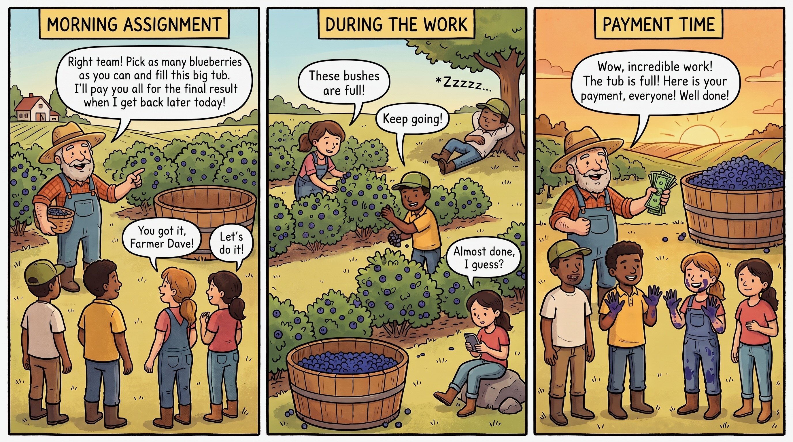

# How a Neuron Learns {#sec-learning}

This unit began by setting its endpoint: *where signaling becomes memory*—with the activity-dependent changes that let a synapse record its own history, the processes that reinforce those changes, and a first look at the hardest problem a learning brain faces: how to assign credit for a reward that arrives only *after* the act that earned it. The preceding two chapters have supplied the two pieces needed for that account.

The chapter on fast signaling built a neuron that can be excited and can excite others. At its close, it introduced a feature that matters here: when a neuron fires, the action potential born at the axon hillock does not travel only outward down the axon. A wave of depolarization can also propagate *backward* into the soma and much of the dendritic tree—the **back-propagating action potential**. This backward signal gives recently active synapses, especially those on proximal and permissive dendritic regions, postsynaptic evidence that the cell has fired. This, in turn, can strengthen the synapses whose depolarization contributed to the action potential. The chapter on neuromodulation described the other component: **dopamine**, released through widely branching projections and often by volume transmission, can arrive as a phasic burst over a tonic background when an outcome is better or worse than expected. Its slower action allows it to shape the synapses it reaches.

Placed together, these two facts outline the mechanism developed in this chapter. A recently active synapse carries a fading biochemical mark of its own participation—a tag indicating that it was active a moment ago. A modulatory signal can arrive afterward and influence whether the activity marked by that tag produces lasting change. The fast layer identifies what happened; the slower layer supplies information about the outcome. Learning emerges from their interaction.

A scope note is important at the outset. Most of this chapter follows the best-studied case: plasticity at excitatory **glutamatergic** synapses—especially for in two domains we will discuss below. These include hippocampal and cortical synapses for a form of plasticity called Hebbian **Long Term Potentiation** (LTP) and for corticostriatal synapses for dopamine-gated reinforcement learning. Other synapses also change with experience, including inhibitory synapses, the synapses of modulatory systems, the cerebellar synapses that express distinctive forms of **Long Term Depression** (LTD), and many synapses whose plasticity is expressed presynaptically. They do not all follow the same template. Unless otherwise specified, “a synapse” in this chapter refers to this particular, comparatively well-mapped class of excitatory connections.

The chapter proceeds from local coincidence detection to slower, more widely distributed signals. It begins with Donald Hebb's postulate and the NMDA receptor, a molecular detector that implements much of its logic. It then examines long-term potentiation and long-term depression, with calcium helping determine the direction of change and receptor trafficking making that change visible. Spike-timing-dependent plasticity adds temporal order, using the back-propagating action potential as part of a learning rule. Retrograde signaling then shows that the postsynaptic cell can also regulate the presynaptic terminal. The final sections address the limits of a purely correlational rule. Correlation carries no information about *value* and cannot by itself bridge a delay between action and outcome. Eligibility traces and dopamine-mediated prediction-error signals provide the additional factors needed for reinforcement-gated plasticity and a biological approach to temporal credit assignment.

## Hebb's postulate

The founding idea predates almost all of the molecular machinery described in this unit. In 1949, the Canadian psychologist **Donald Hebb** asked in *The Organization of Behavior* what physical change in the brain could underlie learning. His answer was that when one neuron repeatedly takes part in *firing* another, the connection between them is strengthened, so that the first neuron becomes more effective at exciting the second. The synapse, in other words, retains a record of its own repeated success, and that record is expressed as a change in strength.

Two features of Hebb's actual proposal are often lost in the famous slogan derived from it. First, Hebb's rule concerns *coincidence with a consequence*: cell A must not merely be active at the same time as cell B; it must “take part in firing” B. Presynaptic activity and postsynaptic firing must occur together. Second, Hebb's rule is **directional and causal**. A takes part in firing B, so the arrow runs from an input to the output it helps produce. This is more than simultaneous activity. It implies that the synapses eligible for credit are those active *just before* the cell fired and therefore capable of contributing to that firing. Spike-timing-dependent plasticity will make this temporal asymmetry precise.

At the level of a network, the rule turns correlation into structure. Inputs that are reliably active together, and reliably active when their shared target fires, become stronger; inputs that fire at unrelated times do not. Across a population, synapses can therefore encode statistical regularities in experience—co-occurrences, predictable sequences, and features that travel together in the world. This is learning of a particular and limited kind: **unsupervised** and **local**. It is unsupervised because nothing outside the synapse identifies what is worth learning; the synapse records what co-occurs. It is local because each synapse uses only information physically available there—its own activity and the state of the postsynaptic cell. No global signal, no teacher, no reward—only local correlation written into synaptic strength. That limitation becomes important in the second half of the chapter.

It is worth pausing to ask what all of this machinery is for. A synapse that strengthens when it takes part in firing its cell, a rule that reads only local coincidence—to what end? The answer becomes clear once we stop looking at a single connection and consider the neuron that receives many. The same coincidence logic, applied across a cell's many synapses at once, allows that cell to come to fire when a particular combination of its inputs is active together. The neuron has learned a conjunction. And a conjunction can carry meaning that no single input carries alone: a set of features that co-occur because they belong to the same object, a collection of cues that mark a particular place, a configuration that recurs in the world. Through Hebbian strengthening, the neuron becomes a **pattern recognizer**, tuned to respond to one such combination among the many it might have learned. This is the point of the mechanism—and it is what gives the two forms of plasticity ahead their purpose. **Associative LTP** is how co-active inputs are bound together into a single recognized pattern; this is why the associative character of LTP is a property worth having rather than an incidental feature of the biology. LTD is its necessary complement: it keeps a learned pattern selective, weakening inputs that do not belong, and allowing patterns that no longer matter to be let go. A neuron that could only strengthen would eventually respond to everything, and so recognize nothing.

::: {.callout-note collapse="true"}
## Deeper dive: what Hebb actually wrote, and who said "fire together, wire together"

Hebb's postulate is usually paraphrased rather than quoted, which has allowed its meaning to drift. His 1949 formulation was that when an axon of cell A is near enough to excite cell B and *repeatedly or persistently takes part in firing it*, some growth process or metabolic change occurs in one or both cells such that A becomes more efficient at firing B. Three features are notable. He located the change in *one or both cells*, leaving open whether it was presynaptic, postsynaptic, or both—the question that later became the debate over the **locus of expression**. He framed the rule in terms of *firing*, not mere co-activation, preserving its causal direction. And he presented the proposal as speculative: he had no mechanism, and the molecular coincidence detector usually associated with it—the NMDA receptor—would not be characterized for decades.

The catchphrase "cells that fire together wire together" is not Hebb's. The neuroscientist **Carla Shatz** coined it in a September 1992 *Scientific American* article, "The Developing Brain"—a piece written for a general audience, summarizing what her lab's work implied about how the visual system is wired. Shatz studied activity-dependent development: she had discovered that spontaneous waves of activity sweep across the retina early in development, before birth, and that these organized activity patterns select the final set of connections from a coarse, genetically-determined map—strengthening some and pruning others. Her slogan compressed Hebb into something memorable, but the compression is lossy. "Fire together" drops the directional element of *takes part in firing* and flattens Hebb's asymmetric, sequence-sensitive proposal into a symmetric claim about simultaneity—ironically so, since the phenomena she was describing turned on the relative timing of inputs, not mere coincidence. Spike-timing-dependent plasticity makes the cost of the flattening concrete: whether a synapse strengthens or weakens depends on firing order, with pre-before-post typically producing potentiation and the reverse producing depression. "Fired together" captures correlation; "one fired just before and may have helped cause the other" captures the temporal asymmetry Hebb's wording preserved—a relationship sometimes framed in terms of prediction or causal contribution, though that framing is an interpretive gloss rather than something Hebb or STDP states outright.

:::

## The molecular detector: the NMDA receptor

Hebb described a coincidence detector without knowing whether the brain contained one. The **NMDA receptor** provides much of the required mechanism. At an excitatory glutamatergic synapse, two ionotropic receptors sit side by side in the postsynaptic membrane. The **AMPA receptor** is the workhorse of rapid transmission: glutamate binds, the channel opens, sodium enters, and the membrane depolarizes to produce an EPSP. The **NMDA receptor** resembles the AMPA receptor but behaves differently. At the resting membrane potential, a magnesium ion blocks its pore. Glutamate binding, together with a co-agonist such as glycine or D-serine, *gates* the receptor, but little current flows while the magnesium block remains. Substantial current passes only when the membrane is already depolarized enough to expel the magnesium ion from the pore. An illustration of an NDMA receptor was presented in @fig-excitation-NMDA-receptor.

The NMDA receptor therefore passes substantial current only when **two conditions are met at once**. Glutamate must be present, indicating that the presynaptic cell was active and released transmitter, and the postsynaptic membrane must be sufficiently depolarized by other inputs or by a back-propagating action potential. Presynaptic activity supplies the chemical signal; local postsynaptic depolarization removes the voltage-dependent magnesium block. Only their conjunction permits substantial calcium entry. This is the coincidence Hebb required, detected at one receptor by the meeting of a presynaptic chemical cue and a postsynaptic electrical one. Importantly, the receptor reads *local dendritic depolarization*. That usually accompanies strong postsynaptic activation, but a local dendritic event can satisfy the condition even without a full somatic action potential.

What passes through the unblocked channel is equally important. The NMDA receptor is unusual among glutamate-gated channels in being substantially permeable to **calcium**. When the coincidence conditions are met, calcium enters the postsynaptic spine. In @fig-excitation-glutamate-synapse, calcium entered the presynaptic axon bouton through a calcium voltage-gated channel and triggered transmitter release; here it acts on the postsynaptic side as the signal that initiates synaptic plasticity. The AMPA receptor carries much of the moment-to-moment message. The NMDA receptor detects coincidence and, when it occurs, admits the calcium that can alter the synapse. Two receptors for the same signaling molecule therefore perform different jobs, illustrating again the unit's distinction between a molecule and the receptor machinery that receives it.

::: {.callout-note collapse="true"}
## Deeper dive: the co-agonist, the astrocyte, and the calcium nanodomain

The NMDA receptor's coincidence requirement is stricter than the two-condition account suggests because opening also requires a *co-agonist* at a separate binding site—either glycine or **D-serine**. This gives the local chemical environment partial control over whether the detector can operate. Astrocytes surrounding a synapse can regulate the availability of D-serine and may thereby influence whether nearby synapses are capable of NMDA-dependent strengthening. The claim requires an important qualification. Astrocytes are one regulator of the co-agonist environment, not its sole source, and the relative contributions of astrocytic and neuronal D-serine, and of glycine and D-serine, vary across synapses and development. The defensible conclusion is therefore that the tripartite synapse is more than a housekeeper that clears glutamate and buffers potassium. Through its contribution to the co-agonist environment, an astrocyte can condition plasticity at some nearby synapses.

The amount and *speed* of the calcium signal also depend on physical geometry. Calcium entering through NMDA receptors does not spread uniformly through the spine. It forms steep, short-lived **nanodomains** near the channel mouth, and the dendritic spine helps compartmentalize the signal within a small volume. This limits diffusion to neighboring synapses and keeps the consequences of calcium entry relatively local. The narrow spine neck is both an electrical amplifier and a diffusional bottleneck. The spine therefore functions as a biochemical compartment, helping explain why plasticity can be **synapse-specific**: a calcium-dependent change in one spine need not be shared by the spine beside it.
:::

![**Two routes to synaptic strengthening.** Both panels show a pyramidal neuron and its dendritic synapses. A synapse is strengthened when input to it arrives at the same time as enough local depolarization. The two panels differ only in *where that depolarization comes from* — the local dendrite, or the cell as a whole. **(a) Local coincidence.** Several neighbouring synapses on the same dendritic branch are active together. Their combined input depolarizes that short stretch of dendrite enough to strengthen the target synapse (coral) — and the cell body never has to fire. Because the signal stays on one branch, this kind of plasticity is *compartmentalized*: synapses that happen to be clustered together can be strengthened while the rest of the cell is left unchanged. **(b) Backpropagating action potential.** Here the depolarizing signal comes from the cell body. When the neuron fires an action potential (single spike, beside the axon), it does not only travel forward down the axon — a copy also propagates *backward* into the dendrites. This one spike spreads through the whole dendritic tree at once, so it can act as a cell-wide "that mattered" signal. Every synapse that was receiving input at that moment — the active *pattern*, drawn here as several synapses across the dendrite — is strengthened together. A single global event therefore reinforces a whole distributed pattern of inputs, not just one branch's worth.](figs/synapse_strengthening.svg){#fig-learning-synapse-strengthening}

::: {.callout-note collapse="true"}
## Deeper dive: the dendritic tree is not a passive funnel {#sec-learning-dendritic-compartments}

Introductory diagrams often reduce a neuron to a single decision-making point. Thousands of synapses produce small voltage changes, the dendrites funnel them toward the cell body, and the axon initial segment fires if their sum crosses threshold. The irrigation-hose analogy captures this convergence: many small lines feed larger lines, and their flows eventually meet at one outlet. But a pyramidal neuron's dendritic tree is not merely plumbing. Its branches are partially isolated electrical compartments, and many contain the ligand- and voltage-gated channels needed to perform local threshold operations of their own.

A small excitatory postsynaptic potential spreads away from its synapse and becomes smaller with distance. Thin terminal branches and branch points make some stretches of dendrite more strongly coupled internally than they are to the rest of the tree. The compartments are not sealed; current can pass through a branch point and reach the soma. They are nevertheless sufficiently isolated that each branch can have a partly independent voltage history. Inputs arriving close together on the same branch can therefore interact more strongly than the same inputs scattered across different branches. Location and timing matter, not only the total number of active synapses. Local inhibition can also prevent one branch from crossing threshold without necessarily silencing the entire cell.

![**The dendritic tree as a branching integration system.** The irrigation-hose analogy represents many small synaptic inputs combining within local branches, followed by larger branch-level events converging toward the soma and axon initial segment. It captures hierarchical convergence but not the full electrical biology: dendritic membrane can regenerate and amplify an electrical event, and an axonal action potential can propagate back in the opposite direction. The schematic is an analogy rather than an anatomical drawing.](figs/dendritic-irrigation.png){#fig-learning-dendritic-irrigation}

When enough nearby excitatory inputs arrive within a short interval, their combined depolarization can recruit regenerative membrane currents and produce a **dendritic spike**. This term describes a family of related events rather than one uniform waveform. Fast dendritic spikes often depend strongly on voltage-gated sodium channels. Broader calcium spikes are prominent in parts of the apical dendrite, while slower **NMDA spikes**, or plateau potentials, depend heavily on NMDA receptors whose magnesium block has been relieved by local depolarization. The conductances often overlap. What unites these events is positive feedback: depolarization opens channels that produce still more depolarization. Below the local threshold, inputs may sum modestly. Once the threshold is crossed, the branch produces a response much larger than simple linear addition would predict.

Experiments have made this compartmentalization concrete. Jackie Schiller and colleagues showed that clustered glutamatergic input can evoke an NMDA spike restricted largely to the activated dendritic segment. Later experiments found that nearby inputs on the same thin branch could sum nonlinearly, whereas inputs placed on separate branches summed more nearly linearly. A branch can therefore respond selectively to a particular spatial and temporal conjunction of inputs rather than merely contributing its inputs to one cell-wide total.

This gives a pyramidal neuron a nested input-output organization. Synapses are first combined within many dendritic subunits. A branch that remains below threshold sends only a relatively small, attenuated contribution toward the soma. A branch that crosses threshold can send a much larger depolarization. The outputs of several branches then converge on the soma and **axon initial segment**, where they influence whether the neuron emits an axonal action potential. In this limited but important sense, several operations usually ascribed to “the neuron”—integration, thresholding, selectivity, and plasticity—also occur inside its dendritic arbor.

This organization motivated the description of a pyramidal neuron as something like a two-stage network. Nonlinear dendritic branches form a first layer of integrators, and the axonal trigger zone supplies a final decision about whether the cell will produce an output spike. The analogy has limits. A dendritic branch is not a complete neuron, and many dendritic spikes remain local, producing no axonal spike at all. Others alter the probability or timing of an output spike, or help convert a single axonal spike into a burst.

Dendritic spikes are not only artifacts of isolated brain tissue. Direct dendritic recordings in living animals have detected local regenerative events during sensory stimulation. Manipulations that suppress these events can reduce the selectivity of a cortical neuron's response, and NMDA spikes in distal tuft branches can substantially alter the number of action potentials emitted by the cell. Active dendrites therefore contribute to the neuron's moment-to-moment computation as well as to its capacity for plasticity.

Communication also runs in the reverse direction. In a cortical pyramidal neuron, an ordinary output action potential is usually initiated in the axon initial segment, just beyond the axon hillock. The same regenerative event then travels forward down the axon and can actively invade the soma and dendrites as a **back-propagating action potential**. Greg Stuart and Bert Sakmann demonstrated this directly in 1994.

A back-propagating spike is not a uniform copy delivered equally to every spine. It normally weakens with distance, can invade different branches unequally, and depends on branch geometry, inhibition, prior activity, and the state of local sodium and potassium channels. Where it does arrive, it can open voltage-gated calcium channels and add depolarization to recently active synapses. It thereby provides local evidence that the cell has fired, although that evidence is stronger in some dendritic compartments than in others.

The forward and backward signals can also meet. In the apical dendrite of a layer 5 pyramidal neuron, a distal input that is too weak to have much effect by itself can coincide with a back-propagating action potential produced by proximal input. Together they may trigger a dendritic calcium spike, which then sends a stronger depolarization back toward the soma and produces a burst of axonal action potentials. This phenomenon, called **backpropagation-activated calcium-spike firing**, or **BAC firing**, was demonstrated by Matthew Larkum and colleagues.

The sequence is reciprocal. Synaptic input helps cause an axonal spike; the spike travels back into the dendrite; it amplifies a dendritic event; and that event returns toward the axon initial segment to alter the cell's output. The dendritic tree is therefore not simply upstream from the axon. It is part of a bidirectionally coupled electrical system.

This architecture matters directly for learning. Nace Golding and colleagues showed that a local dendritic spike can provide the depolarization and calcium entry needed for LTP even when the neuron never emits a somatic or axonal action potential. The excitability of an individual branch can itself be modified, changing how strongly its future dendritic spikes are coupled to the soma. Plasticity can therefore alter not only the strength of individual synapses but also the input-output relationship of a larger dendritic compartment.

In mouse motor cortex, Joseph Cichon and Wen-Biao Gan found that different motor-learning tasks evoked calcium spikes on different apical-tuft branches and potentiated spines that were active on those branches. These findings do not prove that every memory is assigned to one dendritic branch. They do show that plasticity can be compartmentalized at a level between the individual synapse and the whole cell. Such compartmentalization provides a plausible way for one pyramidal neuron to learn several input patterns while limiting interference among them.

The hose metaphor is therefore useful, but incomplete. Water mainly flows in one direction, whereas changes in membrane voltage can spread in both directions. Water is simply redistributed, whereas ion channels can regenerate and amplify an electrical event. The small blue flows in @fig-learning-dendritic-irrigation correspond to synaptic inputs first combined within local branches. The larger red flows correspond to branch-level events that converge toward the final axonal output. A return path from the outlet into the branches would add the second half of the story: the axonal action potential can propagate back into the dendritic tree and change how recently active branches are interpreted.

**A pyramidal neuron is therefore not one point-like integrator with thousands of equivalent inputs. It is a tree of partially independent, nonlinear integrators whose outputs converge on the axon—and whose state can be altered by a signal returning from that axon.**

:::

## Strengthening and weakening: LTP and LTD

In 1973, **Tim Bliss** and **Terje Lømo**, recording in the hippocampus of anesthetized rabbits, supplied a crucial demonstration. They delivered a brief, high-frequency burst of stimulation to a bundle of axons and found that the evoked synaptic response became larger—and remained larger for hours. A few seconds of intense activity had produced a lasting increase in synaptic strength. They had discovered **long-term potentiation**, or **LTP**, which remains one of the most extensively studied candidate mechanisms for memory. The complementary phenomenon, **long-term depression** or **LTD**, is a lasting decrease in synaptic strength, often produced experimentally by prolonged low-frequency activity. LTD was characterized later but is equally important. A system in which synapses could only strengthen would eventually saturate and lose the capacity to store further information. Memory requires both strengthening and weakening.

What determines whether a synapse undergoes LTP or LTD? In the classic NMDA-dependent hippocampal case, a useful first approximation is that both are triggered by calcium entering through NMDA receptors, while the *amount and time course* of calcium bias the direction of change. A large, rapid rise in postsynaptic calcium tends to produce potentiation; a smaller, more prolonged rise tends to produce depression; and calcium below a lower threshold produces little lasting change. High-frequency stimulation usually drives NMDA receptors strongly and produces a large calcium transient, whereas low-frequency stimulation tends to generate a weaker, sustained signal. The same second messenger can therefore produce opposite outcomes when read against different thresholds. This model is a genuine simplification—LTD in particular has several mechanisms, and even among glutamatergic synapses the outcome depends on receptor subtype, dendritic location, prior activity, and neuromodulatory state. Even so, the calcium-threshold model provides a useful first account of how one intracellular signal can strengthen, weaken, or leave a synapse unchanged.

At many well-studied glutamatergic synapses, the physical meaning of “stronger” or “weaker” depends largely on the other glutamate receptor. The NMDA receptor detects the conditions for plasticity, but **AMPA receptors** carry most of the ordinary synaptic current. One major way to change synaptic strength—especially at hippocampal CA1 synapses—is therefore to change the number or conductance of AMPA receptors. Potentiation inserts additional AMPA receptors into the postsynaptic membrane. With more receptors present, the same release of glutamate opens more channels, admits more sodium, and produces a larger EPSP. Depression does the reverse, removing AMPA receptors so that the same glutamate signal produces a smaller response. This postsynaptic receptor-trafficking mechanism is not the only form of plasticity. Some changes are expressed presynaptically as altered transmitter-release probability. It is, however, among the clearest and best documented. In the canonical case, the NMDA receptor detects the conditions for change, while the AMPA receptor population expresses much of the resulting change.

## Receptor trafficking

The verbs *insert* and *remove* conceal the crucial step by which a brief episode of synaptic activity changes what the synapse will do in the future. Neuroscientists distinguish between the **induction** and **expression** of plasticity. Induction consists of the events that initiate the change: glutamate release, postsynaptic depolarization, NMDA-receptor opening, calcium entry, and the intracellular pathways activated by that calcium. Expression is the physical alteration that makes the synapse respond differently afterward. In the canonical form of NMDA-dependent plasticity described here, a major expression mechanism is a change in the number and functional state of AMPA receptors within the postsynaptic density.

This distinction clarifies the division of labor between the two glutamate receptors. NMDA receptors help determine *whether* the conditions for plasticity have occurred and, through the resulting calcium signal, bias the synapse toward strengthening or weakening. AMPA receptors carry most of the ordinary excitatory current and therefore help determine *how strongly* the synapse responds the next time glutamate is released. A brief calcium signal can disappear while leaving behind an altered AMPA-receptor population. In this limited but concrete sense, receptor trafficking is one of the places where transient signaling becomes a persistent record of experience.

AMPA receptors are not permanently fixed in the postsynaptic membrane. They cycle between intracellular compartments and the cell surface, diffuse laterally through the membrane, and enter or leave the postsynaptic density. Receptors already present on the extrasynaptic or perisynaptic membrane can move into a synapse, while intracellular recycling compartments can supply additional receptors through exocytosis. At the same time, surface receptors can leave the postsynaptic density and be retrieved through endocytosis. Even a synapse whose average strength remains stable is therefore molecularly active. Plasticity changes the **balance** of this continuing traffic, favoring net accumulation or net loss of functional AMPA receptors at the synapse.

{#fig-learning-trafficking}

Panel A of @fig-learning-trafficking shows the sequence associated with potentiation. Strong or coincident synaptic activity produces substantial postsynaptic depolarization, relieving the magnesium block of NMDA receptors while glutamate is bound. The resulting large, brief calcium signal activates calcium-sensitive enzymes, especially **calcium/calmodulin-dependent protein kinase II**, or **CaMKII**. CaMKII is concentrated in the postsynaptic density and can phosphorylate itself as well as other synaptic proteins, allowing some of the biochemical consequences of the calcium pulse to continue after calcium has begun to fall. Its targets can increase the conductance of AMPA receptors already present and promote the delivery and stabilization of additional receptors at the synapse.

The figure separates two steps that are often compressed into the single word *insertion*. First, an AMPA-receptor-containing vesicle fuses with the plasma membrane, shown here at a perisynaptic location. This **exocytosis** adds receptors to the cell surface. Second, the newly available receptors move laterally through the membrane and become captured within the postsynaptic density. Receptors may also arrive from an existing extrasynaptic surface pool, so not every rapid change requires the synthesis of a new receptor or the fusion of a vesicle directly beneath the synapse. The decisive event is the net accumulation and stabilization of functional AMPA receptors opposite the presynaptic release site.

The functional consequence is straightforward. The presynaptic terminal need not release more glutamate. With more AMPA receptors available in the postsynaptic density, the same amount of glutamate can open more channels and produce a larger EPSP. The connection has changed its gain: an input that previously produced a modest postsynaptic response now produces a larger one. This increase in responsiveness is one major way in which LTP is expressed.

Panel B shows the complementary process associated with depression. A more modest and sustained calcium elevation preferentially engages calcium-sensitive **phosphatases**, including calcineurin and downstream protein phosphatase 1. These enzymes remove phosphate groups from relevant synaptic proteins and shift the trafficking balance in the opposite direction. AMPA receptors become less stably retained in the postsynaptic density, move laterally toward a nearby endocytic region, and enter clathrin-coated membrane pits. The pits pinch off to form intracellular vesicles, delivering the receptors to endosomal compartments. From there, receptors may be recycled back to the surface, retained within the cell, or directed into other processing pathways.

With fewer AMPA receptors remaining in the postsynaptic density, the same release of glutamate produces a smaller postsynaptic current and a smaller EPSP. LTD therefore does not necessarily mean that the presynaptic neuron has become less active or that glutamate has become a weaker transmitter. The postsynaptic cell has changed the receptor machinery through which it receives the signal.

The depression pathway should not be confused with a complete absence of calcium entry. In the dual-threshold model, a very small calcium signal falls below the threshold for lasting plasticity and produces little enduring change. A moderate signal between the lower and upper thresholds favors phosphatase-dependent depression, whereas a larger signal above the upper threshold favors kinase-dependent potentiation. The *time course* of the signal matters as well as its peak concentration: a relatively large, brief calcium rise and a modest but more sustained rise can engage different mixtures of enzymes. The thresholds are not fixed switches that operate identically at every synapse. They shift with prior activity, dendritic location, receptor composition, and neuromodulatory state. The model is nevertheless useful because it shows how the same intracellular messenger can drive opposite outcomes.

A particularly vivid example of the importance of trafficking is the **silent synapse**, especially common during development. Such a connection contains functional NMDA receptors but few or no functional AMPA receptors in its postsynaptic membrane. Near the resting potential, glutamate release produces little detectable postsynaptic current: the NMDA receptors are blocked by magnesium, and there are too few AMPA receptors to provide the initial depolarizing response. An LTP-inducing event can recruit AMPA receptors to the postsynaptic density and thereby *unsilence* the synapse. Receptor trafficking can therefore do more than make an already active connection somewhat stronger. It can determine whether a connection participates effectively in transmission at all.

Persistence does not require the same individual receptors to remain immobilized forever. A synapse can preserve an altered average strength even while its molecular components continue to turn over. Changes in receptor anchoring, postsynaptic scaffolding, and the balance of recycling and removal can stabilize the new state. Over longer intervals, plasticity is also accompanied by structural change: dendritic spines commonly enlarge as synapses strengthen and shrink as they weaken. Strong and enduring forms of plasticity may recruit gene expression, protein synthesis, and the synaptic tagging mechanisms discussed later in the chapter. Rapid trafficking can therefore provide an early expression of plasticity, while structural and molecular remodeling help maintain the change.

AMPA-receptor trafficking is not the universal explanation for every form of LTP or LTD. Plasticity can also alter the conductance or subunit composition of receptors, change presynaptic transmitter-release probability, remodel inhibitory inputs, or follow mechanisms specific to other brain regions and cell types. Even at one synapse, several of these changes may occur together. Receptor trafficking is nevertheless central to the classic hippocampal example because it supplies a clear physical answer to the question of what it means for a synapse to become stronger or weaker: the same presynaptic signal produces a different postsynaptic response because the receiving membrane has changed.

The remaining question is how patterns of neural activity generate the calcium signals that bias this traffic in one direction or the other. Stimulation frequency provides one experimental route, but the relative timing of presynaptic input and postsynaptic firing can matter on the scale of milliseconds. **Spike-timing-dependent plasticity** turns that temporal relationship into a more precise rule for inducing synaptic change.

## Timing is everything: spike-timing-dependent plasticity

Hebb's causal asymmetry implies that temporal order should matter. If an input is strengthened because it helped cause the postsynaptic output, then mere co-activation is not sufficient. An input that arrives just *before* the cell fires may have contributed to that firing and is a candidate for strengthening; an input that arrives just *after* the spike cannot have caused an event that has already occurred. In the late 1990s, experiments by **Henry Markram**, **Guo-qiang Bi**, **Mu-ming Poo**, and others showed that some synapses follow this logic with millisecond precision. The phenomenon is **spike-timing-dependent plasticity**, or **STDP**—Hebbian plasticity made explicitly temporal.

The canonical rule is straightforward. If the presynaptic depolarization *precedes* the postsynaptic action potential (the 'spike', named by virtue of its sharp rise and fall) by a short interval, often up to roughly twenty milliseconds, the synapse is potentiated, with stronger effects at shorter intervals. If the order is reversed and the postsynaptic spike precedes the presynaptic depolarization within the same brief window, the synapse is depressed. Outside the window, relatively little change occurs. The sign of plasticity therefore depends on whether presynaptic input and resulting depolarization leads or follows the postsynaptic spike output. Pre-before-post timing is consistent with an input that contributed to the spike; post-before-pre timing is not. This canonical pair-based rule is observed most clearly at certain excitatory synapses under controlled, low-frequency pairing. Real synapses can modify it substantially depending on dendritic location, burst structure, firing rate, and neuromodulatory state. At higher firing rates, order dependence can weaken and net potentiation may occur regardless of timing. The clean rule is therefore a central case rather than an invariant law.

A **back-propagating action potential** can provide the additional postsynaptic depolarization that removes the NMDA receptor's magnesium block. The coincidence detected by the receptor is then the temporal overlap between glutamate released by the initial presynaptic depolarization and the additional depolarization produced by the postsynaptic action potential as it back propagates into the dendrites. If glutamate arrives shortly before the back-propagating action potential, it can remain bound when the depolarization reaches the synapse. Magnesium is expelled, NMDA receptors admit a large calcium signal, and the conditions favor potentiation. If the postsynaptic actiona potential occurs first and its depolarization has largely subsided before glutamate arrives, the overlap is weaker and the calcium signal is usually smaller, favoring long term depression in the canonical case. The timing rule and the calcium-threshold model are therefore closely related descriptions of one mechanism. The back-propagating action potential provides the postsynaptic half of the coincidence detector, and its arrival time relative to the input helps determine the direction of plasticity.

::: {.callout-note collapse="true"}
## Deeper dive: the Bi–Poo window

The canonical STDP curve comes largely from Bi and Poo's 1998 experiments in dissociated hippocampal cultures. Plotting the change in synaptic strength against the time difference $\Delta t = t_{\text{post}} - t_{\text{pre}}$ produces a sharp, asymmetric, approximately double-exponential function. Positive $\Delta t$—in which the presynaptic spike leads—produces potentiation that decays over about twenty milliseconds. Negative $\Delta t$ produces depression over a similar window, and the curve changes sign near $\Delta t = 0$. It is among the most reproduced figures in cellular neuroscience because it provides a clean quantitative demonstration that synapses can be sensitive to millisecond-scale spike order.

The canonical curve is less universal than its prominence suggests. Its shape depends on *where* the synapse sits on the dendrite because the back-propagating spike weakens and changes as it travels into the dendritic tree. Distal synapses therefore receive a smaller, later, and less reliable depolarization than proximal synapses, reflecting the same cable properties that shape synaptic summation. The rule also depends on *frequency*. Pair-based order effects are strongest at low pairing frequencies, whereas higher frequencies can favor net potentiation regardless of order, as shown in work associated with Sjöström and others. Some synapses require bursts rather than isolated spikes for robust plasticity. The importance of the canonical STDP curve in the intact, behaving brain also remains debated. STDP is therefore a well-supported principle about coincidence and order under defined conditions, not a universal law with one fixed shape.
:::

## The synapse talks back: retrograde signaling

The mechanisms described so far are largely postsynaptic: calcium signaling, receptor insertion and removal, and spine remodeling. Chemical signaling can also run in the opposite direction—from the postsynaptic cell to the presynaptic terminal. This **retrograde signaling** qualifies the simple one-way diagram of a chemical synapse. The postsynaptic cell is not only a recipient; it can answer by regulating its inputs at their site of release.

The clearest examples are **endocannabinoids**, the brain's endogenous ligands for the same receptor system activated by THC. These lipid messengers are made on demand. When postsynaptic activity raises intracellular calcium or activates relevant metabotropic pathways, the neuron synthesizes endocannabinoids in its membrane and releases them. Because they are lipid-soluble, they diffuse backward across the synaptic cleft and bind presynaptic **CB1 receptors**, which suppress further transmitter release. The circuit effect depends on the identity of the presynaptic terminal. At a glutamatergic terminal, reduced release turns down excitation onto the cell, producing **depolarization-induced suppression of excitation** (**DSE**). At a GABAergic terminal, reduced release suppresses inhibition and briefly disinhibits the postsynaptic cell, producing **depolarization-induced suppression of inhibition** (**DSI**). The two effects have opposite consequences for postsynaptic excitability, but the direction of communication is the same. A strongly active postsynaptic neuron sends a signal backward and adjusts the terminals that provide its input.

![**Retrograde endocannabinoid signaling.** Postsynaptic depolarization and the resulting rise in intracellular Ca²⁺, or activation of an appropriate metabotropic receptor, trigger the on-demand synthesis of endocannabinoids in the postsynaptic membrane. These lipid messengers diffuse backward across the synaptic cleft and bind presynaptic CB1 receptors. CB1 signaling reduces Ca²⁺ entry and vesicle-release probability, thereby decreasing transmitter release. At glutamatergic terminals, this produces depolarization-induced suppression of excitation (DSE); at GABAergic terminals, it produces depolarization-induced suppression of inhibition (DSI), transiently disinhibiting the postsynaptic cell.](figs/retrograde.jpeg){#fig-learning-retrograde}

Retrograde signaling matters for two related reasons. First, some lasting forms of synaptic weakening are expressed *presynaptically* through endocannabinoid signaling that durably reduces release probability. Plasticity is therefore not limited to changes in postsynaptic receptor number; it can also alter the amount of transmitter released. This addresses part of the locus-of-expression question that Hebb left open. Second, retrograde signaling can contribute to feedback regulation of synaptic strength rather than leaving the system entirely to the positive-feedback logic of Hebbian potentiation. The net effect depends on the circuit, because DSI reduces inhibition rather than excitation. Broader homeostatic mechanisms are nevertheless required to keep synaptic strengths within a functional range.

::: {.callout-note collapse="true"}
## Deeper dive: endocannabinoids, DSI, and why cannabis touches memory

The two principal endocannabinoids in the brain are **2-arachidonoylglycerol (2-AG)** and **anandamide**, whose name derives from the Sanskrit *ananda*, meaning “bliss.” Unlike classical transmitters, they are not synthesized in advance and stored in vesicles. They are cleaved from membrane lipid precursors *on demand* in response to postsynaptic depolarization, calcium influx, and activation of postsynaptic metabotropic glutamate receptors. Those metabotropic receptors initiate lipid synthesis rather than opening an ion channel directly. The endocannabinoids then cross to the presynaptic terminal and activate CB1 receptors, among the most abundant G-protein-coupled receptors in the brain, to inhibit transmitter release. The canonical demonstrations are **DSI** and **DSE**, in which strong postsynaptic depolarization briefly suppresses incoming GABAergic or glutamatergic transmission for several seconds. These transient retrograde effects can be observed directly in electrophysiological recordings.

This endogenous system also explains why cannabis affects memory and cognition. THC is a CB1 receptor agonist, so it activates an existing retrograde-signaling mechanism rather than introducing a new one. Endocannabinoid signaling normally operates locally, transiently, and on demand. THC produces broader and more sustained receptor activation. Because CB1 signaling regulates transmitter release and plasticity in regions that include the hippocampus, this exogenous activation perturbs mechanisms involved in short-term memory and the formation of new memories.
:::

## One neuron, several patterns

Hebbian plasticity is sometimes described as though it teaches a neuron one preferred pattern of input. But a cortical pyramidal neuron receives thousands of synapses, and different subsets of those synapses can be strengthened on different occasions. The same neuron can therefore become responsive to more than one pattern.

Consider a highly simplified example. Suppose inputs A and B are repeatedly active together and, through their combined effect, help a neuron reach threshold. Because activity at those synapses coincides with strong postsynaptic depolarization, the A and B synapses are strengthened. Later, a different combination—C and D—also helps the same neuron fire. Those synapses can be strengthened by the same rule. The second episode does not necessarily erase the first. After learning, either A&B or C&D may be sufficient to activate the neuron.

In this limited sense, one neuron has learned two patterns. The patterns might overlap, or they might involve almost entirely different sets of synapses. In the simple example used here, A&B and C&D are completely separate. Real patterns would ordinarily involve many more inputs, and their boundaries would be less tidy, but the principle is the same: a neuron need not be dedicated to only one combination of inputs.

Figure @fig-learning-neuron-population-code extends the example across three neurons. Neuron N1 has learned A&B and C&D. Neuron N2 has learned A&B and E&F. Neuron N3 has learned C&D and E&F. Thus, every neuron responds to two patterns, and every pattern activates two neurons.

{#fig-learning-neuron-population-code}

This arrangement has an important advantage. A population does not need a separate, dedicated neuron for every event it might represent. Instead, each neuron can participate in many representations, while each representation is distributed across many neurons. A relatively limited population can therefore support a much larger repertoire of activity patterns.

The same arrangement also creates ambiguity. When N1 fires, its action potential does not identify which of its learned input patterns was responsible. It might have been driven by A&B, or it might have been driven by C&D. The axon carries the neuron's output, not an inventory of the synapses that produced it. Spike timing and firing rate may carry additional information, but they still do not explicitly label the particular coalition of inputs that drove the cell.

The ambiguity is reduced by observing the other neurons. If N1 and N2 fire together, A&B is the shared explanation. If N1 and N3 fire together, the likely pattern is C&D. If N2 and N3 fire together, it is E&F. In the simplified network shown in the figure, the response of one neuron is ambiguous, but the joint response of the population identifies the input exactly.

Real neural populations are larger, noisier, and more redundant than this three-neuron example. Their input patterns overlap, neurons sometimes fail to fire, and the same event does not produce an identical response on every occasion. Population coding is therefore not usually a matter of applying a perfect logical rule. Instead, the pattern across many neurons provides evidence from which a downstream circuit can infer the most likely stimulus, action, context, or bodily state.

The general principle remains: **a single neuron's output can collapse several possible causes into the same response, while the pattern across neurons preserves distinctions that the individual response loses**. Each neuron is individually ambiguous because it participates in several representations. The population is informative because neighboring neurons participate in overlapping but nonidentical sets of representations.

::: {.callout-note collapse="true"}
## Deeper dive: From input patterns to population vectors

The illustration can be written as a small coding problem. Let the response of the three neurons be represented by a binary vector in the order N1, N2, N3. The three input patterns then produce

\[
\mathbf{r}_{AB}=(1,1,0),
\]

\[
\mathbf{r}_{CD}=(1,0,1),
\]

and

\[
\mathbf{r}_{EF}=(0,1,1).
\]

No single component identifies the input. A response of \(1\) from N1 is compatible with either A&B or C&D. The complete population vector, however, is different for all three patterns. Information that is unavailable from one neuron's response remains available in the joint response.

The input patterns can also be represented as vectors. In the toy example,

\[
\mathbf{x}_{AB}=(1,1,0,0,0,0)
\]

and

\[
\mathbf{x}_{CD}=(0,0,1,1,0,0).
\]

Their dot product is zero, so they are orthogonal. Hebbian plasticity can strengthen the synapses involved in both patterns, allowing the same neuron to respond to either one.

This has a family resemblance to principal-components analysis because both begin with high-dimensional inputs and use changes in synaptic weights to capture statistical structure. In the strict mathematical sense, however, the example is not PCA. A normalized linear Hebbian unit of the kind analyzed by **Erkki Oja** approaches a leading principal component; it does not store an arbitrary list of orthogonal patterns as separate components. **Terence Sanger's** extension uses a population of competing units to recover several components.

The present example is better understood as **superposition followed by population decoding**. Each neuron acquires sensitivity to several patterns, and the identities of those patterns are recovered from the overlapping response repertoires of many neurons.

Superposition also introduces a capacity problem. A simple neuron strengthened for A&B and C&D might respond incorrectly to a novel mixture such as A&D. Sparse activity, inhibition, synaptic competition, and nonlinear dendritic branches can reduce this cross-talk by making neurons more selective for particular conjunctions. These mechanisms affect how many patterns a neuron can learn reliably, but they do not alter the central representational point: several input patterns may converge on the same single-neuron output while remaining distinguishable in the population response.
:::

![**Two routes to synaptic strengthening.** Both panels show the *same* pyramidal neuron and the *same* target synapse (coral). A synapse is strengthened when input to it arrives at the same time as enough local depolarization. The two panels differ only in *where that depolarization comes from*. (a) **Local coincidence.** Several neighbouring synapses on the same dendritic branch are active together. Their combined input depolarizes that short stretch of dendrite enough to strengthen the target synapse — and the cell body never has to fire. Because the signal stays on one branch, this kind of plasticity is *compartmentalized*: synapses that happen to be clustered together can be strengthened as a group while the rest of the cell is left unchanged. (b) **Backpropagating action potential.** Here the depolarizing signal comes from the cell body. When the neuron fires, the action potential does not only travel forward down the axon — a copy also propagates *backward* into the dendrites. If this backpropagating spike sweeps past the target synapse while that synapse is receiving input, the coincidence strengthens it. Because the spike spreads through the whole dendritic tree, it can act as a cell-wide "that mattered" signal, tagging whichever synapses were active at that moment.](figs/neuron-population_code.svg){#fig-learning-neuron-population-code}

## Why correlation is not enough

Hebbian plasticity, even when refined by STDP and regulated by retrograde signaling, is not sufficient to explain learning in an animal. The account is powerful—but it has two distinct limitations. One concerns stability; the other concerns value and temporal delay.

The first limitation is **instability**, which follows from the rule's positive-feedback logic. A synapse that helps fire its target becomes stronger, making it still more likely to help fire the target in the future. Without countervailing processes, strong synapses would approach saturation while weak synapses would lose influence. A network in that state would have little capacity for further learning. Neurons avoid this outcome through several mechanisms, including retrograde regulation and more global forms of **homeostatic plasticity**. In homeostatic synaptic scaling, a neuron monitors its average activity and adjusts synaptic strengths upward or downward to keep firing within a functional range. These are essential stabilizers, but they do not supply information about value.

The second limitation is that a Hebbian rule is **silent about value**. It records correlations without distinguishing those that support useful outcomes from those that are incidental. A nervous system encounters far more statistical regularities than are important for survival or future behavior, yet a purely local Hebbian rule contains no signal that identifies which of them led to food, escape, injury, or no meaningful consequence. Nothing in the coincidence of pre- and postsynaptic activity carries information about the eventual outcome. The problem is compounded by *time*. The outcome that reveals whether an action mattered often arrives seconds after the neural activity that contributed to it, after the relevant coincidence has ended. At the moment of activity, the synapse cannot know what consequence will follow; by the time the consequence occurs, the original electrical event has passed. This is the **credit-assignment problem**: how can a brain identify and modify the synapses that contributed to an action when information about its outcome becomes available only later?

A local correlational rule cannot solve this problem by itself because it contains neither a value signal nor a mechanism for bridging delay. Two additions are required. The first is a broadly available signal that reports whether an outcome was better or worse than expected. The second is a transient record that keeps recently active synapses eligible for modification until that delayed signal arrives. Dopamine can provide the outcome-related signal, while a biochemical **eligibility trace** provides the temporal bridge.

## The eligibility trace

An **eligibility trace** bridges the interval between relevant synaptic activity and a delayed outcome. When a synapse satisfies the required pre- and postsynaptic conditions, the event leaves a fading biochemical mark—a temporary flag that persists for several seconds. During that interval, the synapse is **eligible** for modification. It has not necessarily completed a lasting change, but it remains a candidate. If a reinforcement signal arrives while the trace persists, the candidate change can be stabilized, redirected, or otherwise modified. If no such signal arrives, the trace fades and the synapse does not undergo the same lasting reinforcement. The trace therefore preserves information about recent participation long enough for a later outcome signal to act selectively on the synapses that were involved.

The back-propagating action potential can help establish the postsynaptic side of the coincidence that creates an eligibility trace. By carrying depolarization into recently active dendritic regions, it helps mark synapses at which presynaptic input and postsynaptic firing occurred in the appropriate relationship. The electrical spike itself, however, is gone within milliseconds. The eligibility trace is a short-lived *biochemical* state produced by that recent activity, not a voltage change lingering in the dendrite. It can persist for seconds after the electrical events have ended. A slower modulatory signal, particularly dopamine, can then act while the trace remains active. Fast activity identifies which synapses participated; the biochemical trace preserves that information; and the later modulatory signal supplies information about the outcome.

The concept of an eligibility trace originated in mathematical models of reinforcement learning, where it allows delayed reward to modify an earlier action. For many years it was primarily a theoretical requirement rather than a directly observed biological process. The clearest experimental support comes from the striatum. Dopamine can strengthen recently active corticostriatal synapses only when it arrives within a limited interval, often on the order of one or two seconds after the relevant activity. This is the temporal window expected of an eligibility trace. The molecular composition of the trace remains under investigation, and related traces may operate over more than one timescale. The central principle nevertheless has direct experimental support: recent synaptic activity can create a temporary window during which a delayed dopamine signal alters plasticity.

{#fig-learning-credit-assignment}

::: {.callout-note collapse="true"}
## Deeper dive: synaptic tagging and capture

A second, slower phenomenon applies similar logic to memory *consolidation* rather than second-by-second reinforcement. In 1997, **Uwe Frey** and **Richard Morris** demonstrated **synaptic tagging and capture**. Lasting, “late” LTP requires the synthesis of new proteins, but protein synthesis is relatively cell-wide whereas LTP remains synapse-specific. The problem is therefore how broadly available proteins act only at the synapses that underwent plasticity. A synapse can set a local **tag**, a transient synapse-specific mark that lasts roughly an hour or two but does not by itself initiate protein synthesis. A sufficiently strong event, at that synapse or elsewhere on the cell, can trigger production of **plasticity-related proteins**. Any synapse whose tag is still present can *capture* those proteins and use them to convert a transient change into a more durable one. Untagged synapses do not consolidate in the same way even though the proteins are available throughout the cell.

The synaptic tag and the seconds-scale eligibility trace may be molecularly distinct, but they implement a similar architecture. Both allow a delayed and relatively broad signal to act selectively on synapses that retain a local mark of prior activity. Their timescales differ: reinforcement-related eligibility traces last seconds, whereas synaptic tags can persist for an hour or more. The later gate can also be neuromodulatory. Dopamine acting at D1/D5 receptors, for example, can promote the synthesis and capture of plasticity-related proteins. Synaptic tagging therefore extends the same general solution from immediate reinforcement to the longer process of memory consolidation.
:::

## Dopamine and the reward-prediction error

An eligibility trace identifies a synapse that can still be modified, but reinforcement learning also requires a signal about the outcome. The best-studied candidate is **dopamine**—released through widely projecting modulatory systems and able to act on a trace after the initiating synaptic activity has ended. Its significance became especially clear when recordings from dopamine neurons were compared with theories of learning developed independently in psychology and computer science.

A simple hypothesis is that dopamine neurons signal reward: they fire when something good occurs. Recordings by **Wolfram Schultz** and colleagues from midbrain dopamine neurons in monkeys showed a more specific pattern. An unexpected juice reward produced a phasic burst. After the animal learned that a cue reliably predicted the reward, the burst shifted from the reward to the predictive cue, while the now-expected reward produced little additional response. If the expected reward was omitted, firing fell below baseline at the time the reward should have occurred. In these classic conditioning tasks, many midbrain dopamine neurons therefore behaved less like simple reward detectors and more like **reward-prediction-error** neurons. Their activity signaled the difference between the reward received and the reward expected: better-than-expected outcomes produced a positive burst, outcomes matching expectation produced little change, and worse-than-expected outcomes produced a dip below baseline.

A reward-prediction error has a useful property for learning: it is large when predictions are inaccurate and approaches zero as prediction improves. The signal therefore diminishes when there is little left to learn. Phasic dopamine released across striatal and related targets can interact with eligibility traces through metabotropic receptors, allowing outcome information to influence recently active synapses. This mechanism also uses the distinction between tonic and phasic release. Tonic dopamine contributes to the background dopaminergic state, whereas brief phasic changes carry event-related information in many dopamine populations. Receptor affinity helps distinguish these concentration profiles, but receptor kinetics, location, uptake, and circuit context also matter. The same molecule can therefore support sustained modulation and a brief outcome-related signal over different timescales.

::: {.callout-note collapse="true"}
## Deeper dive: from Rescorla–Wagner to temporal difference

The relevant learning theory was developed by psychologists and computer scientists rather than from studies of dopamine. In 1972, **Robert Rescorla** and **Allan Wagner** proposed that associative learning is driven not by mere co-occurrence but by *surprise*. In their model, the change in the associative strength $V$ of a cue is proportional to the difference between the outcome received, $\lambda$, and the outcome already predicted:

$$
\Delta V = \alpha\,(\lambda - V)
$$

where $\alpha$ is a learning rate. The bracketed term is a prediction error: learning is rapid when prediction is poor ($\lambda - V$ is large) and stops when the outcome is fully predicted ($\lambda = V$, so $\Delta V = 0$). When several cues are present, the relevant prediction is their summed associative strength, so the error becomes $\lambda - \sum_i V_i$. This formulation explains **blocking**, first demonstrated by Kamin. If one cue already predicts a reward, adding a second cue alongside it produces little learning about the second cue because the first has already reduced the prediction error to near zero. The two cues still co-occur with the reward, but the outcome is no longer surprising. Value-based learning is therefore controlled by a broader error signal rather than by local correlation alone.

Rescorla–Wagner describes learning about outcomes but does not represent timing within a trial. **Temporal-difference (TD) learning**, developed by **Richard Sutton** and **Andrew Barto**, extends prediction-error learning across successive moments:

$$
\delta_t = r_t + \gamma V(s_{t+1}) - V(s_t)
$$

where $r_t$ is the reward received at time $t$, $V(s)$ is the estimated future value of a state, and $\gamma$ is a discount factor that weights future reward. The term $\gamma V(s_{t+1})$ allows value to propagate backward through a sequence, so a cue that predicts a later reward gradually acquires value of its own. This resembles the shift Schultz observed when dopamine responses moved from an unexpected reward to its predictive cue. Montague, Dayan, and Schultz therefore proposed in the 1990s that **phasic dopamine approximates $\delta_t$**—the temporal-difference error. A theory developed to solve delayed reward in artificial learning systems had converged on a signal resembling the activity of many midbrain dopamine neurons. The correspondence remains highly influential, but modern work has added important qualifications. Dopamine neurons are heterogeneous; many also carry movement, salience, or ramping signals; responses differ across striatal territories; and some evidence suggests that populations encode a distribution of prediction errors rather than a single scalar average. Phasic dopamine often carries reward-prediction-error information, but it is not reducible to that function alone.
:::

## The three-factor rule: putting value into Hebb

The rule for **reinforcement-gated** plasticity is three-factor rather than two-factor. It does not replace classical Hebbian LTP in the hippocampus, which can be induced without dopamine. Instead, it describes a particular and important job, seen most clearly at corticostriatal synapses. The first two factors are Hebbian: the presynaptic cell is active and the postsynaptic membrane is driven in an appropriate temporal relationship. Their conjunction leaves an eligibility trace at a candidate synapse. The third factor is a neuromodulatory signal reporting *value*, often dopamine carrying a reward-prediction error while the trace remains active. The first two factors identify *which* synapse participated and establish its local state; the third strongly influences whether the candidate change is retained and in which direction it proceeds. The third factor does not act alone. Dopamine receptor class, cell type, local microcircuit state, acetylcholine, endocannabinoids, and precise timing all shape the outcome. The three-factor rule therefore extends rather than corrects Hebbian plasticity: local coincidence identifies the relevant synapses, while the additional factor supplies information about value and can arrive after a brief delay.

The **medium spiny neuron** of the striatum occupies an anatomical position suited to this computation. It receives extensive glutamatergic input from the cortex, conveying information about current sensory conditions and ongoing actions, and dopaminergic input from the midbrain, carrying information related to subsequent outcomes. At a corticostriatal synapse, cortical activity paired with postsynaptic depolarization can create an eligibility trace. Dopamine arriving shortly afterward can then convert that transient state into a lasting change whose sign depends on receptor class, cell type, and local conditions. The convergence is almost diagrammatic: cortical input identifies what occurred, and dopamine reports how it turned out. Within basal-ganglia action-selection loops, medium spiny neurons provide a site at which action-related cortical patterns can be strengthened or weakened according to their consequences.

Eligibility traces and dopamine signals together provide a biological solution to the seconds-scale form of temporal credit assignment. Recent synaptic activity leaves a trace for a brief interval, and an outcome-related signal can modify synapses whose traces remain active. Fast signaling identifies participation; slower modulation supplies information about value. This mechanism can connect an action with an outcome delayed by a second or two. Longer delays require additional circuit-level processes that propagate value across sequences of states and actions.

::: {.callout-note collapse="true"}
## Deeper dive: where the three-factor rule is solid, and where it outruns the evidence

The three-factor rule is one of the most productive ideas in contemporary neuroscience, but the evidence is uneven across brain systems. It is strongest in the striatum, where the relevant synaptic, cellular, and dopaminergic mechanisms have direct experimental support.

Corticostriatal plasticity onto medium spiny neurons depends on dopamine in a sign- and cell-type-dependent manner. Neurons expressing **D1** and **D2** receptors often show broadly opposite forms of plasticity. A useful introductory picture associates D1 neurons with the direct, roughly *go* pathway and D2 neurons with the indirect, roughly *no-go* pathway, allowing the same dopamine signal to reinforce selected actions while reducing competing ones. This is a useful first picture, not a literal division. Both pathways are active during movement, D1/D2 segregation is not absolute, and plasticity depends strongly on cholinergic interneurons and local microcircuit state. Direct evidence for an eligibility trace is also strongest in the striatum. Experiments that vary the timing of dopamine relative to synaptic activity have identified a window of roughly one to two seconds during which dopamine can reinforce recent activity, including work associated with Yagishita and Kasai. In the basal ganglia, the three-factor rule is therefore supported by mechanistic evidence rather than by computational theory alone.

Evidence is weaker outside the striatum. In the **hippocampus**, classical NMDA-dependent LTP can be induced without dopamine. Dopamine and other neuromodulators more strongly regulate its *persistence* and consolidation, including the protein-synthesis-dependent phase and synaptic capture, than its initial induction. The third factor therefore influences how durable a Hebbian change becomes more than whether the change begins. In the **neocortex**, neuromodulators clearly affect LTP and STDP, but a universal rule in which a dopamine-like error gates plasticity at every synapse has not been demonstrated. Much of the appeal of that proposal comes from computational models rather than from a comparably complete experimental account. The three-factor rule is a powerful and partially confirmed synthesis whose strongest evidence lies in the basal ganglia. Treating it as a single law applied identically across the brain would go beyond the evidence.
:::

## Where this leaves us — and where the unit ends

A synapse learns through several interacting mechanisms. At an excitatory glutamatergic synapse, the NMDA receptor detects the conjunction of presynaptic glutamate and postsynaptic depolarization. In the classic hippocampal case, the magnitude and time course of the resulting calcium signal bias the synapse toward potentiation or depression. Much of the change is expressed through insertion or removal of AMPA receptors and corresponding changes in spine structure. Temporal order refines coincidence, with the back-propagating action potential providing one source of postsynaptic depolarization. Retrograde signals allow the postsynaptic cell to regulate presynaptic release, while homeostatic mechanisms limit Hebbian positive feedback. Correlation alone, however, contains no information about value and cannot bridge a delay. At synapses involved in reinforcement learning, a short-lived eligibility trace preserves information about recent participation until a dopamine signal reports whether an outcome was better or worse than expected. Two local factors establish eligibility; a third, outcome-related factor influences whether and how the synapse changes. This mechanism addresses the seconds-scale form of temporal credit assignment while leaving longer delays to additional circuit-level processes.

Four themes from the unit converge in this account. First, the **molecule-versus-receptor** principle appears in the different roles of AMPA and NMDA receptors for the same transmitter, and in the different consequences of tonic and phasic dopamine signaling. Second, the **timescales** that organized the unit from its overview are now part of the learning rule itself: millisecond coincidence, a seconds-long eligibility trace, a delayed modulatory signal, and consolidation that can require hours, new proteins, and structural change. Learning is a conversation across timescales, with fast and slow processes doing together what neither can do alone. Third, useful biological rules require boundary conditions. Hebbian plasticity is incomplete, the canonical STDP curve is not universal, and the three-factor rule has stronger support in the striatum than in the cortex. Finally, plasticity has a **metabolic cost**. Detecting coincidence, changing receptor number, remodeling spines, and restoring ionic gradients all require ATP—much of it ultimately spent by the same ion pumps that have supported neural signaling throughout this unit.

The final distinction is between mechanisms that are well established and those whose scope or molecular implementation remains uncertain.

::: {.callout-tip collapse="true"}
## What we're sure of, and what we're not

Plasticity is a rapidly developing area of neuroscience. The central mechanisms are well supported, but several widely taught formulations remain useful approximations rather than universal rules.

**Reasonably settled:**

- Activity-dependent, long-lasting changes in synaptic strength are well established. At excitatory glutamatergic synapses, the **NMDA receptor** can act as a coincidence detector: ligand and co-agonist binding gate the receptor, while postsynaptic depolarization removes its magnesium block and permits calcium entry.
- **LTP and LTD** are both well established. At hippocampal CA1 synapses, postsynaptic calcium is a major control variable, and AMPA receptor insertion or removal is a major expression mechanism accompanied by structural growth or shrinkage of the spine.
- Plasticity can be **timing-dependent**. Under controlled low-frequency pairing at suitable synapses, presynaptic-before-postsynaptic firing tends to strengthen a connection, whereas the reverse order tends to weaken it.
- Endocannabinoids are genuine **retrograde messengers**. They suppress release from terminals bearing CB1 receptors, producing DSE at excitatory terminals and DSI at inhibitory terminals.
- In classic conditioning tasks, many midbrain dopamine neurons carry a **reward-prediction-error-like signal**. Responses shift from unexpected rewards to predictive cues and fall below baseline when an expected reward is omitted.
- At **corticostriatal synapses**, dopamine gates plasticity in a sign- and cell-type-dependent manner. Direct evidence supports an eligibility window of approximately one to two seconds during which dopamine can reinforce recent activity. This is the firmest evidence for a three-factor, reward-gated learning rule.

**Genuinely unsettled, and presented as such:**

- *How universal is the calcium-threshold rule?* The formulation “large, rapid calcium = LTP; smaller, prolonged calcium = LTD” is a useful first approximation for classic NMDA-dependent plasticity. LTD has several mechanisms, and outcomes vary with receptor subtype, dendritic location, prior activity, and neuromodulatory state.
- *How important is the canonical STDP rule in vivo?* The familiar Bi–Poo curve comes largely from culture. In intact tissue, firing rate, bursts, dendritic location, voltage, and neuromodulation can alter the rule, and its behavioral importance remains debated.
- *What is the molecular identity of the eligibility trace?* The trace is a biochemical state rather than a lingering action potential, but the molecules that maintain it are not fully established. Its relationship to the longer-lasting **synaptic tag** used in tagging and capture is also unresolved.
- *How far does the three-factor rule extend beyond the striatum?* In the **hippocampus**, dopamine chiefly modulates persistence and consolidation rather than the induction of LTP. In the **neocortex**, a universal dopamine-gated rule remains more computationally attractive than experimentally demonstrated.
- *Is phasic dopamine a single scalar reward-prediction error?* The reward-prediction-error correspondence is robust, but dopamine neurons are heterogeneous and can also carry movement, salience, and ramping signals. Signals vary across striatal territories, and recent work suggests that populations may encode a distribution of prediction errors rather than one average.

The central framework is therefore well supported even though its scope remains under investigation. NMDA-dependent coincidence detection, calcium-sensitive plasticity, AMPA receptor trafficking, timing-dependent change, retrograde endocannabinoid signaling, dopamine-related prediction errors, and short eligibility windows all have substantial empirical support. The major open questions concern how broadly each mechanism applies and how these cellular processes combine to produce learning at the level of whole behavior.
:::

The mechanism described here assigns credit when an outcome follows relevant activity by a second or two. Many important outcomes occur after much longer sequences of actions, beyond the reach of a single short eligibility trace. Solving the broader credit-assignment problem requires value to propagate across states and actions through interactions among basal-ganglia loops, cortex, dopamine systems, and other memory processes. This chapter therefore establishes the synaptic ingredients of reinforcement-gated learning without claiming a complete account of learning over long delays. A single synapse can preserve a coincidence and use a later outcome signal to alter its strength; assembling many such synapses into a system that pursues distant goals is a larger problem. The signaling molecule remains the humble inherited tool it was in the ancestors of sponges. In a nervous system, however, its effects can now persist as memory—and can help determine which experiences are worth remembering.
